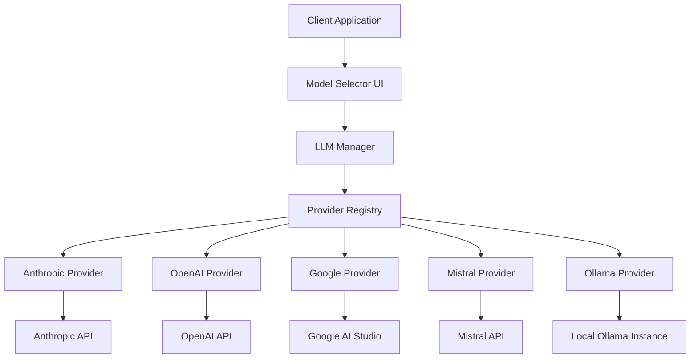
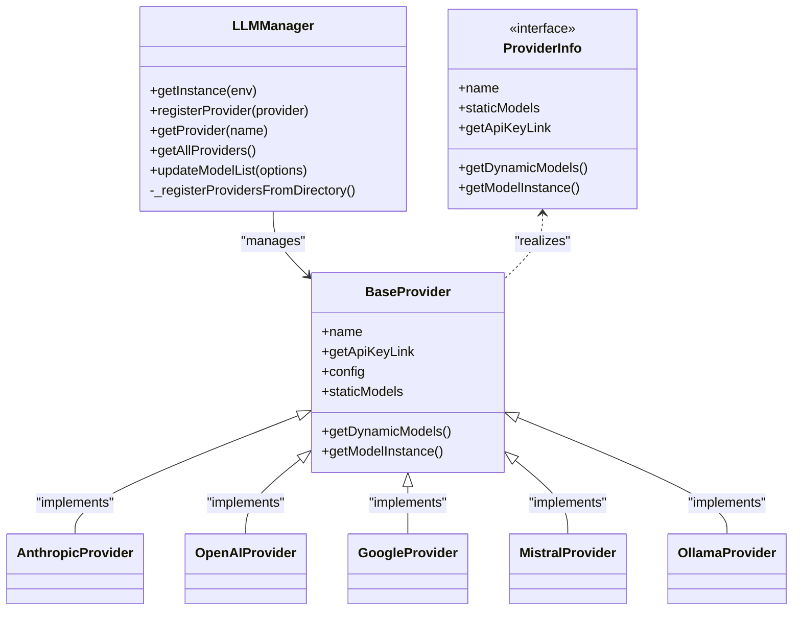
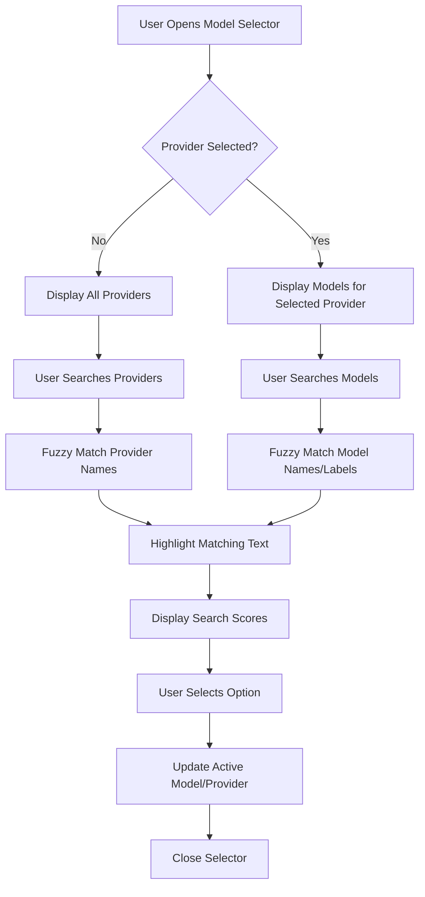
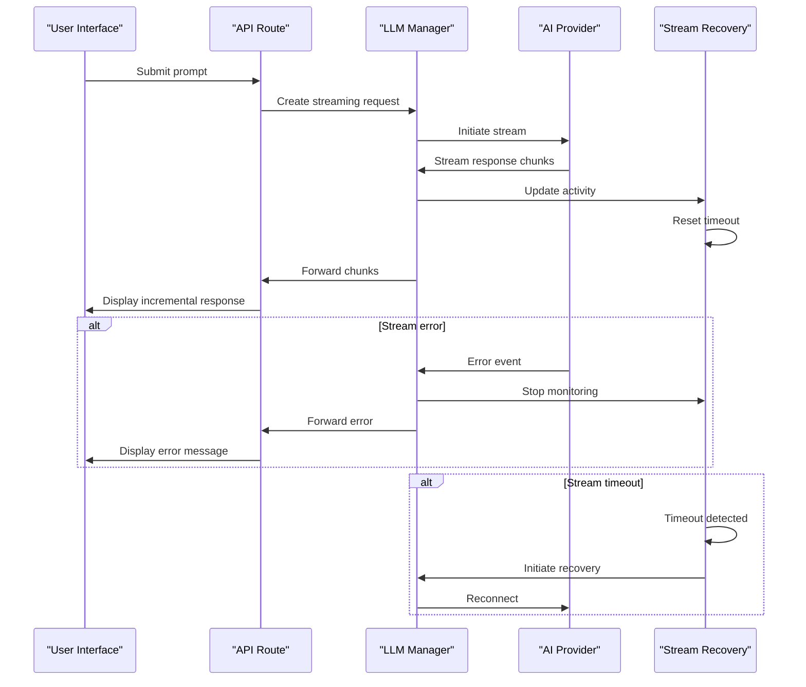
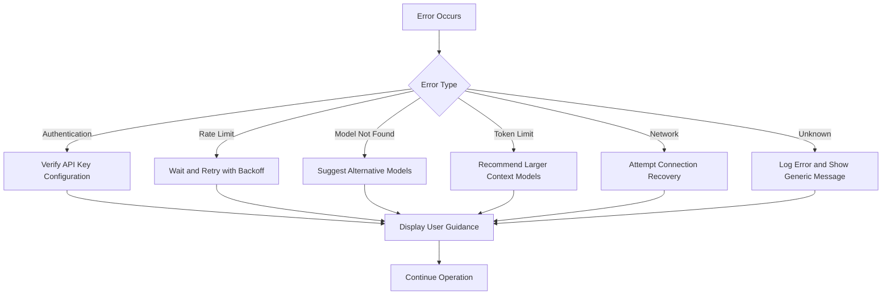

# AI Integration

<cite>
**Referenced Files in This Document**   
- [lib/models.ts](file://lib/models.ts)
- [apps/desktop/app/lib/modules/llm/providers/anthropic.ts](file://apps/desktop/app/lib/modules/llm/providers/anthropic.ts)
- [apps/desktop/app/lib/modules/llm/providers/openai.ts](file://apps/desktop/app/lib/modules/llm/providers/openai.ts)
- [apps/desktop/app/lib/modules/llm/providers/google.ts](file://apps/desktop/app/lib/modules/llm/providers/google.ts)
- [apps/desktop/app/lib/modules/llm/providers/mistral.ts](file://apps/desktop/app/lib/modules/llm/providers/mistral.ts)
- [apps/desktop/app/lib/modules/llm/providers/ollama.ts](file://apps/desktop/app/lib/modules/llm/providers/ollama.ts)
- [apps/desktop/app/lib/modules/llm/registry.ts](file://apps/desktop/app/lib/modules/llm/registry.ts)
- [apps/desktop/app/lib/modules/llm/manager.ts](file://apps/desktop/app/lib/modules/llm/manager.ts)
- [apps/desktop/app/lib/modules/llm/types.ts](file://apps/desktop/app/lib/modules/llm/types.ts)
- [apps/desktop/app/components/chat/ModelSelector.tsx](file://apps/desktop/app/components/chat/ModelSelector.tsx)
- [apps/desktop/app/routes/api.chat.ts](file://apps/desktop/app/routes/api.chat.ts)
- [apps/desktop/app/lib/.server/llm/stream-recovery.ts](file://apps/desktop/app/lib/.server/llm/stream-recovery.ts)
- [apps/desktop/app/lib/stores/streaming.ts](file://apps/desktop/app/lib/stores/streaming.ts)
</cite>

## Table of Contents
1. [Introduction](#introduction)
2. [Architecture Overview](#architecture-overview)
3. [Provider Registration and Configuration](#provider-registration-and-configuration)
4. [Model Selection Interface](#model-selection-interface)
5. [Streaming Architecture](#streaming-architecture)
6. [Configuration Options](#configuration-options)
7. [Natural Language to Code Generation](#natural-language-to-code-generation)
8. [Error Handling Patterns](#error-handling-patterns)
9. [Performance Considerations](#performance-considerations)
10. [Cost Optimization Strategies](#cost-optimization-strategies)

## Introduction
The AI Integration system in CodingIT-1 provides a unified interface for interacting with over 50 AI models from various providers including OpenAI, Anthropic, Google, Mistral, Ollama, and custom endpoints. This multi-provider architecture enables users to leverage the strengths of different AI models for various tasks, from code generation to natural language processing. The system is designed to be flexible, scalable, and user-friendly, allowing seamless switching between providers and models based on specific requirements.

## Architecture Overview
The AI integration system follows a modular architecture with a clear separation of concerns. At its core is the LLMManager class that orchestrates provider registration, model discovery, and request routing. Providers are implemented as individual classes that extend a common BaseProvider interface, ensuring consistent behavior across different AI services. The system supports both static models (predefined in code) and dynamic models (discovered at runtime via API calls to the provider).

**Diagram sources**
- [apps/desktop/app/lib/modules/llm/manager.ts](file://apps/desktop/app/lib/modules/llm/manager.ts#L1-L238)
- [apps/desktop/app/lib/modules/llm/registry.ts](file://apps/desktop/app/lib/modules/llm/registry.ts#L1-L42)

**Section sources**
- [apps/desktop/app/lib/modules/llm/manager.ts](file://apps/desktop/app/lib/modules/llm/manager.ts#L1-L238)
- [apps/desktop/app/lib/modules/llm/types.ts](file://apps/desktop/app/lib/modules/llm/types.ts#L1-L39)

## Provider Registration and Configuration
The system implements a dynamic provider registration mechanism through the LLMManager class. Providers are automatically registered during initialization by scanning the providers directory and instantiating classes that extend BaseProvider. Each provider implementation defines its own configuration requirements, API endpoints, and model discovery logic.

The registry pattern is used to maintain a centralized collection of available providers, making it easy to add new providers without modifying core system code. Providers like Anthropic, OpenAI, Google, Mistral, and Ollama each implement the ProviderInfo interface, defining methods for retrieving both static and dynamic models.

**Diagram sources**
- [apps/desktop/app/lib/modules/llm/manager.ts](file://apps/desktop/app/lib/modules/llm/manager.ts#L1-L238)
- [apps/desktop/app/lib/modules/llm/base-provider.ts](file://apps/desktop/app/lib/modules/llm/base-provider.ts)
- [apps/desktop/app/lib/modules/llm/types.ts](file://apps/desktop/app/lib/modules/llm/types.ts#L1-L39)

**Section sources**
- [apps/desktop/app/lib/modules/llm/registry.ts](file://apps/desktop/app/lib/modules/llm/registry.ts#L1-L42)
- [apps/desktop/app/lib/modules/llm/manager.ts](file://apps/desktop/app/lib/modules/llm/manager.ts#L1-L238)

## Model Selection Interface
The model selection interface provides users with a comprehensive view of available AI models across all configured providers. Implemented in ModelSelector.tsx, this component displays both providers and their associated models in a dual combobox interface, allowing users to filter and search through available options.

The interface supports several key features:
- Provider filtering with fuzzy search capabilities
- Model filtering within selected providers
- Context window size display for each model
- Visual indicators for free models
- Keyboard navigation support
- Search score highlighting for matching terms

Users can switch between providers and models dynamically, with the interface updating to show only models relevant to the selected provider. The component also supports a "free models only" filter to help users identify cost-effective options.

**Diagram sources**
- [apps/desktop/app/components/chat/ModelSelector.tsx](file://apps/desktop/app/components/chat/ModelSelector.tsx#L1-L849)

**Section sources**
- [apps/desktop/app/components/chat/ModelSelector.tsx](file://apps/desktop/app/components/chat/ModelSelector.tsx#L1-L849)

## Streaming Architecture
The system implements a robust streaming architecture to handle real-time AI responses efficiently. When a user submits a query, the system establishes a streaming connection with the selected AI provider and processes the response incrementally as it arrives. This approach provides immediate feedback to users and creates a more natural conversational experience.

The streaming implementation includes several key components:
- A stream recovery manager that monitors connection health and handles timeouts
- Error handling middleware that translates provider-specific errors into user-friendly messages
- Data transformation pipelines that convert raw stream data into the format expected by the UI
- Activity tracking to detect stalled streams and initiate recovery procedures

The architecture is designed to handle various streaming scenarios, including partial responses, error events, and connection interruptions, ensuring a reliable user experience even under challenging network conditions.

**Diagram sources**
- [apps/desktop/app/routes/api.chat.ts](file://apps/desktop/app/routes/api.chat.ts#L1-L462)
- [apps/desktop/app/lib/.server/llm/stream-recovery.ts](file://apps/desktop/app/lib/.server/llm/stream-recovery.ts#L1-L91)

**Section sources**
- [apps/desktop/app/lib/.server/llm/stream-recovery.ts](file://apps/desktop/app/lib/.server/llm/stream-recovery.ts#L1-L91)
- [apps/desktop/app/lib/stores/streaming.ts](file://apps/desktop/app/lib/stores/streaming.ts#L1-L2)

## Configuration Options
The AI integration system provides extensive configuration options to accommodate different providers, usage scenarios, and user preferences. Configuration is managed through environment variables, API keys, and provider-specific settings that can be customized in the application settings.

Key configuration options include:
- API keys for authentication with external providers
- Base URLs for custom or self-hosted endpoints
- Rate limiting controls to manage API usage
- Provider-specific parameters like temperature, top_p, and max_tokens
- Local model configuration for Ollama and other local providers

The system supports both static configuration (defined in code) and dynamic configuration (set by users through the interface). For example, the Ollama provider allows users to specify a custom base URL, while cloud providers like OpenAI and Anthropic require API keys that are securely stored and managed.

**Section sources**
- [lib/models.ts](file://lib/models.ts#L1-L108)
- [apps/desktop/app/lib/modules/llm/providers/ollama.ts](file://apps/desktop/app/lib/modules/llm/providers/ollama.ts#L1-L140)

## Natural Language to Code Generation
The system excels at natural language to code generation workflows, leveraging the strengths of different AI models to produce high-quality code from descriptive prompts. Users can describe functionality in plain language, and the AI system generates corresponding code in various programming languages and frameworks.

The workflow typically follows these steps:
1. User describes desired functionality in natural language
2. System selects appropriate model based on task complexity and requirements
3. AI processes the prompt and generates code
4. Code is displayed in the editor with syntax highlighting
5. User can refine the prompt and regenerate code as needed

The system supports various code generation patterns, including:
- Complete file generation from specifications
- Function or method implementation based on comments
- Code refactoring and optimization suggestions
- Bug fixing based on error descriptions
- Test case generation from requirements

**Section sources**
- [apps/desktop/app/routes/api.chat.ts](file://apps/desktop/app/routes/api.chat.ts#L1-L462)
- [apps/desktop/app/lib/runtime/message-parser.spec.ts](file://apps/desktop/app/lib/runtime/message-parser.spec.ts#L1-L36)

## Error Handling Patterns
The system implements comprehensive error handling patterns to provide users with meaningful feedback and maintain application stability. Errors are categorized and handled at multiple levels, from network connectivity issues to provider-specific limitations.

Common error types and their handling strategies include:
- Authentication errors: Prompt users to verify API key configuration
- Rate limiting: Implement retry logic with exponential backoff
- Model unavailability: Suggest alternative models or providers
- Token limits: Recommend using models with larger context windows
- Network issues: Implement connection recovery and fallback mechanisms

The error handling system translates technical error messages into user-friendly guidance, helping users resolve issues without requiring deep technical knowledge. For example, instead of showing a generic "429" error code, the system displays "API rate limit exceeded. Please wait a moment before trying again."

**Diagram sources**
- [apps/desktop/app/routes/api.chat.ts](file://apps/desktop/app/routes/api.chat.ts#L312-L351)
- [CHANGELOG.md](file://CHANGELOG.md#L463-L507)

**Section sources**
- [apps/desktop/app/routes/api.chat.ts](file://apps/desktop/app/routes/api.chat.ts#L312-L351)
- [components/help-center.tsx](file://components/help-center.tsx#L565-L598)

## Performance Considerations
The AI integration system incorporates several performance optimizations to ensure responsive interactions and efficient resource utilization. These optimizations address both client-side and server-side performance aspects.

Key performance considerations include:
- Efficient model discovery with caching of dynamic model lists
- Stream processing to minimize memory usage during long responses
- Connection pooling and reuse to reduce latency
- Asynchronous operations to prevent UI blocking
- Selective model loading to reduce initial startup time

The system also implements performance monitoring through logging and metrics collection, allowing developers to identify and address bottlenecks. For example, the stream recovery manager tracks activity and timeout events, providing insights into connection stability and response times.

**Section sources**
- [apps/desktop/app/lib/.server/llm/stream-recovery.ts](file://apps/desktop/app/lib/.server/llm/stream-recovery.ts#L1-L91)
- [apps/desktop/app/lib/modules/llm/manager.ts](file://apps/desktop/app/lib/modules/llm/manager.ts#L1-L238)

## Cost Optimization Strategies
The multi-provider architecture enables sophisticated cost optimization strategies by allowing users to select the most cost-effective model for each task. The system supports various approaches to minimize AI service costs while maintaining quality.

Effective cost optimization strategies include:
- Using smaller, faster models for simple tasks
- Leveraging free models when available and appropriate
- Implementing rate limiting to control API usage
- Caching common responses to avoid redundant calls
- Selecting providers with favorable pricing for specific model types

The interface helps users make cost-aware decisions by displaying indicators for free models and providing context about model capabilities. Users can also configure provider preferences in settings to automatically prioritize lower-cost options when multiple suitable models are available.

**Section sources**
- [apps/desktop/app/components/chat/ModelSelector.tsx](file://apps/desktop/app/components/chat/ModelSelector.tsx#L115-L151)
- [lib/models.ts](file://lib/models.ts#L1-L108)