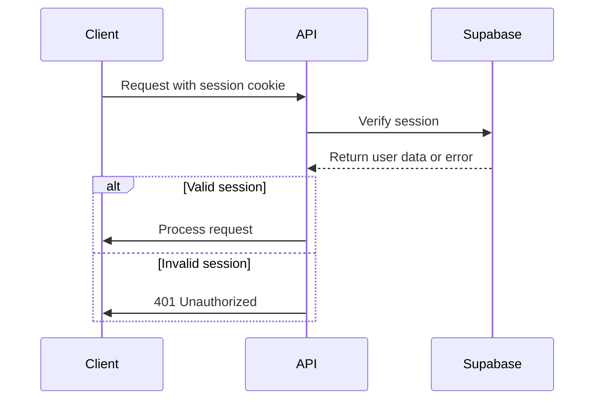
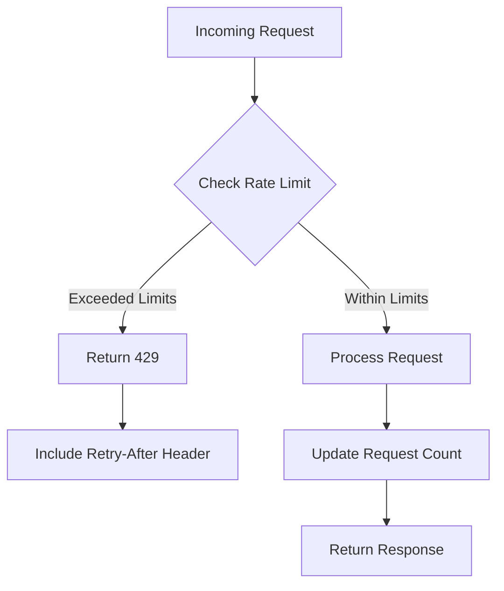
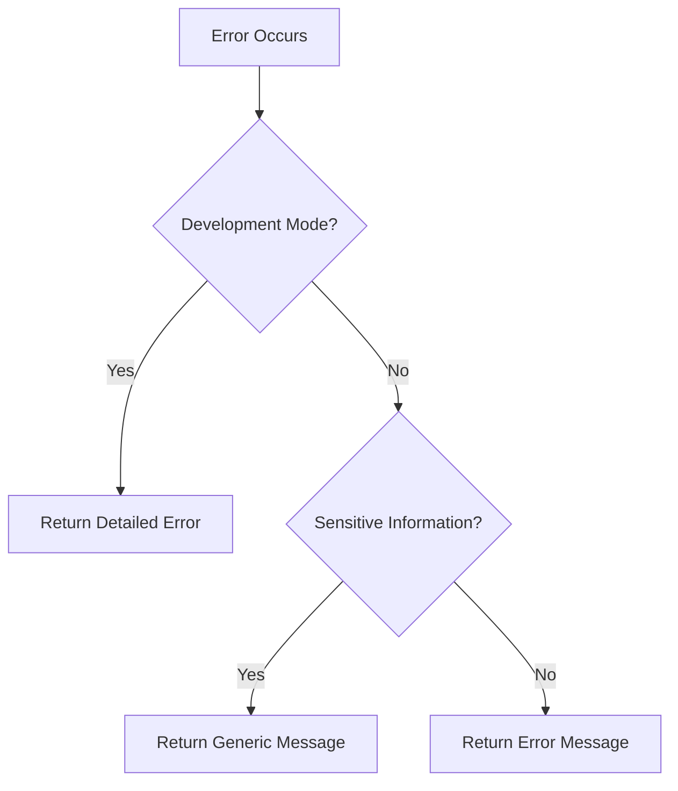
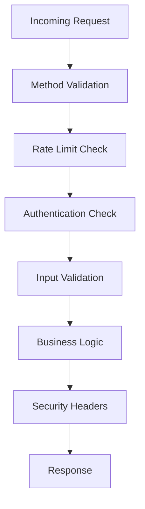

# API Reference

<cite>
**Referenced Files in This Document**   
- [chat/route.ts](file://app/api/chat/route.ts)
- [chat/morph-chat/route.ts](file://app/api/chat/morph-chat/route.ts)
- [files/route.ts](file://app/api/files/route.ts)
- [files/content/route.ts](file://app/api/files/content/route.ts)
- [files/batch/route.ts](file://app/api/files/batch/route.ts)
- [github/user/route.ts](file://app/api/github/user/route.ts)
- [github/repos/route.ts](file://app/api/github/repos/route.ts)
- [github/orgs/route.ts](file://app/api/github/orgs/route.ts)
- [sandbox/route.ts](file://app/api/sandbox/route.ts)
- [tasks/route.ts](file://app/api/tasks/route.ts)
- [tasks/[taskId]/route.ts](file://app/api/tasks/[taskId]/route.ts)
- [terminal/route.ts](file://app/api/terminal/route.ts)
- [lib/ratelimit.ts](file://lib/ratelimit.ts)
- [lib/api-errors.ts](file://lib/api-errors.ts)
- [lib/security.ts](file://apps/desktop/app/lib/security.ts)
- [lib/schema.ts](file://lib/schema.ts)
- [lib/tasks.ts](file://lib/tasks.ts)
</cite>

## Table of Contents
1. [Introduction](#introduction)
2. [Authentication](#authentication)
3. [Rate Limiting](#rate-limiting)
4. [Chat API](#chat-api)
5. [Files API](#files-api)
6. [GitHub API](#github-api)
7. [Sandbox API](#sandbox-api)
8. [Tasks API](#tasks-api)
9. [Terminal API](#terminal-api)
10. [Error Handling](#error-handling)
11. [WebSocket Real-Time Features](#websocket-real-time-features)
12. [Client Implementation Guidelines](#client-implementation-guidelines)
13. [Security Considerations](#security-considerations)

## Introduction
The CodingIT-1 API provides a comprehensive set of RESTful endpoints for interacting with the platform's core functionality. This documentation covers all public API endpoints in the `app/api` directory, including chat, files, GitHub, sandbox, tasks, and terminal operations. The API follows standard REST conventions with JSON request and response payloads, and implements robust security, rate limiting, and error handling mechanisms.

The API is designed to support both internal components and external integrations, with clear request/response schemas and comprehensive error handling. All endpoints require authentication via session-based authentication using Supabase, and are protected by rate limiting to ensure service stability.

**Section sources**
- [chat/route.ts](file://app/api/chat/route.ts)
- [lib/security.ts](file://apps/desktop/app/lib/security.ts)

## Authentication
All API endpoints require authentication through Supabase's session-based authentication system. The system uses JWT tokens managed by Supabase Auth, which are automatically included in requests when a user is logged in.

Authentication is implemented through the Supabase client, which checks for a valid session before allowing access to protected endpoints. When a request is made, the API verifies the user's session and extracts the user ID for authorization and data filtering purposes.



**Diagram sources**
- [files/route.ts](file://app/api/files/route.ts)
- [tasks/route.ts](file://app/api/tasks/route.ts)
- [github/user/route.ts](file://app/api/github/user/route.ts)

**Section sources**
- [files/route.ts](file://app/api/files/route.ts)
- [tasks/route.ts](file://app/api/tasks/route.ts)
- [github/user/route.ts](file://app/api/github/user/route.ts)

## Rate Limiting
The API implements rate limiting to prevent abuse and ensure fair usage of resources. Rate limiting is configured differently for various endpoint groups based on their resource requirements and usage patterns.



The rate limiting configuration includes:
- General API endpoints: 100 requests per 15 minutes
- LLM API endpoints: 10 requests per minute
- GitHub API endpoints: 30 requests per minute
- Netlify API endpoints: 20 requests per minute

When a rate limit is exceeded, the API returns a 429 status code with headers indicating the reset time and retry information.

**Diagram sources**
- [lib/security.ts](file://apps/desktop/app/lib/security.ts)

**Section sources**
- [lib/ratelimit.ts](file://lib/ratelimit.ts)
- [lib/security.ts](file://apps/desktop/app/lib/security.ts)

## Chat API
The Chat API provides endpoints for processing chat messages and generating responses using various language models.

### POST /api/chat
Processes chat messages and generates responses using the specified language model.

**Request**
```json
{
  "messages": [
    {
      "role": "user",
      "content": "Hello, how are you?"
    }
  ],
  "userID": "string",
  "teamID": "string",
  "template": "string",
  "model": {
    "id": "string",
    "name": "string",
    "provider": "string",
    "providerId": "string"
  },
  "config": {
    "model": "string",
    "apiKey": "string",
    "baseURL": "string",
    "temperature": 0.7,
    "topP": 0.9,
    "topK": 40,
    "frequencyPenalty": 0,
    "presencePenalty": 0,
    "maxTokens": 4096
  }
}
```

**Response**
Streamed text response containing the AI-generated content.

**Authentication**: Required  
**Rate Limit**: 10 requests per minute for users without API keys

**Section sources**
- [chat/route.ts](file://app/api/chat/route.ts)

### POST /api/chat/morph-chat
Processes chat messages for code editing operations using the Morph patch system.

**Request**
```json
{
  "messages": [
    {
      "role": "user",
      "content": "Fix the bug in this code"
    }
  ],
  "model": {
    "id": "string",
    "name": "string",
    "provider": "string",
    "providerId": "string"
  },
  "config": {
    "model": "string",
    "apiKey": "string",
    "baseURL": "string"
  },
  "currentFragment": {
    "commentary": "string",
    "template": "string",
    "title": "string",
    "description": "string",
    "additional_dependencies": ["string"],
    "has_additional_dependencies": false,
    "install_dependencies_command": "string",
    "port": 3000,
    "file_path": "string",
    "code": "string"
  }
}
```

**Response**
```json
{
  "commentary": "string",
  "template": "string",
  "title": "string",
  "description": "string",
  "additional_dependencies": ["string"],
  "has_additional_dependencies": false,
  "install_dependencies_command": "string",
  "port": 3000,
  "file_path": "string",
  "code": "string"
}
```

**Authentication**: Required  
**Rate Limit**: 10 requests per minute for users without API keys

**Section sources**
- [chat/morph-chat/route.ts](file://app/api/chat/morph-chat/route.ts)
- [lib/schema.ts](file://lib/schema.ts)

## Files API
The Files API provides CRUD operations for managing workspace files.

### GET /api/files
Retrieves the file tree structure for the authenticated user's workspace.

**Response**
```json
[
  {
    "name": "src",
    "path": "src",
    "isDirectory": true,
    "children": [
      {
        "name": "index.js",
        "path": "src/index.js",
        "isDirectory": false
      }
    ]
  }
]
```

**Authentication**: Required  
**Rate Limit**: 100 requests per 15 minutes

**Section sources**
- [files/route.ts](file://app/api/files/route.ts)

### POST /api/files
Creates a new file or directory in the workspace.

**Request**
```json
{
  "path": "src/new-file.js",
  "isDirectory": false,
  "content": "console.log('Hello World');"
}
```

**Response**
```json
{
  "success": true,
  "file": {
    "id": "uuid",
    "user_id": "uuid",
    "path": "src/new-file.js",
    "name": "new-file.js",
    "content": "console.log('Hello World');",
    "is_directory": false,
    "parent_path": "src",
    "size_bytes": 21,
    "created_at": "timestamp",
    "updated_at": "timestamp"
  }
}
```

**Authentication**: Required  
**Rate Limit**: 100 requests per 15 minutes

**Section sources**
- [files/route.ts](file://app/api/files/route.ts)

### DELETE /api/files
Deletes a file or directory and all its children.

**Request**
```json
{
  "path": "src/old-directory"
}
```

**Response**
```json
{
  "success": true
}
```

**Authentication**: Required  
**Rate Limit**: 100 requests per 15 minutes

**Section sources**
- [files/route.ts](file://app/api/files/route.ts)

### GET /api/files/content
Retrieves the content of a specific file.

**Query Parameters**
- `path`: The path to the file

**Response**
```json
{
  "content": "console.log('Hello World');",
  "path": "src/index.js",
  "name": "index.js"
}
```

**Authentication**: Required  
**Rate Limit**: 100 requests per 15 minutes

**Section sources**
- [files/content/route.ts](file://app/api/files/content/route.ts)

### POST /api/files/content
Updates the content of an existing file.

**Request**
```json
{
  "path": "src/index.js",
  "content": "console.log('Updated content');"
}
```

**Response**
```json
{
  "success": true,
  "file": {
    "id": "uuid",
    "user_id": "uuid",
    "path": "src/index.js",
    "name": "index.js",
    "content": "console.log('Updated content');",
    "is_directory": false,
    "parent_path": "src",
    "size_bytes": 27,
    "created_at": "timestamp",
    "updated_at": "timestamp"
  }
}
```

**Authentication**: Required  
**Rate Limit**: 100 requests per 15 minutes

**Section sources**
- [files/content/route.ts](file://app/api/files/content/route.ts)

## GitHub API
The GitHub API provides integration with GitHub repositories and user information.

### GET /api/github/user
Retrieves information about the authenticated GitHub user.

**Response**
```json
{
  "login": "username",
  "name": "Full Name",
  "avatar_url": "https://github.com/avatars/..."
}
```

**Authentication**: Required (via GitHub token in environment)  
**Rate Limit**: 30 requests per minute

**Section sources**
- [github/user/route.ts](file://app/api/github/user/route.ts)

### GET /api/github/repos
Retrieves repositories for a specified GitHub user or organization.

**Query Parameters**
- `owner`: GitHub username or organization name

**Response**
```json
[
  {
    "name": "repository-name",
    "full_name": "username/repository-name",
    "description": "Repository description",
    "private": false,
    "clone_url": "https://github.com/username/repository-name.git",
    "updated_at": "2023-01-01T00:00:00Z",
    "language": "JavaScript"
  }
]
```

**Authentication**: Required (via GitHub token in environment)  
**Rate Limit**: 30 requests per minute

**Section sources**
- [github/repos/route.ts](file://app/api/github/repos/route.ts)

### GET /api/github/orgs
Retrieves organizations for the authenticated GitHub user.

**Response**
```json
[
  {
    "login": "organization-name",
    "id": 123456,
    "node_id": "string",
    "url": "https://api.github.com/orgs/organization-name",
    "repos_url": "https://api.github.com/orgs/organization-name/repos",
    "avatar_url": "https://github.com/avatars/..."
  }
]
```

**Authentication**: Required (via GitHub token in environment)  
**Rate Limit**: 30 requests per minute

**Section sources**
- [github/orgs/route.ts](file://app/api/github/orgs/route.ts)

## Sandbox API
The Sandbox API provides functionality for creating and managing isolated execution environments.

### POST /api/sandbox
Creates a new sandbox environment and executes code within it.

**Request**
```json
{
  "fragment": {
    "commentary": "string",
    "template": "string",
    "title": "string",
    "description": "string",
    "additional_dependencies": ["string"],
    "has_additional_dependencies": false,
    "install_dependencies_command": "string",
    "port": 3000,
    "file_path": "string",
    "code": "string"
  },
  "userID": "string",
  "teamID": "string",
  "accessToken": "string"
}
```

**Response (Interpreter Template)**
```json
{
  "sbxId": "string",
  "template": "string",
  "stdout": "string",
  "stderr": "string",
  "runtimeError": "string",
  "cellResults": [],
  "files": []
}
```

**Response (Web Template)**
```json
{
  "sbxId": "string",
  "template": "string",
  "url": "string",
  "files": []
}
```

**Authentication**: Required  
**Rate Limit**: 100 requests per 15 minutes

**Section sources**
- [sandbox/route.ts](file://app/api/sandbox/route.ts)
- [lib/schema.ts](file://lib/schema.ts)

## Tasks API
The Tasks API provides functionality for managing background tasks and their execution.

### GET /api/tasks
Retrieves all tasks for the authenticated user.

**Response**
```json
{
  "tasks": [
    {
      "id": "string",
      "user_id": "string",
      "status": "pending",
      "progress": 0,
      "prompt": "string",
      "repo_url": "string",
      "selected_agent": "string",
      "selected_model": "string",
      "sandbox_url": "string",
      "branch_name": "string",
      "logs": [
        {
          "id": "string",
          "timestamp": "string",
          "type": "info",
          "message": "string"
        }
      ],
      "created_at": "string",
      "updated_at": "string"
    }
  ]
}
```

**Authentication**: Required  
**Rate Limit**: 100 requests per 15 minutes

**Section sources**
- [tasks/route.ts](file://app/api/tasks/route.ts)
- [lib/tasks.ts](file://lib/tasks.ts)

### POST /api/tasks
Creates a new task for processing.

**Request**
```json
{
  "prompt": "string",
  "repoUrl": "string",
  "selectedAgent": "string",
  "selectedModel": "string"
}
```

**Response**
```json
{
  "task": {
    "id": "string",
    "user_id": "string",
    "status": "pending",
    "progress": 0,
    "prompt": "string",
    "repo_url": "string",
    "selected_agent": "string",
    "selected_model": "string",
    "created_at": "string",
    "updated_at": "string"
  }
}
```

**Authentication**: Required  
**Rate Limit**: 100 requests per 15 minutes

**Section sources**
- [tasks/route.ts](file://app/api/tasks/route.ts)
- [lib/tasks.ts](file://lib/tasks.ts)

### DELETE /api/tasks
Deletes tasks with specified statuses.

**Query Parameters**
- `action`: Comma-separated list of actions (completed,failed)

**Response**
```json
{
  "message": "string",
  "deletedCount": 0
}
```

**Authentication**: Required  
**Rate Limit**: 100 requests per 15 minutes

**Section sources**
- [tasks/route.ts](file://app/api/tasks/route.ts)
- [lib/tasks.ts](file://lib/tasks.ts)

### GET /api/tasks/[taskId]
Retrieves a specific task by ID.

**Response**
```json
{
  "task": {
    "id": "string",
    "user_id": "string",
    "status": "pending",
    "progress": 0,
    "prompt": "string",
    "repo_url": "string",
    "selected_agent": "string",
    "selected_model": "string",
    "logs": [
      {
        "id": "string",
        "timestamp": "string",
        "type": "info",
        "message": "string"
      }
    ],
    "created_at": "string",
    "updated_at": "string"
  }
}
```

**Authentication**: Required  
**Rate Limit**: 100 requests per 15 minutes

**Section sources**
- [tasks/[taskId]/route.ts](file://app/api/tasks/[taskId]/route.ts)

### DELETE /api/tasks/[taskId]
Deletes a specific task by ID.

**Response**
```json
{
  "message": "Task deleted successfully"
}
```

**Authentication**: Required  
**Rate Limit**: 100 requests per 15 minutes

**Section sources**
- [tasks/[taskId]/route.ts](file://app/api/tasks/[taskId]/route.ts)

## Terminal API
The Terminal API provides functionality for executing commands in sandboxed environments.

### POST /api/terminal
Executes a command in a specified sandbox environment.

**Request**
```json
{
  "command": "npm run dev",
  "sbxId": "string",
  "workingDirectory": "/home/user",
  "teamID": "string",
  "accessToken": "string"
}
```

**Response**
```json
{
  "stdout": "string",
  "stderr": "string",
  "exitCode": 0,
  "workingDirectory": "/home/user"
}
```

**Authentication**: Required  
**Rate Limit**: 100 requests per 15 minutes

**Section sources**
- [terminal/route.ts](file://app/api/terminal/route.ts)

## Error Handling
The API implements comprehensive error handling with standardized response formats and status codes.

### Status Codes
- **200**: Success
- **400**: Bad Request (invalid parameters)
- **401**: Unauthorized (missing or invalid authentication)
- **404**: Not Found (resource not found)
- **429**: Too Many Requests (rate limit exceeded)
- **500**: Internal Server Error (unexpected server error)
- **503**: Service Unavailable (dependency not configured)

### Error Response Format
```json
{
  "error": true,
  "message": "User-friendly error message"
}
```

The API sanitizes error messages in production to prevent information leakage, while providing detailed error information in development mode.



**Diagram sources**
- [lib/api-errors.ts](file://lib/api-errors.ts)
- [lib/security.ts](file://apps/desktop/app/lib/security.ts)

**Section sources**
- [lib/api-errors.ts](file://lib/api-errors.ts)
- [lib/security.ts](file://apps/desktop/app/lib/security.ts)

## WebSocket Real-Time Features
The API supports real-time features through WebSocket connections for chat streaming and terminal output. While the documented endpoints are RESTful, the frontend components establish WebSocket connections for real-time updates.

For chat streaming, the API uses server-sent events (SSE) to stream responses from language models, allowing for incremental display of generated content. For terminal output, the system establishes persistent connections to relay command output in real-time.

The real-time features are implemented through the frontend components, which manage the WebSocket connections and update the UI based on incoming messages.

**Section sources**
- [chat/route.ts](file://app/api/chat/route.ts)
- [terminal/route.ts](file://app/api/terminal/route.ts)

## Client Implementation Guidelines
When implementing clients for the CodingIT-1 API, follow these guidelines for optimal integration.

### Internal Components
Internal components should use the existing utility functions and hooks provided in the codebase. The `lib` directory contains various utilities for API calls, authentication, and state management that should be leveraged.

### External Integrations
External integrations should:
1. Handle authentication through the established session mechanism
2. Implement proper error handling and retry logic
3. Respect rate limits by monitoring response headers
4. Use appropriate timeouts for long-running operations
5. Validate request payloads before sending

### Best Practices
- Cache responses when appropriate to reduce API calls
- Implement exponential backoff for retrying failed requests
- Monitor rate limit headers to avoid exceeding limits
- Use structured logging for debugging API interactions
- Validate all responses before processing

**Section sources**
- [lib/api-errors.ts](file://lib/api-errors.ts)
- [lib/ratelimit.ts](file://lib/ratelimit.ts)
- [lib/security.ts](file://apps/desktop/app/lib/security.ts)

## Security Considerations
The API implements multiple security layers to protect user data and system resources.

### Authentication Security
- Session-based authentication with JWT tokens
- Automatic session expiration
- Secure cookie settings (HttpOnly, Secure, SameSite)

### Rate Limiting
- Per-IP rate limiting to prevent abuse
- Different limits for different endpoint groups
- Clear headers indicating rate limit status

### Input Validation
- Strict validation of all input parameters
- Sanitization of error messages to prevent information leakage
- Protection against injection attacks

### Security Headers
The API includes the following security headers:
- X-Frame-Options: DENY (prevent clickjacking)
- X-Content-Type-Options: nosniff (prevent MIME type sniffing)
- X-XSS-Protection: 1; mode=block (enable XSS protection)
- Content-Security-Policy: restrict sources for various content types
- Strict-Transport-Security: enforce HTTPS in production



**Diagram sources**
- [lib/security.ts](file://apps/desktop/app/lib/security.ts)

**Section sources**
- [lib/security.ts](file://apps/desktop/app/lib/security.ts)
- [lib/api-errors.ts](file://lib/api-errors.ts)