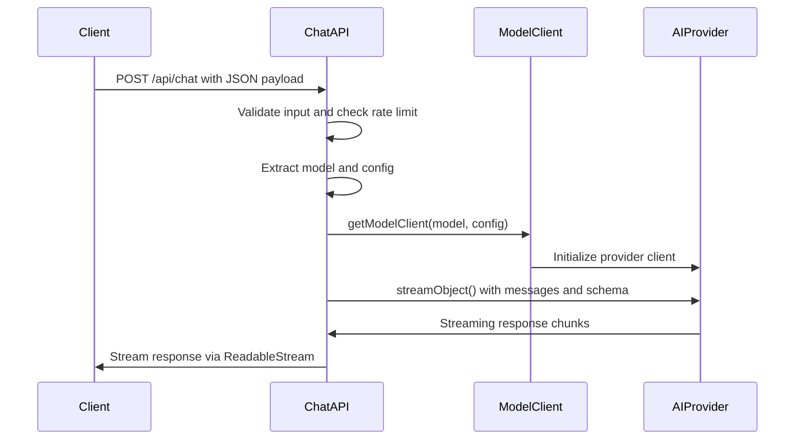
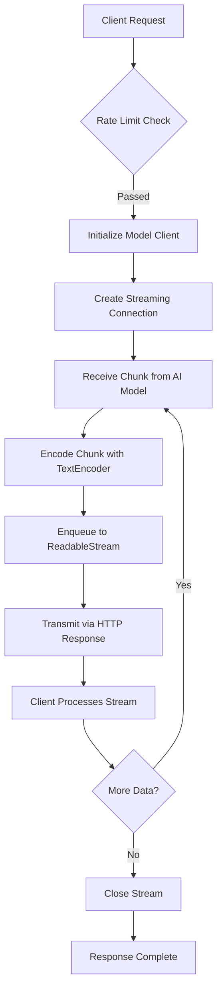
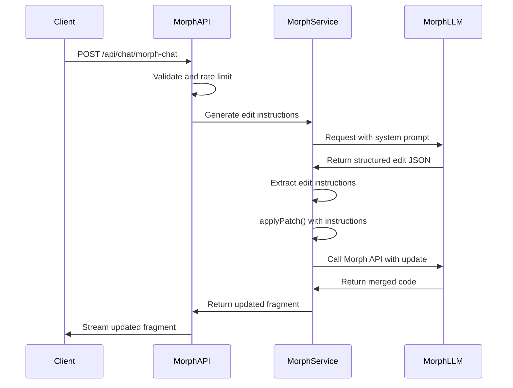
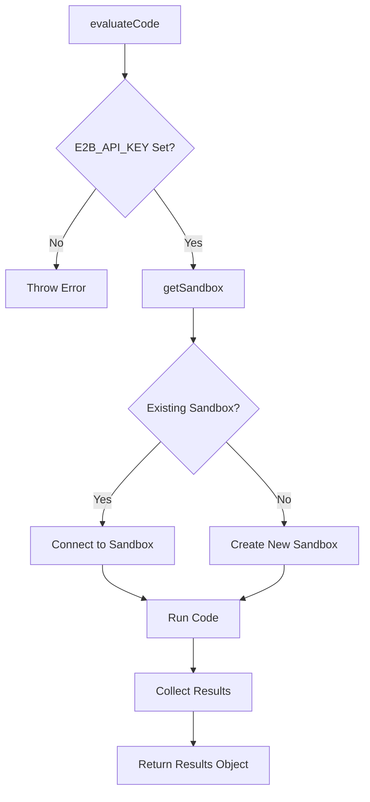
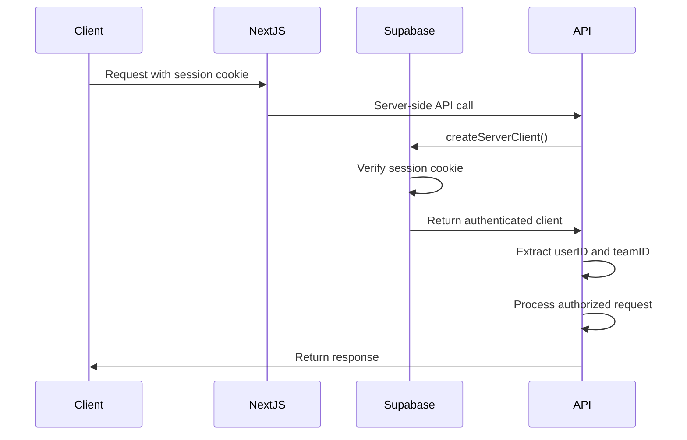
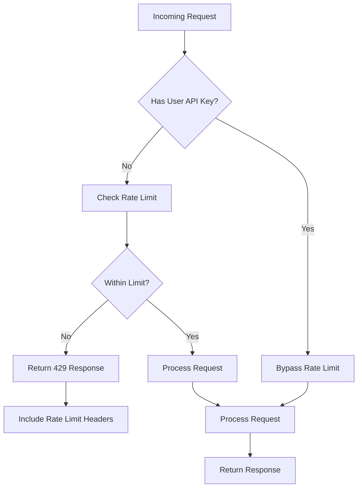
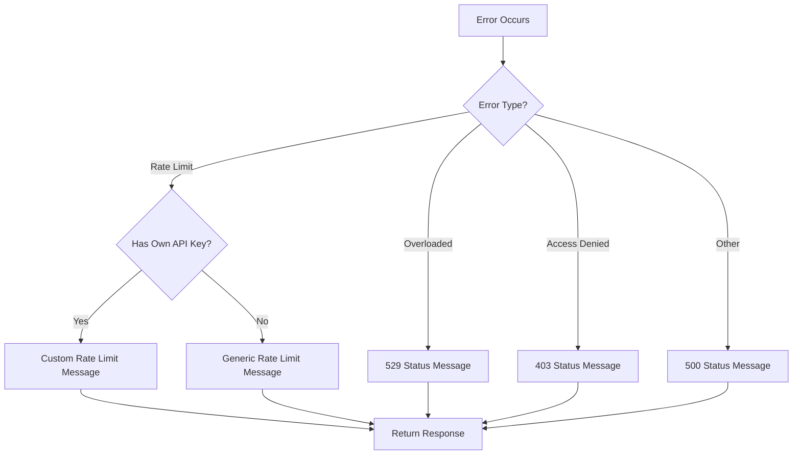
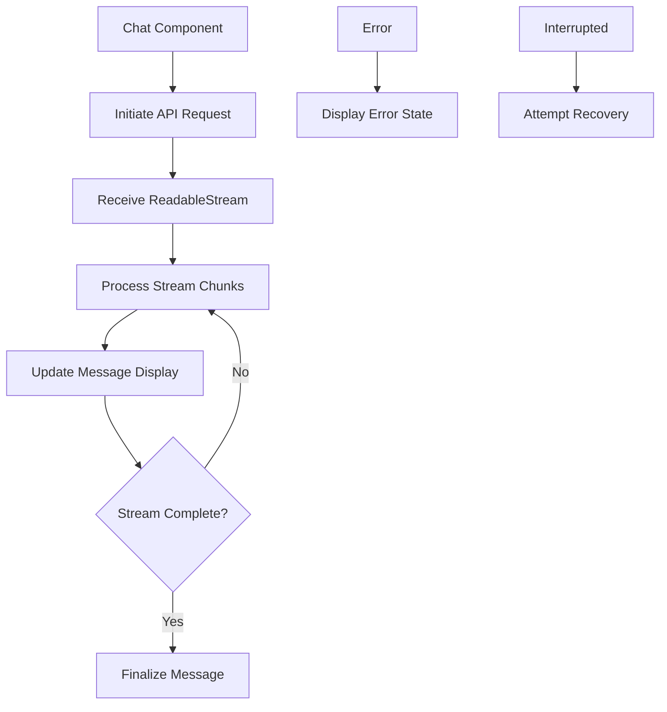

# Chat API

<cite>
**Referenced Files in This Document**   
- [route.ts](file://app/api/chat/route.ts)
- [morph-chat/route.ts](file://app/api/chat/morph-chat/route.ts)
- [codeInterpreter.ts](file://app/api/chat/codeInterpreter.ts)
- [api-errors.ts](file://lib/api-errors.ts)
- [models.ts](file://lib/models.ts)
- [prompt.ts](file://lib/prompt.ts)
- [morph.ts](file://lib/morph.ts)
- [schema.ts](file://lib/schema.ts)
- [templates.ts](file://lib/templates.ts)
- [ratelimit.ts](file://lib/ratelimit.ts)
- [supabase-server.ts](file://lib/supabase-server.ts)
- [supabase-credentials.ts](file://lib/supabase-credentials.ts)
</cite>

## Table of Contents
1. [Introduction](#introduction)
2. [POST /api/chat Endpoint](#post-apichat-endpoint)
3. [Streaming Response Mechanism](#streaming-response-mechanism)
4. [Morph-Chat Endpoint](#morph-chat-endpoint)
5. [CodeInterpreter Functionality](#codeinterpreter-functionality)
6. [Authentication and Authorization](#authentication-and-authorization)
7. [Rate Limiting Policies](#rate-limiting-policies)
8. [Error Handling](#error-handling)
9. [Request Payload Examples](#request-payload-examples)
10. [Frontend Integration](#frontend-integration)
11. [Error Recovery Mechanisms](#error-recovery-mechanisms)

## Introduction
The Chat API in CodingIT-1 provides a comprehensive interface for AI-powered conversations, enabling users to interact with various language models through a unified endpoint. This documentation details the core functionality of the chat system, including message processing, model integration, code execution, and conversation transformation features. The API supports streaming responses for real-time interaction and includes advanced capabilities like code interpretation and morph-based code editing.

**Section sources**
- [route.ts](file://app/api/chat/route.ts#L1-L71)
- [morph-chat/route.ts](file://app/api/chat/morph-chat/route.ts#L1-L110)
- [codeInterpreter.ts](file://app/api/chat/codeInterpreter.ts#L1-L57)

## POST /api/chat Endpoint
The primary entry point for AI conversations is the POST /api/chat endpoint, which processes user messages and generates AI responses. The endpoint accepts a structured JSON payload containing message history, user and team identifiers, template selection, model configuration, and system prompts. It orchestrates the interaction between the user's input and the selected language model through the AI SDK.

The request structure includes:
- **messages**: Array of CoreMessage objects representing conversation history
- **userID**: Identifier for the authenticated user
- **teamID**: Identifier for the user's team context
- **template**: Template selection that influences system behavior
- **model**: Specification of the target language model
- **config**: Configuration object containing API key, base URL, and generation parameters

The endpoint applies rate limiting and authentication checks before forwarding the request to the appropriate model provider via the getModelClient function.



**Diagram sources**
- [route.ts](file://app/api/chat/route.ts#L1-L71)
- [models.ts](file://lib/models.ts#L28-L98)

**Section sources**
- [route.ts](file://app/api/chat/route.ts#L1-L71)
- [models.ts](file://lib/models.ts#L28-L98)
- [prompt.ts](file://lib/prompt.ts#L2-L14)

## Streaming Response Mechanism
The Chat API implements real-time response streaming using ReadableStream and Server-Sent Events (SSE) to deliver AI-generated content incrementally. When a client initiates a chat request, the server establishes a streaming connection that transmits response chunks as they become available from the language model.

The streaming process follows these steps:
1. The AI SDK's streamObject function creates a streaming interface to the language model
2. As the model generates content, it is chunked and encoded using TextEncoder
3. Each chunk is enqueued to the ReadableStream controller
4. The stream is converted to a TextStreamResponse with appropriate headers
5. Client-side JavaScript processes the stream and updates the UI in real-time

This approach enables immediate feedback to users, reducing perceived latency and providing a more natural conversational experience. The streaming continues until the model completes its response or reaches the maximum duration limit of 300 seconds.



**Diagram sources**
- [route.ts](file://app/api/chat/route.ts#L1-L71)
- [lib/schema.ts](file://lib/schema.ts#L1-L72)

**Section sources**
- [route.ts](file://app/api/chat/route.ts#L1-L71)
- [lib/schema.ts](file://lib/schema.ts#L1-L72)

## Morph-Chat Endpoint
The morph-chat endpoint provides advanced conversation transformation capabilities, allowing users to modify existing code fragments through AI-powered editing. This endpoint accepts the current code fragment along with conversation history and applies intelligent code changes based on user requests.

Key features of the morph-chat endpoint include:
- Contextual system prompting that includes current file information
- Structured JSON output format for edit instructions
- Integration with the Morph API for reliable code patching
- Preservation of unchanged code sections using special markers
- Comprehensive error handling for invalid API keys or processing failures

The endpoint generates edit instructions containing commentary, a one-line instruction, and the actual code changes with markers indicating unchanged sections. These instructions are then applied to the original code using the applyPatch function, which communicates with the Morph API to produce the final result.



**Diagram sources**
- [morph-chat/route.ts](file://app/api/chat/morph-chat/route.ts#L1-L110)
- [morph.ts](file://lib/morph.ts#L3-L50)

**Section sources**
- [morph-chat/route.ts](file://app/api/chat/morph-chat/route.ts#L1-L110)
- [morph.ts](file://lib/morph.ts#L3-L50)
- [schema.ts](file://lib/schema.ts#L1-L72)

## CodeInterpreter Functionality
The CodeInterpreter functionality enables execution of code within the chat context, allowing users to test and validate AI-generated code snippets. Implemented through the E2B code interpreter sandbox, this feature provides a secure environment for code execution with session persistence.

Key aspects of the CodeInterpreter:
- Uses E2B API for secure code execution in isolated sandboxes
- Maintains sandbox sessions using sessionID for continuity
- Handles various programming languages and dependencies
- Returns execution results, stdout, stderr, and error information
- Implements timeout protection (10 minutes) to prevent long-running processes

The evaluateCode function first attempts to connect to an existing sandbox with the provided sessionID. If no existing sandbox is found, it creates a new one with metadata including the sessionID. This ensures that subsequent code executions within the same chat session can access variables and state from previous executions.



**Diagram sources**
- [codeInterpreter.ts](file://app/api/chat/codeInterpreter.ts#L1-L57)
- [lib/models.ts](file://lib/models.ts#L28-L98)

**Section sources**
- [codeInterpreter.ts](file://app/api/chat/codeInterpreter.ts#L1-L57)

## Authentication and Authorization
The Chat API implements authentication through Supabase session tokens, which are automatically handled by Next.js server components. The system uses Supabase's authentication infrastructure to verify user identity and manage sessions.

Authentication flow:
1. Client requests include Supabase session cookies
2. Server-side code uses createServerClient to access Supabase
3. User identity is verified through the Supabase authentication system
4. User and team IDs are extracted for context-aware processing
5. API operations are authorized based on user permissions

The createServerClient function in supabase-server.ts handles the creation of Supabase client instances with appropriate credentials. It supports both anonymous access (for public operations) and service role access (for privileged operations) through the useServiceRole parameter.



**Diagram sources**
- [supabase-server.ts](file://lib/supabase-server.ts#L4-L29)
- [supabase-credentials.ts](file://lib/supabase-credentials.ts#L1-L3)

**Section sources**
- [supabase-server.ts](file://lib/supabase-server.ts#L4-L29)
- [supabase-credentials.ts](file://lib/supabase-credentials.ts#L1-L3)

## Rate Limiting Policies
The Chat API implements rate limiting to ensure fair usage and prevent abuse of the system. Rate limiting is applied differently based on whether the user is using their own API key or relying on the platform's API key.

Rate limiting configuration:
- Default limit: 10 requests per day (configurable via environment variables)
- Window: 1 day (configurable via RATE_LIMIT_WINDOW)
- Exemption: Requests with user-provided API keys bypass rate limiting
- Storage: Uses Vercel KV for distributed rate limit tracking

The ratelimit function checks the client's IP address (via x-forwarded-for header) against the Redis-backed rate limit store. When a user exceeds their limit, the createRateLimitResponse function returns a 429 status code with appropriate headers indicating the rate limit parameters.



**Diagram sources**
- [ratelimit.ts](file://lib/ratelimit.ts#L1-L28)
- [api-errors.ts](file://lib/api-errors.ts#L22-L56)

**Section sources**
- [ratelimit.ts](file://lib/ratelimit.ts#L1-L28)
- [api-errors.ts](file://lib/api-errors.ts#L22-L56)
- [route.ts](file://app/api/chat/route.ts#L1-L71)

## Error Handling
The Chat API implements comprehensive error handling to manage various failure scenarios gracefully. The handleAPIError function centralizes error processing and returns appropriate HTTP responses based on the error type.

Error types handled:
- **Rate limit errors**: 429 status with provider-specific messaging
- **Overloaded errors**: 529 status when providers are unavailable
- **Access denied errors**: 403 status for invalid API keys
- **Generic errors**: 500 status for unexpected issues

The error handling system differentiates between errors occurring with user-provided API keys versus platform-managed keys. This allows for more informative error messages, such as suggesting users try their own API key when rate limits are reached.



**Diagram sources**
- [api-errors.ts](file://lib/api-errors.ts#L22-L56)
- [route.ts](file://app/api/chat/route.ts#L1-L71)

**Section sources**
- [api-errors.ts](file://lib/api-errors.ts#L22-L56)

## Request Payload Examples
The Chat API accepts structured JSON payloads for initiating conversations. Below are examples for different AI models:

### OpenAI Request
```json
{
  "messages": [
    {
      "role": "user",
      "content": "Create a React component for a button"
    }
  ],
  "userID": "user_123",
  "teamID": "team_456",
  "template": "react",
  "model": {
    "id": "gpt-4-turbo",
    "name": "GPT-4 Turbo",
    "provider": "OpenAI",
    "providerId": "openai"
  },
  "config": {
    "apiKey": "sk-...",
    "temperature": 0.7,
    "maxTokens": 4096
  }
}
```

### Anthropic Request
```json
{
  "messages": [
    {
      "role": "user",
      "content": "Explain the concept of recursion"
    }
  ],
  "userID": "user_123",
  "teamID": "team_456",
  "template": "general",
  "model": {
    "id": "claude-3-opus-20240229",
    "name": "Claude 3 Opus",
    "provider": "Anthropic",
    "providerId": "anthropic"
  },
  "config": {
    "apiKey": "sk-...",
    "temperature": 0.5
  }
}
```

### Local Model (Ollama) Request
```json
{
  "messages": [
    {
      "role": "user",
      "content": "Write a Python function to calculate factorial"
    }
  ],
  "userID": "user_123",
  "teamID": "team_456",
  "template": "python",
  "model": {
    "id": "codellama",
    "name": "CodeLlama",
    "provider": "Ollama",
    "providerId": "ollama"
  },
  "config": {
    "baseURL": "http://localhost:11434",
    "temperature": 0.8
  }
}
```

**Section sources**
- [route.ts](file://app/api/chat/route.ts#L1-L71)
- [models.ts](file://lib/models.ts#L28-L98)

## Frontend Integration
The Chat API integrates with the frontend Chat component through a streaming interface that handles real-time updates. The frontend establishes a connection to the API endpoint and processes the streaming response to update the UI incrementally.

Integration points:
- **Chat.client.tsx**: Manages the connection to the chat API
- **Messages.client.tsx**: Processes and displays streaming messages
- **stream-recovery.ts**: Handles stream recovery for interrupted connections
- **useMessageParser.ts**: Parses incoming message chunks
- **BaseChat.tsx**: Coordinates the overall chat interface

The frontend uses the ReadableStream API to consume the server-sent events and update the message display as content arrives. Error boundaries and loading states provide feedback during processing, while the Supabase connection ensures authentication tokens are properly included in requests.



**Diagram sources**
- [route.ts](file://app/api/chat/route.ts#L1-L71)
- [app/lib/.server/llm/stream-recovery.ts](file://apps/desktop/app/lib/.server/llm/stream-recovery.ts)

**Section sources**
- [route.ts](file://app/api/chat/route.ts#L1-L71)

## Error Recovery Mechanisms
The Chat API includes mechanisms for recovering from interrupted streams and handling connection issues. When a streaming response is interrupted, the system can resume from the point of failure using message history and context preservation.

Recovery strategies:
- **Stream recovery**: Uses message history to reconstruct context
- **Session persistence**: Maintains conversation state across requests
- **Error boundary handling**: Prevents UI crashes from API errors
- **Retry logic**: Implements controlled retries for transient failures

The stream-recovery.ts module provides functionality to restore interrupted conversations by analyzing the last successfully processed message and reconstructing the context needed to continue the conversation. This ensures users don't lose progress when network issues occur.

**Section sources**
- [app/lib/.server/llm/stream-recovery.ts](file://apps/desktop/app/lib/.server/llm/stream-recovery.ts)
- [route.ts](file://app/api/chat/route.ts#L1-L71)