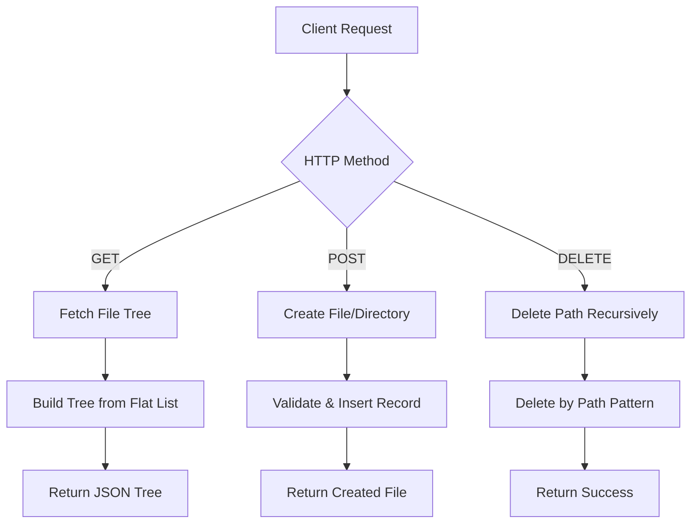
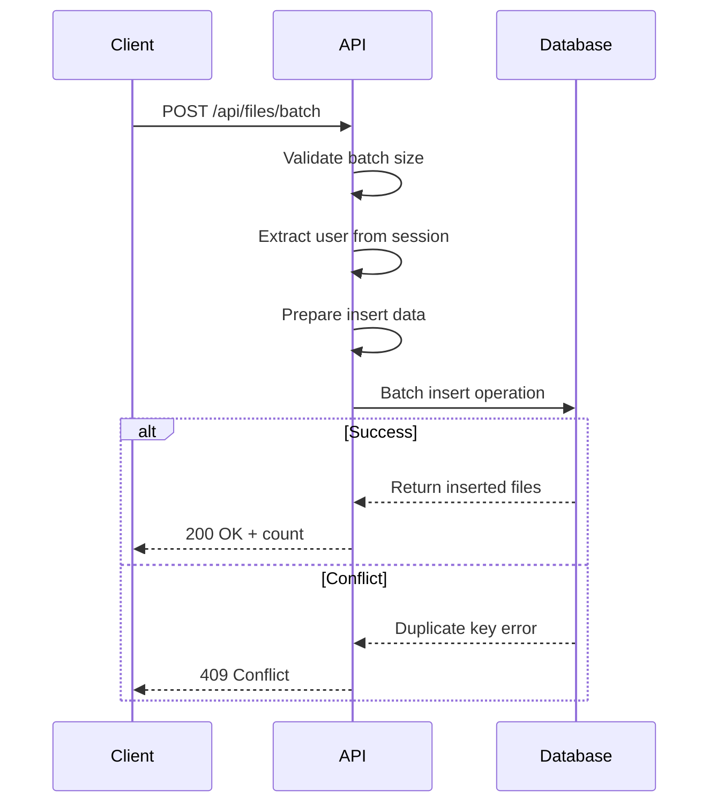
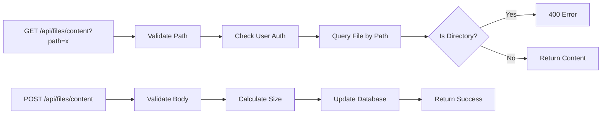
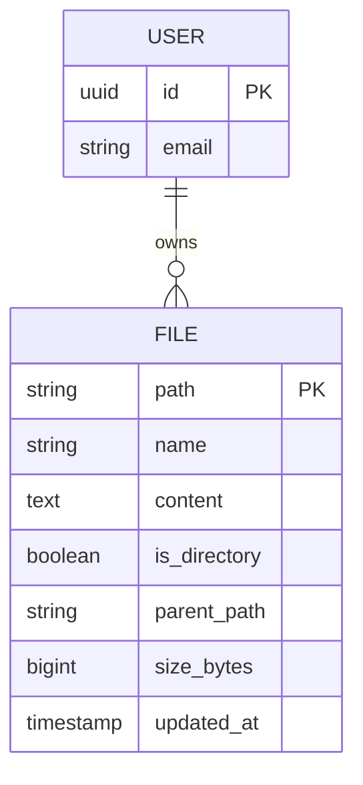
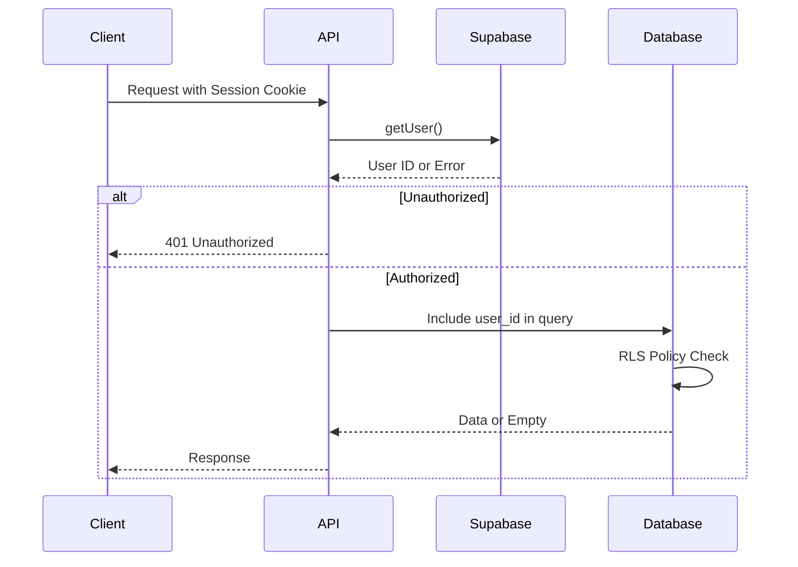

# Files API

<cite>
**Referenced Files in This Document**   
- [app/api/files/route.ts](file://app/api/files/route.ts)
- [app/api/files/batch/route.ts](file://app/api/files/batch/route.ts)
- [app/api/files/content/route.ts](file://app/api/files/content/route.ts)
- [lib/sandbox.ts](file://lib/sandbox.ts)
- [supabase/migrations/20250104000000_create_workspace_files_table.sql](file://supabase/migrations/20250104000000_create_workspace_files_table.sql)
</cite>

## Table of Contents
1. [Introduction](#introduction)
2. [Core Endpoints](#core-endpoints)
3. [Batch Operations](#batch-operations)
4. [Content Management](#content-management)
5. [Request and Response Schemas](#request-and-response-schemas)
6. [Authentication and Authorization](#authentication-and-authorization)
7. [Usage Examples](#usage-examples)
8. [Performance Considerations](#performance-considerations)
9. [Conflict Resolution](#conflict-resolution)
10. [Architecture Overview](#architecture-overview)

## Introduction
The Files API provides a comprehensive interface for managing file operations within the development environment. It supports full CRUD operations on files and directories through RESTful endpoints, with additional specialized routes for batch processing and content manipulation. The API is designed to support both interactive IDE operations and automated project setup workflows, with robust handling of text and binary content, proper encoding, and workspace-level access control.

**Section sources**
- [app/api/files/route.ts](file://app/api/files/route.ts#L1-L160)
- [supabase/migrations/20250104000000_create_workspace_files_table.sql](file://supabase/migrations/20250104000000_create_workspace_files_table.sql#L1-L57)

## Core Endpoints
The main `/api/files` endpoint supports GET, POST, and DELETE methods for retrieving file structures, creating new files/directories, and removing existing ones. The GET method returns a hierarchical file tree representation, while POST creates individual files or directories. DELETE removes a file or directory and all its children recursively using path prefix matching.



**Diagram sources**
- [app/api/files/route.ts](file://app/api/files/route.ts#L1-L160)

**Section sources**
- [app/api/files/route.ts](file://app/api/files/route.ts#L1-L160)

## Batch Operations
The `/api/files/batch` endpoint enables atomic creation of multiple files in a single request, essential for initializing project structures. It accepts an array of file objects with path and content, enforcing a 1000-file limit to prevent abuse. The operation uses a single database transaction to ensure all-or-nothing semantics, with conflict detection for existing files returning a 409 status.



**Diagram sources**
- [app/api/files/batch/route.ts](file://app/api/files/batch/route.ts#L1-L90)

**Section sources**
- [app/api/files/batch/route.ts](file://app/api/files/batch/route.ts#L1-L90)

## Content Management
The `/api/files/content` endpoint specializes in reading and writing file content with proper encoding handling. The GET method retrieves only the content of a specific file by path, while POST updates the content and automatically recalculates size metadata. Directory content access is explicitly prohibited with a 400 response.



**Diagram sources**
- [app/api/files/content/route.ts](file://app/api/files/content/route.ts#L1-L94)

**Section sources**
- [app/api/files/content/route.ts](file://app/api/files/content/route.ts#L1-L94)

## Request and Response Schemas
The API uses consistent JSON schemas for requests and responses. File objects include path, name, content, directory status, and metadata. The file tree response represents a nested structure with children arrays for directories. Batch operations expect an array of file inputs, while content operations focus on path and content pairs.



**Diagram sources**
- [app/api/files/route.ts](file://app/api/files/route.ts#L1-L160)
- [supabase/migrations/20250104000000_create_workspace_files_table.sql](file://supabase/migrations/20250104000000_create_workspace_files_table.sql#L1-L57)

## Authentication and Authorization
All endpoints require authentication via session cookies managed by Supabase Auth. The server verifies the user session and enforces ownership checks by including `user_id` in all database queries. Row Level Security (RLS) policies provide an additional enforcement layer, ensuring users can only access their own workspace files through both application logic and database policies.



**Diagram sources**
- [app/api/files/route.ts](file://app/api/files/route.ts#L1-L160)
- [supabase/migrations/20250104000000_create_workspace_files_table.sql](file://supabase/migrations/20250104000000_create_workspace_files_table.sql#L1-L57)

**Section sources**
- [app/api/files/route.ts](file://app/api/files/route.ts#L1-L160)
- [supabase/migrations/20250104000000_create_workspace_files_table.sql](file://supabase/migrations/20250104000000_create_workspace_files_table.sql#L1-L57)

## Usage Examples
Common use cases include creating project structures via batch import, updating multiple files in sequence, and handling different content types. For text files, UTF-8 encoding is automatically handled through Buffer.byteLength. Binary content should be base64-encoded before transmission. Directory creation requires setting `isDirectory: true` with empty content.

**Section sources**
- [app/api/files/route.ts](file://app/api/files/route.ts#L1-L160)
- [app/api/files/batch/route.ts](file://app/api/files/batch/route.ts#L1-L90)

## Performance Considerations
The API includes several performance optimizations: indexed database queries on user_id and path, batch operations to minimize round trips, and efficient file tree building from flat results. Large file operations are constrained by the 5-minute maxDuration setting in the batch endpoint. For optimal performance, clients should batch related file operations and leverage client-side caching of file listings.

**Section sources**
- [app/api/files/batch/route.ts](file://app/api/files/batch/route.ts#L1-L90)
- [supabase/migrations/20250104000000_create_workspace_files_table.sql](file://supabase/migrations/20250104000000_create_workspace_files_table.sql#L1-L57)

## Conflict Resolution
The API employs a strict conflict prevention strategy: the batch endpoint fails entirely if any target file exists (409 status), requiring clients to delete existing files first. This prevents accidental overwrites and ensures predictable state transitions. Individual file creation follows the same principle through the UNIQUE constraint on (user_id, path).

**Section sources**
- [app/api/files/batch/route.ts](file://app/api/files/batch/route.ts#L1-L90)
- [supabase/migrations/20250104000000_create_workspace_files_table.sql](file://supabase/migrations/20250104000000_create_workspace_files_table.sql#L1-L57)

## Architecture Overview
The Files API follows a clean separation of concerns with route handlers delegating to database operations while enforcing business rules. Supabase provides both authentication and storage, with RLS policies adding a security layer. The file tree representation transforms the flat database structure into a hierarchical format suitable for UI rendering.

```mermaid
graph TB
A[Client] --> B[/api/files]
A --> C[/api/files/batch]
A --> D[/api/files/content]
B --> E[Supabase Database]
C --> E
D --> E
B --> F[File Tree Builder]
E --> G[Row Level Security]
H[Session Cookie] --> B
H --> C
H --> D
```

**Diagram sources**
- [app/api/files/route.ts](file://app/api/files/route.ts#L1-L160)
- [app/api/files/batch/route.ts](file://app/api/files/batch/route.ts#L1-L90)
- [app/api/files/content/route.ts](file://app/api/files/content/route.ts#L1-L94)
- [supabase/migrations/20250104000000_create_workspace_files_table.sql](file://supabase/migrations/20250104000000_create_workspace_files_table.sql#L1-L57)