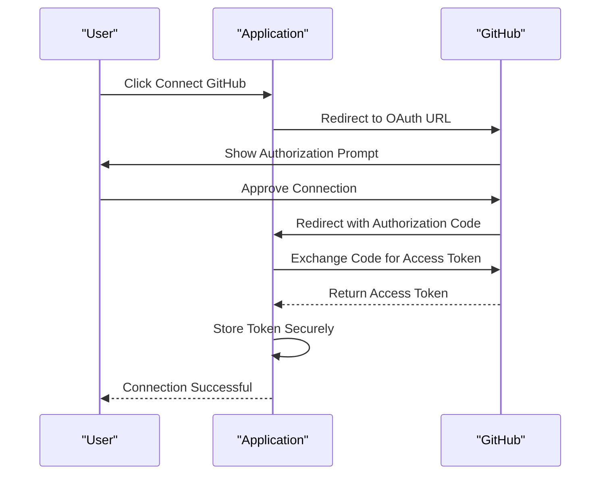
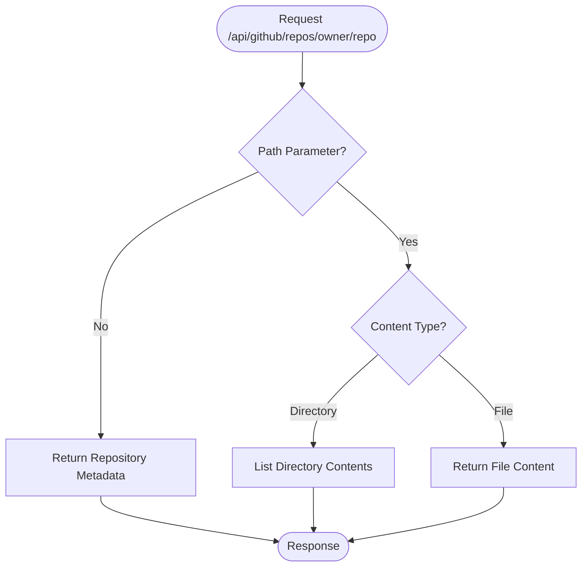
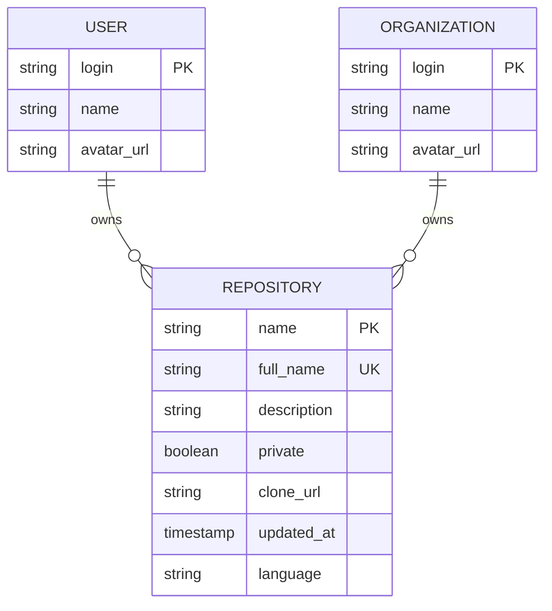
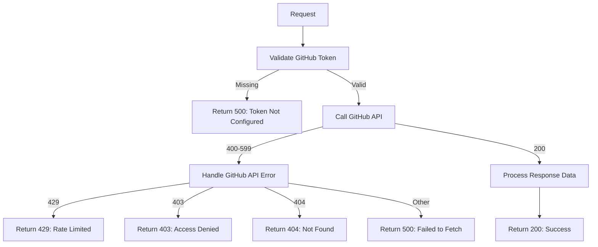

# GitHub Integration API

<cite>
**Referenced Files in This Document**   
- [user/route.ts](file://app/api/github/user/route.ts)
- [orgs/route.ts](file://app/api/github/orgs/route.ts)
- [repos/route.ts](file://app/api/github/repos/route.ts)
- [\[owner\]\[repo\]/route.ts](file://app/api/github/repos/[owner]/[repo]/route.ts)
- [github-oauth.ts](file://lib/github-oauth.ts)
- [api-errors.ts](file://lib/api-errors.ts)
- [github-import.tsx](file://components/github-import.tsx)
</cite>

## Table of Contents
1. [Introduction](#introduction)
2. [OAuth2 Authentication Flow](#oauth2-authentication-flow)
3. [User Endpoint](#user-endpoint)
4. [Orgs Endpoint](#orgs-endpoint)
5. [Repos Endpoint](#repos-endpoint)
6. [Repository Metadata and Content Access](#repository-metadata-and-content-access)
7. [Request/Response Formats](#requestresponse-formats)
8. [Error Handling](#error-handling)
9. [Usage Examples](#usage-examples)
10. [Architecture Overview](#architecture-overview)

## Introduction
The GitHub Integration API provides secure access to GitHub repositories and user data through a set of RESTful endpoints. Built on Next.js API routes, the system enables authenticated users to retrieve their GitHub profile information, organization memberships, and repository lists. The API supports dynamic repository access for metadata and content retrieval, facilitating repository import workflows and branch management operations within the application. Authentication is handled via OAuth2 using Supabase Auth with the GitHub provider, ensuring secure token management and refresh mechanisms.

## OAuth2 Authentication Flow
The GitHub Integration API uses OAuth2 authentication through Supabase Auth with the GitHub provider. The authentication flow begins with generating an authorization URL using the `generateGitHubOAuthUrl` function from `github-oauth.ts`, which includes required scopes for user email, repository access, webhook management, and organization reading. Upon successful authentication, GitHub redirects to the application with an authorization code, which is exchanged for an access token stored securely. The token is used for subsequent API requests to GitHub's REST API. Token revocation is supported through the `revokeGitHubToken` function, allowing users to disconnect their GitHub account securely.



**Diagram sources**
- [github-oauth.ts](file://lib/github-oauth.ts#L1-L290)

**Section sources**
- [github-oauth.ts](file://lib/github-oauth.ts#L1-L290)

## User Endpoint
The user endpoint retrieves authenticated user information from GitHub. Accessible via `GET /api/github/user`, this endpoint fetches the user's login, name, and avatar URL from GitHub's API using the stored access token. The endpoint validates the presence of the GitHub token in environment variables before making the request. Response data is sanitized to include only essential user information, enhancing security and reducing payload size. This endpoint serves as the foundation for user identification and personalization throughout the application.

**Section sources**
- [user/route.ts](file://app/api/github/user/route.ts#L1-L34)

## Orgs Endpoint
The orgs endpoint lists organization memberships for the authenticated GitHub user. Available at `GET /api/github/orgs`, it retrieves the user's organization memberships and returns each organization's login, name, and avatar URL. The endpoint uses the GitHub token to authenticate requests to the GitHub API's user organizations endpoint. Organizations are filtered to include only essential fields, providing a clean list of accessible organizations for repository discovery and access control purposes.

**Section sources**
- [orgs/route.ts](file://app/api/github/orgs/route.ts#L1-L36)

## Repos Endpoint
The repos endpoint queries repositories for a specified owner, supporting both user and organization repositories. Accessed via `GET /api/github/repos?owner={owner}`, this endpoint intelligently routes requests based on ownership type. For the authenticated user, it retrieves both public and private repositories using the authenticated user endpoint. For organizations, it first verifies the organization's existence before fetching repositories. The endpoint handles pagination automatically, retrieving all pages of results with a per-page limit of 100 repositories. Results are deduplicated and sorted alphabetically by repository name.

**Section sources**
- [repos/route.ts](file://app/api/github/repos/route.ts#L1-L112)

## Repository Metadata and Content Access
The dynamic `[owner]/[repo]` route enables access to specific repository metadata, contents, and permissions. Available at `GET /api/github/repos/[owner]/[repo]`, this endpoint supports path-based navigation through repository contents. When no path parameter is provided, it returns repository metadata including name, description, language, and update timestamp. When a path parameter is specified, it returns the directory structure or file content at that path. This hierarchical access pattern enables complete repository traversal for import operations and file management.



**Diagram sources**
- [\[owner\]\[repo\]/route.ts](file://app/api/github/repos/[owner]/[repo]/route.ts)

**Section sources**
- [repos/route.ts](file://app/api/github/repos/route.ts#L1-L112)
- [\[owner\]\[repo\]/route.ts](file://app/api/github/repos/[owner]/[repo]/route.ts)

## Request/Response Formats
The GitHub Integration API uses standard HTTP methods and JSON formatting for requests and responses. All endpoints use GET requests with appropriate query parameters for filtering. The user endpoint returns a JSON object containing login, name, and avatar_url fields. The orgs endpoint returns an array of organization objects with login, name, and avatar_url properties. The repos endpoint returns an array of repository objects with name, full_name, description, private, clone_url, updated_at, and language fields. Error responses follow a consistent format with error messages and appropriate HTTP status codes.



**Diagram sources**
- [user/route.ts](file://app/api/github/user/route.ts#L1-L34)
- [orgs/route.ts](file://app/api/github/orgs/route.ts#L1-L36)
- [repos/route.ts](file://app/api/github/repos/route.ts#L1-L112)

## Error Handling
The API implements comprehensive error handling for rate limits, permission denials, and service unavailability. The `api-errors.ts` file defines error detection functions for rate limit errors (status 429), overloaded services (status 529), and access denied errors (status 401/403). When GitHub API errors occur, the endpoints return appropriate HTTP status codes with descriptive error messages. Rate limiting is handled by detecting 429 responses from GitHub and propagating them to the client. Permission denials are identified by 403 responses, typically indicating insufficient OAuth scopes or repository access permissions.



**Diagram sources**
- [api-errors.ts](file://lib/api-errors.ts#L1-L72)
- [user/route.ts](file://app/api/github/user/route.ts#L1-L34)
- [orgs/route.ts](file://app/api/github/orgs/route.ts#L1-L36)
- [repos/route.ts](file://app/api/github/repos/route.ts#L1-L112)

**Section sources**
- [api-errors.ts](file://lib/api-errors.ts#L1-L72)

## Usage Examples
The GitHub Integration API supports repository import workflows and branch management operations. The `github-import.tsx` component demonstrates a complete repository import workflow, allowing users to search, select, and import repositories into their workspace. The import process recursively fetches all files from the selected repository and uses the batch file endpoint to import them. For branch management, the API provides the foundation for retrieving repository contents at specific branches or commits, though branch-specific operations would require extending the current endpoints. The integration also supports usage limits tracking, enabling subscription-based access control for repository imports.

**Section sources**
- [github-import.tsx](file://components/github-import.tsx#L1-L446)

## Architecture Overview
The GitHub Integration API follows a layered architecture with clear separation of concerns. API routes handle HTTP requests and responses, while utility functions in the lib directory manage business logic and external service integration. The system uses environment variables for secure storage of the GitHub token, eliminating the need for per-request token management. Client components consume the API endpoints to provide user interfaces for repository management and import operations. The architecture supports horizontal scaling of API routes and modular extension of GitHub functionality.

```mermaid
graph TB
subgraph "Client Layer"
UI[GitHub Import UI]
Hook[useAuth Hook]
end
subgraph "API Layer"
User[user/route.ts]
Orgs[orgs/route.ts]
Repos[repos/route.ts]
OwnerRepo[[owner][repo]/route.ts]
end
subgraph "Service Layer"
OAuth[github-oauth.ts]
Errors[api-errors.ts]
end
subgraph "External Services"
GitHubAPI[(GitHub API)]
SupabaseAuth[(Supabase Auth)]
end
UI --> User
UI --> Orgs
UI --> Repos
UI --> OwnerRepo
Hook --> SupabaseAuth
User --> GitHubAPI
Orgs --> GitHubAPI
Repos --> GitHubAPI
OwnerRepo --> GitHubAPI
User --> OAuth
Orgs --> OAuth
Repos --> OAuth
OwnerRepo --> OAuth
User --> Errors
Orgs --> Errors
Repos --> Errors
OwnerRepo --> Errors
```

**Diagram sources**
- [user/route.ts](file://app/api/github/user/route.ts)
- [orgs/route.ts](file://app/api/github/orgs/route.ts)
- [repos/route.ts](file://app/api/github/repos/route.ts)
- [\[owner\]\[repo\]/route.ts](file://app/api/github/repos/[owner]/[repo]/route.ts)
- [github-oauth.ts](file://lib/github-oauth.ts)
- [api-errors.ts](file://lib/api-errors.ts)
- [github-import.tsx](file://components/github-import.tsx)

**Section sources**
- [user/route.ts](file://app/api/github/user/route.ts#L1-L34)
- [orgs/route.ts](file://app/api/github/orgs/route.ts#L1-L36)
- [repos/route.ts](file://app/api/github/repos/route.ts#L1-L112)
- [\[owner\]\[repo\]/route.ts](file://app/api/github/repos/[owner]/[repo]/route.ts)
- [github-oauth.ts](file://lib/github-oauth.ts#L1-L290)
- [api-errors.ts](file://lib/api-errors.ts#L1-L72)
- [github-import.tsx](file://components/github-import.tsx#L1-L446)