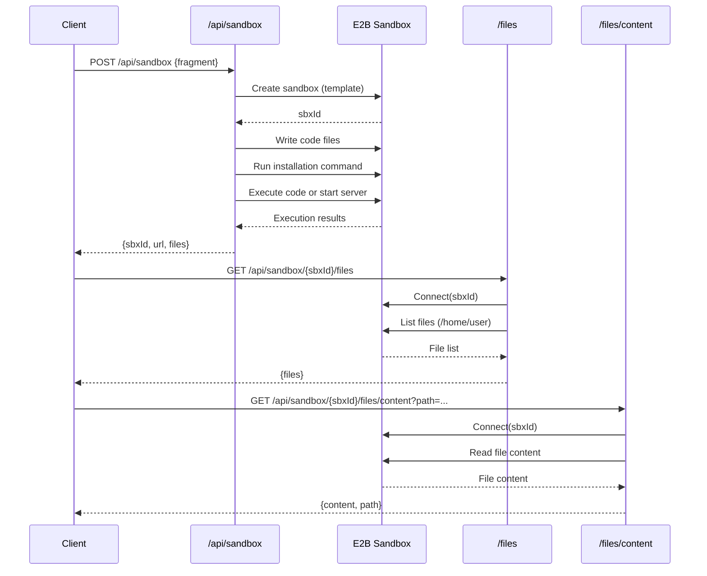
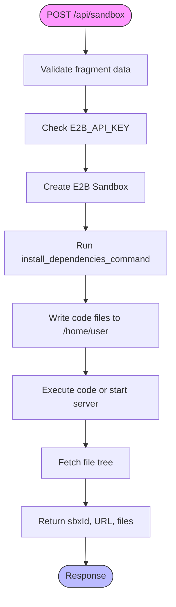
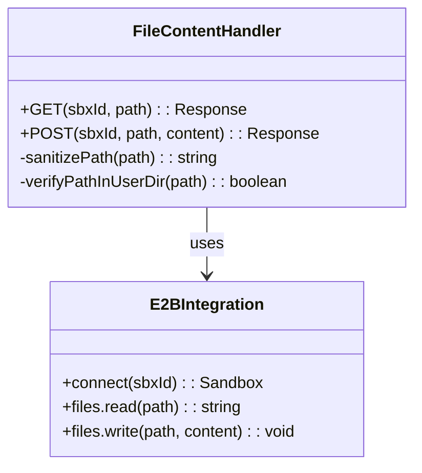

# Sandbox API

<cite>
**Referenced Files in This Document**   
- [app/api/sandbox/route.ts](file://app/api/sandbox/route.ts)
- [app/api/sandbox/[sbxId]/files/route.ts](file://app/api/sandbox/[sbxId]/files/route.ts)
- [app/api/sandbox/[sbxId]/files/content/route.ts](file://app/api/sandbox/[sbxId]/files/content/route.ts)
- [lib/sandbox.ts](file://lib/sandbox.ts)
- [lib/types.ts](file://lib/types.ts)
- [lib/schema.ts](file://lib/schema.ts)
- [lib/auth-utils.ts](file://lib/auth-utils.ts)
- [lib/api-errors.ts](file://lib/api-errors.ts)
</cite>

## Table of Contents
1. [Introduction](#introduction)
2. [Project Structure](#project-structure)
3. [Core Components](#core-components)
4. [Architecture Overview](#architecture-overview)
5. [Detailed Component Analysis](#detailed-component-analysis)
6. [Dependency Analysis](#dependency-analysis)
7. [Performance Considerations](#performance-considerations)
8. [Troubleshooting Guide](#troubleshooting-guide)
9. [Conclusion](#conclusion)

## Introduction
The Sandbox API provides secure execution environments for code fragments using E2B containers. It enables users to create isolated sandboxes, manage files within them, and execute code with proper resource allocation and security isolation. The API supports various development templates such as Next.js, Streamlit, Gradio, and Vue, allowing flexible deployment of web applications and code interpreters. Authentication is handled via JWT tokens integrated with Supabase, ensuring secure access control and team-based permissions.

## Project Structure
The Sandbox API is organized under the `app/api/sandbox` directory with a modular structure supporting RESTful endpoints for sandbox lifecycle management and file operations. The core functionality is implemented in route handlers using Next.js App Router conventions, with supporting utilities in the `lib` directory for type definitions, schema validation, and error handling.

```mermaid
graph TB
subgraph "API Endpoints"
A[/api/sandbox] --> B[/api/sandbox/[sbxId]/files]
B --> C[/api/sandbox/[sbxId]/files/content]
end
subgraph "Core Libraries"
D[lib/sandbox.ts] --> E[lib/types.ts]
D --> F[lib/schema.ts]
G[lib/auth-utils.ts] --> H[lib/api-errors.ts]
end
A --> D
B --> D
C --> D
```

**Diagram sources**
- [app/api/sandbox/route.ts](file://app/api/sandbox/route.ts#L1-L195)
- [app/api/sandbox/[sbxId]/files/route.ts](file://app/api/sandbox/[sbxId]/files/route.ts#L1-L78)
- [app/api/sandbox/[sbxId]/files/content/route.ts](file://app/api/sandbox/[sbxId]/files/content/route.ts#L1-L159)
- [lib/sandbox.ts](file://lib/sandbox.ts#L1-L29)

**Section sources**
- [app/api/sandbox/route.ts](file://app/api/sandbox/route.ts#L1-L195)
- [app/api/sandbox/[sbxId]/files/route.ts](file://app/api/sandbox/[sbxId]/files/route.ts#L1-L78)
- [app/api/sandbox/[sbxId]/files/content/route.ts](file://app/api/sandbox/[sbxId]/files/content/route.ts#L1-L159)

## Core Components
The Sandbox API consists of three main endpoints: `/api/sandbox` for creating sandboxes, `/api/sandbox/[sbxId]/files` for managing file trees, and `/api/sandbox/[sbxId]/files/content` for reading and writing individual file contents. These components work together to provide a complete solution for secure code execution and file management within isolated environments.

**Section sources**
- [app/api/sandbox/route.ts](file://app/api/sandbox/route.ts#L25-L195)
- [app/api/sandbox/[sbxId]/files/route.ts](file://app/api/sandbox/[sbxId]/files/route.ts#L1-L78)
- [app/api/sandbox/[sbxId]/files/content/route.ts](file://app/api/sandbox/[sbxId]/files/content/route.ts#L1-L159)

## Architecture Overview
The Sandbox API follows a service-oriented architecture where each endpoint handles specific aspects of sandbox management. The system integrates with the E2B Code Interpreter SDK to create and manage containers, while leveraging Supabase for authentication and authorization. All API routes run on Node.js runtime with extended duration limits to accommodate long-running code executions.



**Diagram sources**
- [app/api/sandbox/route.ts](file://app/api/sandbox/route.ts#L1-L195)
- [app/api/sandbox/[sbxId]/files/route.ts](file://app/api/sandbox/[sbxId]/files/route.ts#L1-L78)
- [app/api/sandbox/[sbxId]/files/content/route.ts](file://app/api/sandbox/[sbxId]/files/content/route.ts#L1-L159)

## Detailed Component Analysis

### Sandbox Creation Endpoint
The `/api/sandbox` endpoint handles the creation of new E2B containers based on specified templates. It validates incoming fragment data, creates a sandbox environment, installs dependencies, writes code files, and executes the code or starts a web server depending on the template type.



**Diagram sources**
- [app/api/sandbox/route.ts](file://app/api/sandbox/route.ts#L1-L195)

**Section sources**
- [app/api/sandbox/route.ts](file://app/api/sandbox/route.ts#L1-L195)

### File Management Endpoints
The file management endpoints provide RESTful operations for interacting with files within running sandboxes. The `/files` endpoint returns the directory structure as a tree, while the `/files/content` endpoint allows reading and writing individual file contents with path sanitization to prevent directory traversal attacks.

#### File Tree Endpoint
```mermaid
flowchart TD
A([GET /files]) --> B{Validate sbxId}
B --> |Invalid| C[Return 400]
B --> |Valid| D{Check E2B_API_KEY}
D --> |Missing| E[Return 503]
D --> |Present| F[Connect to Sandbox]
F --> G[List files at /home/user]
G --> H[Convert to FileSystemNode[]]
H --> I[Return JSON response]
I --> J([Success])
C --> K([Error])
E --> K
K --> End
J --> End
```

**Diagram sources**
- [app/api/sandbox/[sbxId]/files/route.ts](file://app/api/sandbox/[sbxId]/files/route.ts#L1-L78)

#### File Content Endpoint


**Diagram sources**
- [app/api/sandbox/[sbxId]/files/content/route.ts](file://app/api/sandbox/[sbxId]/files/content/route.ts#L1-L159)

**Section sources**
- [app/api/sandbox/[sbxId]/files/route.ts](file://app/api/sandbox/[sbxId]/files/route.ts#L1-L78)
- [app/api/sandbox/[sbxId]/files/content/route.ts](file://app/api/sandbox/[sbxId]/files/content/route.ts#L1-L159)

## Dependency Analysis
The Sandbox API relies on several external dependencies and internal modules to function correctly. The primary external dependency is the E2B Code Interpreter SDK, which provides the containerization and execution capabilities. Internally, the API uses Zod for schema validation, Supabase for authentication, and custom utilities for error handling and security.

```mermaid
dependency-graph
app/api/sandbox/route.ts --> lib/sandbox.ts
app/api/sandbox/route.ts --> lib/schema.ts
app/api/sandbox/route.ts --> lib/types.ts
app/api/sandbox/[sbxId]/files/route.ts --> lib/sandbox.ts
app/api/sandbox/[sbxId]/files/content/route.ts --> lib/sandbox.ts
lib/sandbox.ts --> @e2b/code-interpreter
app/api/sandbox/route.ts --> @e2b/code-interpreter
app/api/sandbox/[sbxId]/files/route.ts --> @e2b/code-interpreter
app/api/sandbox/[sbxId]/files/content/route.ts --> @e2b/code-interpreter
app/api/sandbox/route.ts --> lib/auth-utils.ts
app/api/sandbox/route.ts --> lib/api-errors.ts
```

**Diagram sources**
- [package.json](file://package.json)
- [app/api/sandbox/route.ts](file://app/api/sandbox/route.ts#L1-L195)
- [lib/sandbox.ts](file://lib/sandbox.ts#L1-L29)

**Section sources**
- [app/api/sandbox/route.ts](file://app/api/sandbox/route.ts#L1-L195)
- [lib/sandbox.ts](file://lib/sandbox.ts#L1-L29)
- [lib/auth-utils.ts](file://lib/auth-utils.ts#L1-L43)
- [lib/api-errors.ts](file://lib/api-errors.ts#L1-L72)

## Performance Considerations
The Sandbox API is configured with a maximum duration of 60 seconds to handle long-running code executions. Each sandbox has a timeout of 10 minutes (600,000ms) after which it will be automatically terminated. The API implements connection pooling through a Map-based cache in `lib/sandbox.ts` to reuse existing sandbox instances when possible, reducing initialization overhead.

The file operations are optimized by using the E2B SDK's native `files.list()` and `files.read()` methods rather than shell commands, improving reliability and performance. Path normalization and validation are performed synchronously to prevent security vulnerabilities without introducing significant latency.

## Troubleshooting Guide
Common issues with the Sandbox API typically relate to configuration, authentication, or resource limits. The following error types may occur:

- **Configuration Errors**: Missing `E2B_API_KEY` environment variable results in 503 Service Unavailable responses
- **Validation Errors**: Invalid or missing fragment data returns 400 Bad Request
- **Authentication Issues**: Invalid JWT tokens or missing authorization headers prevent access
- **Rate Limiting**: Excessive requests may trigger rate limiting at the infrastructure level
- **Execution Failures**: Code errors or dependency installation failures return 500 Internal Server Error

When troubleshooting, check server logs for detailed error messages and verify that all required environment variables are properly set. For persistent issues, ensure the E2B service is reachable and the API key has sufficient quota.

**Section sources**
- [app/api/sandbox/route.ts](file://app/api/sandbox/route.ts#L1-L195)
- [lib/api-errors.ts](file://lib/api-errors.ts#L1-L72)
- [lib/auth-utils.ts](file://lib/auth-utils.ts#L1-L43)

## Conclusion
The Sandbox API provides a robust and secure solution for executing code in isolated environments using E2B containers. It offers comprehensive functionality for creating sandboxes, managing files, and retrieving execution results through well-defined REST endpoints. The integration with authentication systems and proper error handling makes it suitable for production use in collaborative development environments. By following security best practices such as path sanitization and environment isolation, the API ensures safe code execution while maintaining flexibility for various development workflows.