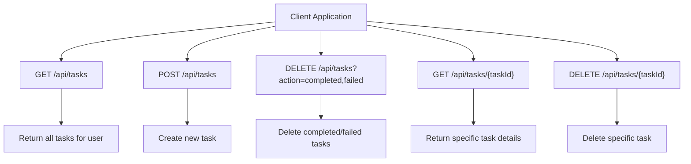
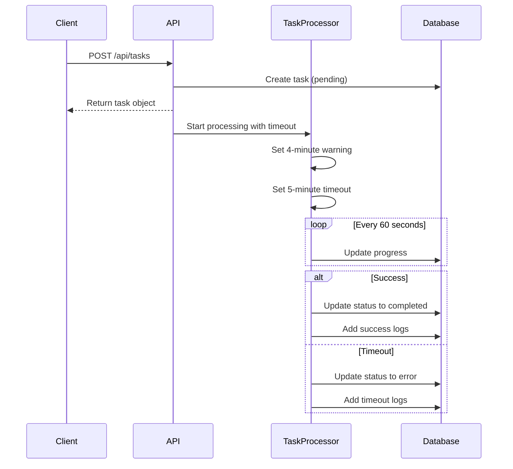
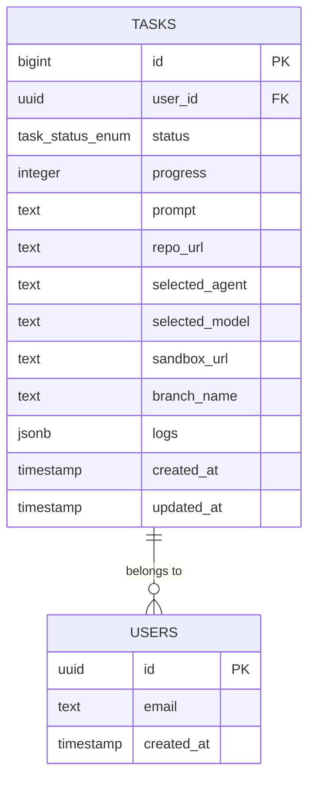

# Tasks API

<cite>
**Referenced Files in This Document**   
- [route.ts](file://app/api/tasks/route.ts)
- [\[taskId\]/route.ts](file://app/api/tasks/[taskId]/route.ts)
- [tasks.ts](file://lib/tasks.ts)
- [use-tasks.ts](file://hooks/use-tasks.ts)
- [use-task.ts](file://hooks/use-task.ts)
- [public.sql](file://supabase/schemas/public.sql)
- [20250929060300_create_tasks_table.sql](file://supabase/migrations/20250929060300_create_tasks_table.sql)
</cite>

## Table of Contents
1. [Introduction](#introduction)
2. [API Endpoints](#api-endpoints)
3. [Request/Response Schemas](#requestresponse-schemas)
4. [Authentication and Authorization](#authentication-and-authorization)
5. [Task Processing Workflow](#task-processing-workflow)
6. [Error Handling](#error-handling)
7. [Client-Side Implementation](#client-side-implementation)
8. [Database Schema](#database-schema)
9. [Usage Examples](#usage-examples)
10. [Polling and Notifications](#polling-and-notifications)

## Introduction
The Tasks API provides a comprehensive system for managing development workflows and background operations within the application. It enables users to create, retrieve, and manage tasks that represent various operations such as code generation, deployment processes, and other long-running background jobs. The API follows RESTful principles and integrates with Supabase for data persistence and authentication.

The system is designed to handle asynchronous operations with proper status tracking, progress reporting, and error handling. Each task maintains a complete log of its execution process, allowing users to monitor progress and troubleshoot issues effectively.

**Section sources**
- [route.ts](file://app/api/tasks/route.ts#L1-L217)
- [tasks.ts](file://lib/tasks.ts#L1-L262)

## API Endpoints
The Tasks API provides several endpoints for managing tasks through HTTP operations.

### GET /api/tasks
Retrieves a list of all tasks for the authenticated user, ordered by creation date in descending order (most recent first). The response includes complete task details including logs, which are parsed from JSON format.

### POST /api/tasks
Creates a new task with the provided parameters. The endpoint validates required fields, creates the task record, and initiates asynchronous processing. Upon successful creation, it returns the created task object.

### DELETE /api/tasks
Deletes tasks based on their status. This bulk operation accepts an action parameter specifying which task statuses to remove (completed or failed). Multiple actions can be specified using comma separation.

### GET /api/tasks/[taskId]
Retrieves detailed information about a specific task identified by its ID. The endpoint returns the complete task object with parsed logs. Access is restricted to the task owner through Row Level Security.

### DELETE /api/tasks/[taskId]
Deletes a specific task identified by its ID. The operation first verifies the task exists before proceeding with deletion.



**Diagram sources**
- [route.ts](file://app/api/tasks/route.ts#L1-L217)
- [\[taskId\]/route.ts](file://app/api/tasks/[taskId]/route.ts#L1-L68)

**Section sources**
- [route.ts](file://app/api/tasks/route.ts#L1-L217)
- [\[taskId\]/route.ts](file://app/api/tasks/[taskId]/route.ts#L1-L68)

## Request/Response Schemas
The Tasks API uses consistent schemas for request and response payloads.

### Task Object Schema
The task object represents a background operation with the following properties:

| Property | Type | Required | Description |
|---------|------|----------|-------------|
| id | string | Yes | Unique identifier for the task |
| user_id | string | Yes | ID of the user who owns the task |
| status | string | Yes | Current status of the task (pending, processing, completed, error) |
| progress | number | Yes | Progress percentage (0-100) |
| prompt | string | Yes | Description of the task to be performed |
| repo_url | string | No | Repository URL associated with the task |
| selected_agent | string | No | AI agent selected for the task (default: claude) |
| selected_model | string | No | Model selected for processing |
| sandbox_url | string | No | URL of the sandbox environment |
| branch_name | string | No | Git branch name for the operation |
| logs | array | Yes | Array of log entries with timestamp and message |
| created_at | string | Yes | ISO timestamp of task creation |
| updated_at | string | Yes | ISO timestamp of last update |

### Task Log Schema
Each log entry in the task logs array has the following structure:

| Property | Type | Description |
|---------|------|-------------|
| id | string | Unique identifier for the log entry |
| timestamp | string | ISO timestamp of the log entry |
| type | string | Type of log (info, error, success, command) |
| message | string | Log message content |

### Create Task Request
The POST request to create a new task requires the following JSON payload:

```json
{
  "prompt": "string",
  "repoUrl": "string",
  "selectedAgent": "string",
  "selectedModel": "string"
}
```

The `prompt` field is required, while other fields are optional.

### Response Format
All API responses follow a consistent JSON format:

```json
{
  "task": { /* task object */ },
  "tasks": [ /* array of task objects */ ],
  "message": "string",
  "error": "string",
  "deletedCount": "number"
}
```

The response includes either a `task` or `tasks` property depending on whether a single task or multiple tasks are returned, along with optional message, error, and count properties as appropriate.

**Section sources**
- [tasks.ts](file://lib/tasks.ts#L1-L262)
- [route.ts](file://app/api/tasks/route.ts#L1-L217)

## Authentication and Authorization
The Tasks API implements robust authentication and authorization mechanisms to ensure data security and privacy.

### Session-Based Authentication
The API uses Supabase authentication to verify user identity. When a request is received, the system extracts the user session and validates their authentication status. The `createServerClient` function from `@/lib/supabase-server` handles the authentication process, ensuring that only authenticated users can access the API endpoints.

### Task Ownership and Row Level Security
All tasks are associated with a specific user through the `user_id` field. The system enforces strict ownership rules using Supabase Row Level Security (RLS). The RLS policy "Users can manage their own tasks" ensures that users can only access, modify, or delete tasks that they own.

This security model prevents unauthorized access to tasks and ensures data isolation between users. Even if a user knows the ID of another user's task, the RLS policy will prevent access to that task.

### Authorization Checks
Authorization is automatically handled through the Supabase integration. When retrieving or modifying tasks, the system verifies that the authenticated user's ID matches the `user_id` field of the task. This check occurs at the database level through RLS policies, providing an additional layer of security beyond application-level checks.

**Section sources**
- [route.ts](file://app/api/tasks/route.ts#L1-L217)
- [public.sql](file://supabase/schemas/public.sql#L778-L782)
- [20250929060300_create_tasks_table.sql](file://supabase/migrations/20250929060300_create_tasks_table.sql#L30-L33)

## Task Processing Workflow
The Tasks API implements a comprehensive workflow for handling background operations from creation to completion.

### Task Creation and Initialization
When a new task is created via POST /api/tasks, the system performs the following steps:
1. Validates the request and extracts user authentication
2. Creates a new task record with status "pending" and progress 0%
3. Returns the created task to the client
4. Initiates asynchronous processing in the background

The task creation process includes validation of required fields, particularly ensuring that the prompt is provided.

### Asynchronous Processing with Timeout
Created tasks are processed asynchronously using the `processTaskWithTimeout` function, which implements a 5-minute timeout mechanism:



**Diagram sources**
- [route.ts](file://app/api/tasks/route.ts#L80-L118)
- [tasks.ts](file://lib/tasks.ts#L218-L262)

The timeout mechanism includes a warning at the 4-minute mark, informing the user that the task is taking longer than expected and will timeout in one minute if not completed.

### Progress Tracking and Logging
During processing, the system provides real-time feedback through progress updates and detailed logging. The `TaskLogger` class provides methods to update task status, progress, and add log entries of different types (info, error, success, command).

The processing workflow typically follows this pattern:
1. Update status to "processing"
2. Set initial progress (10%) with initialization message
3. Progress through various stages (setup, processing, finalizing)
4. Update to 100% upon completion
5. Set final status (completed or error)

### Status Management
The system supports four task statuses:
- **pending**: Task created but not yet processing
- **processing**: Task is actively being executed
- **completed**: Task finished successfully
- **error**: Task failed to complete

Status transitions are logged, and error states include detailed error messages to aid troubleshooting.

**Section sources**
- [route.ts](file://app/api/tasks/route.ts#L80-L118)
- [tasks.ts](file://lib/tasks.ts#L218-L262)

## Error Handling
The Tasks API implements comprehensive error handling to ensure reliability and provide meaningful feedback to users.

### Client-Side Validation
The API performs validation on incoming requests, particularly for the POST endpoint. The most critical validation ensures that the `prompt` field is provided, returning a 400 Bad Request response if missing.

### Server-Side Error Management
The system uses try-catch blocks to capture and handle errors throughout the task lifecycle. All errors are logged to the console for debugging purposes, while user-friendly error messages are returned in the response.

For the GET endpoints, if a task is not found, the API returns a 404 Not Found response. For other errors, a 500 Internal Server Error is returned with a generic error message to prevent exposing sensitive information.

### Task-Specific Error Handling
The asynchronous task processing includes specialized error handling:
- **Timeout errors**: Tasks that exceed the 5-minute limit are marked as failed with a specific timeout message
- **Processing errors**: Any errors during task execution are caught, logged, and result in the task status being set to "error"
- **Database errors**: Failures in database operations are handled gracefully, with appropriate error responses

The system also handles timeout warnings, adding informational logs when a task approaches its time limit.

### Bulk Operation Validation
The DELETE endpoint for bulk task deletion includes validation of the action parameter:
- Requires the action parameter to be present
- Validates that only supported actions (completed, failed) are specified
- Returns appropriate error responses for invalid inputs

```mermaid
flowchart TD
A[Start] --> B{Operation}
B --> C[GET /api/tasks]
B --> D[POST /api/tasks]
B --> E[DELETE /api/tasks]
B --> F[GET /api/tasks/{id}]
B --> G[DELETE /api/tasks/{id}]
C --> H{Success?}
H --> |Yes| I[Return tasks]
H --> |No| J[Log error, return 500]
D --> K{Valid prompt?}
K --> |No| L[Return 400]
K --> |Yes| M[Create task]
M --> N{Success?}
N --> |Yes| O[Return task]
N --> |No| P[Return 500]
E --> Q{Valid action?}
Q --> |No| R[Return 400]
Q --> |Yes| S[Delete tasks]
S --> T{Success?}
T --> |Yes| U[Return result]
T --> |No| V[Return 500]
F --> W{Task exists?}
W --> |No| X[Return 404]
W --> |Yes| Y[Return task]
G --> Z{Task exists?}
Z --> |No| AA[Return 404]
Z --> |Yes| AB[Delete task]
AB --> AC{Success?}
AC --> |Yes| AD[Return success]
AC --> |No| AE[Return 500]
```

**Diagram sources**
- [route.ts](file://app/api/tasks/route.ts#L1-L217)
- [\[taskId\]/route.ts](file://app/api/tasks/[taskId]/route.ts#L1-L68)

**Section sources**
- [route.ts](file://app/api/tasks/route.ts#L1-L217)
- [\[taskId\]/route.ts](file://app/api/tasks/[taskId]/route.ts#L1-L68)

## Client-Side Implementation
The Tasks API is consumed by client-side components that provide a user interface for task management.

### useTasks Hook
The `useTasks` hook provides a React interface for interacting with the Tasks API:

```typescript
const { tasks, isLoading, error, refetch, createTask, deleteTasks } = useTasks();
```

This hook manages:
- Fetching the list of tasks on component mount
- Creating new tasks with the specified parameters
- Deleting tasks by status (completed or failed)
- Maintaining loading and error states
- Providing a refresh function to manually update the task list

### useTask Hook
The `useTask` hook manages individual task details:

```typescript
const { task, isLoading, error, refetch } = useTask(taskId);
```

This hook includes automatic polling every 5 seconds to keep the task status updated in real-time, which is essential for monitoring long-running operations.

### State Management
The hooks use React's useState and useEffect hooks to manage component state and side effects. They handle loading states during API calls and provide error messages when operations fail.

The createTask function optimistically updates the task list by adding the new task to the beginning of the array, providing immediate feedback to the user while the background processing occurs.

**Section sources**
- [use-tasks.ts](file://hooks/use-tasks.ts#L1-L99)
- [use-task.ts](file://hooks/use-task.ts#L1-L46)

## Database Schema
The Tasks API relies on a well-structured database schema to store and manage task data.

### Tasks Table Structure
The tasks table in the database includes the following columns:

| Column | Type | Constraints | Description |
|-------|------|-------------|-------------|
| id | bigint | PRIMARY KEY, GENERATED ALWAYS AS IDENTITY | Unique identifier |
| user_id | uuid | NOT NULL, FOREIGN KEY to auth.users(id) | Owner of the task |
| status | task_status_enum | NOT NULL, DEFAULT 'pending' | Current status |
| progress | integer | NOT NULL, DEFAULT 0, CHECK (0-100) | Completion percentage |
| prompt | text | NOT NULL, CHECK (length >= 1) | Task description |
| repo_url | text | NULLABLE | Repository URL |
| selected_agent | text | DEFAULT 'claude' | AI agent selection |
| selected_model | text | NULLABLE | Model selection |
| sandbox_url | text | NULLABLE | Sandbox environment URL |
| branch_name | text | NULLABLE | Git branch name |
| logs | jsonb | DEFAULT '[]'::jsonb | Array of log entries |
| created_at | timestamp with time zone | NOT NULL, DEFAULT now() | Creation timestamp |
| updated_at | timestamp with time zone | NOT NULL, DEFAULT now() | Last update timestamp |

### Indexes for Performance
The database includes several indexes to optimize query performance:
- `idx_tasks_user_id` on user_id for filtering by owner
- `idx_tasks_status` on status for filtering by task state
- `idx_tasks_created_at` on created_at DESC for chronological ordering

### Row Level Security
The table has Row Level Security enabled with a policy that allows users to manage only their own tasks:

```sql
CREATE POLICY "Users can manage their own tasks" ON public.tasks
  FOR ALL USING (auth.uid() = user_id);
```

This policy ensures data isolation between users and prevents unauthorized access to tasks.



**Diagram sources**
- [public.sql](file://supabase/schemas/public.sql#L698-L742)
- [20250929060300_create_tasks_table.sql](file://supabase/migrations/20250929060300_create_tasks_table.sql#L1-L33)

**Section sources**
- [public.sql](file://supabase/schemas/public.sql#L698-L742)
- [20250929060300_create_tasks_table.sql](file://supabase/migrations/20250929060300_create_tasks_table.sql#L1-L33)

## Usage Examples
The Tasks API supports various use cases for development workflows and background operations.

### Code Generation Task
Creating a task to generate code based on a prompt:

```javascript
const task = await createTask({
  prompt: "Create a React component for a user profile card with avatar, name, and bio",
  selectedAgent: "claude",
  selectedModel: "claude-3-opus-20240229"
});
```

This would initiate a background process to generate the requested component, with progress updates as the AI processes the request.

### Deployment Operation
Creating a task to deploy an application to a specific environment:

```javascript
const task = await createTask({
  prompt: "Deploy the current branch to the staging environment",
  repoUrl: "https://github.com/user/project.git",
  selectedAgent: "deployment-bot"
});
```

The system would process this request, potentially creating a deployment pipeline and providing status updates throughout the deployment process.

### Long-Running Process
For operations that may take extended time, such as data processing or complex builds:

```javascript
const task = await createTask({
  prompt: "Process 10,000 records and generate analytics report",
  selectedAgent: "data-processor"
});
```

The 5-minute timeout provides a reasonable limit for most operations, with the system handling timeouts gracefully by marking the task as failed with an appropriate message.

### Bulk Cleanup
Removing completed and failed tasks to clean up the task list:

```javascript
// Delete all completed tasks
await deleteTasks(['completed']);

// Delete all failed tasks  
await deleteTasks(['failed']);

// Delete both completed and failed tasks
await deleteTasks(['completed', 'failed']);
```

This helps maintain a clean task list by removing tasks that have served their purpose.

**Section sources**
- [route.ts](file://app/api/tasks/route.ts#L1-L217)
- [tasks.ts](file://lib/tasks.ts#L1-L262)
- [use-tasks.ts](file://hooks/use-tasks.ts#L1-L99)

## Polling and Notifications
The Tasks API supports various strategies for monitoring task progress and receiving updates.

### Client-Side Polling
The `useTask` hook implements automatic polling every 5 seconds to check for updates to a specific task:

```javascript
useEffect(() => {
  const interval = setInterval(() => {
    fetchTask();
  }, 5000);
  
  return () => clearInterval(interval);
}, [fetchTask, taskId]);
```

This ensures that the UI remains up-to-date with the current task status without requiring manual refreshes.

### Real-Time Logging
As tasks progress, they generate log entries that are stored in the database. These logs provide detailed information about the processing steps, including:
- Initialization messages
- Progress updates at various stages
- Success or error messages upon completion
- Command execution details

Clients can display these logs to provide transparency into the task execution process.

### Future Webhook Integration
While not currently implemented, the system architecture supports webhook notifications for task completion. This would allow external systems to be notified when tasks complete, enabling integration with other services and workflows.

The current polling approach provides reliable updates for the user interface, while webhook support could be added for external integrations in the future.

### Progress Indicators
The combination of status and progress fields enables rich progress visualization in the UI:
- Status text (Pending, Processing, Completed, Failed)
- Progress bar based on the progress percentage
- Timestamps showing how long the task has been running
- Log entries providing detailed step-by-step information

This comprehensive approach to progress tracking helps users understand the current state of their background operations.

**Section sources**
- [use-task.ts](file://hooks/use-task.ts#L1-L46)
- [tasks.ts](file://lib/tasks.ts#L218-L262)
- [route.ts](file://app/api/tasks/route.ts#L80-L118)