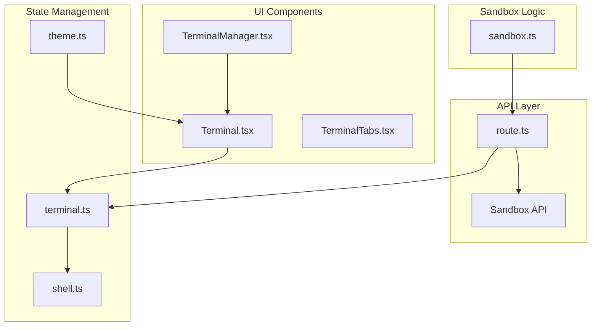
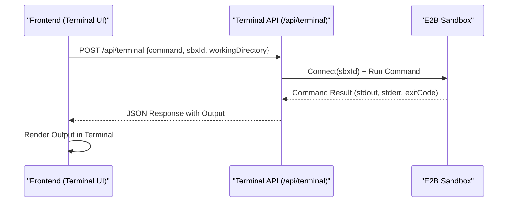
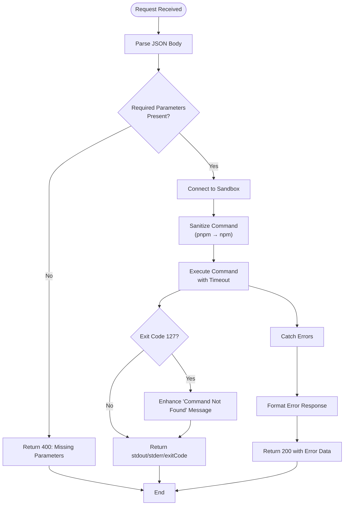
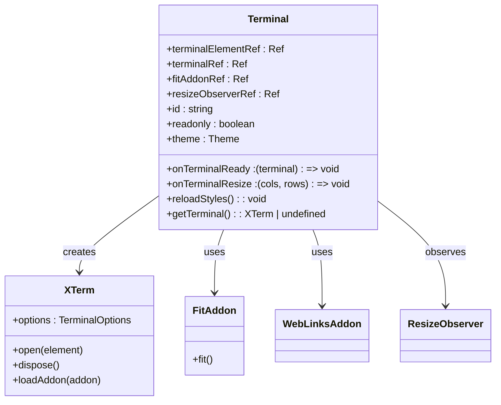
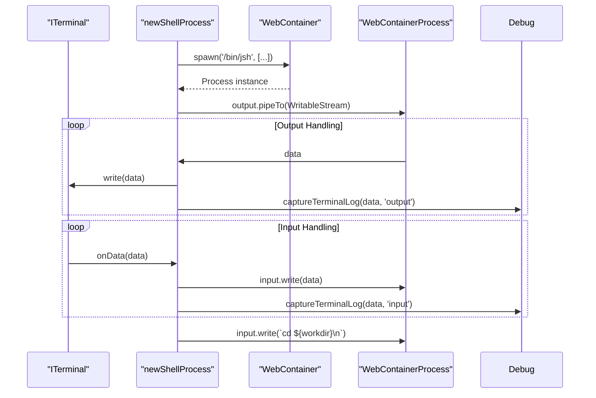
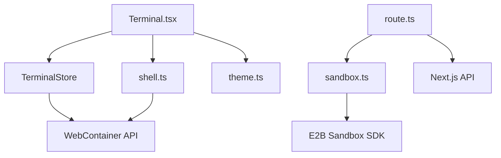

# Terminal API

<cite>
**Referenced Files in This Document**   
- [route.ts](file://app/api/terminal/route.ts)
- [Terminal.tsx](file://apps/desktop/app/components/workbench/terminal/Terminal.tsx)
- [TerminalManager.tsx](file://apps/desktop/app/components/workbench/terminal/TerminalManager.tsx)
- [sandbox.ts](file://lib/sandbox.ts)
- [terminal.ts](file://apps/desktop/app/lib/stores/terminal.ts)
- [shell.ts](file://apps/desktop/app/utils/shell.ts)
- [theme.ts](file://apps/desktop/app/components/workbench/terminal/theme.ts)
</cite>

## Table of Contents
1. [Introduction](#introduction)
2. [Project Structure](#project-structure)
3. [Core Components](#core-components)
4. [Architecture Overview](#architecture-overview)
5. [Detailed Component Analysis](#detailed-component-analysis)
6. [Dependency Analysis](#dependency-analysis)
7. [Performance Considerations](#performance-considerations)
8. [Troubleshooting Guide](#troubleshooting-guide)
9. [Conclusion](#conclusion)

## Introduction
The Terminal API enables real-time command execution within development environments through a WebSocket-based interface. This document details the `/api/terminal` endpoint that establishes persistent connections to sandboxed terminal sessions, allowing secure and interactive command-line access. The system supports message framing for commands, input, and output streaming with proper encoding, ensuring reliable communication between client and server. Authentication is handled via session tokens with authorization checks tied to active sandbox ownership. The lifecycle of terminal sessions—including creation, command execution, and resource cleanup—is managed to ensure efficient resource utilization and security. This documentation provides implementation details, usage examples, and security considerations for preventing command injection and enforcing resource limits.

## Project Structure
The Terminal API is organized across multiple directories, with core functionality split between API routes, UI components, and utility stores. The backend logic resides in the `app/api/terminal` directory, while frontend components are located in `apps/desktop/app/components/workbench/terminal`. Supporting logic for sandbox management and terminal state is found in the `lib` and `apps/desktop/app/lib/stores` directories.



**Diagram sources**
- [route.ts](file://app/api/terminal/route.ts#L1-L90)
- [Terminal.tsx](file://apps/desktop/app/components/workbench/terminal/Terminal.tsx#L1-L132)
- [terminal.ts](file://apps/desktop/app/lib/stores/terminal.ts#L1-L69)
- [shell.ts](file://apps/desktop/app/utils/shell.ts#L1-L92)
- [sandbox.ts](file://lib/sandbox.ts#L1-L29)

**Section sources**
- [route.ts](file://app/api/terminal/route.ts#L1-L90)
- [Terminal.tsx](file://apps/desktop/app/components/workbench/terminal/Terminal.tsx#L1-L132)

## Core Components
The Terminal API consists of several key components responsible for handling terminal session lifecycle, command execution, and UI integration. The backend `route.ts` file processes incoming POST requests to execute commands within a sandboxed environment. The frontend `Terminal.tsx` component renders the terminal interface using xterm.js, while `TerminalManager.tsx` orchestrates multiple terminal instances. The `terminal.ts` store manages state for active terminal processes, and `shell.ts` handles process spawning and I/O piping. The `sandbox.ts` utility manages connections to E2B sandboxes, ensuring isolation and security.

**Section sources**
- [route.ts](file://app/api/terminal/route.ts#L1-L90)
- [Terminal.tsx](file://apps/desktop/app/components/workbench/terminal/Terminal.tsx#L1-L132)
- [terminal.ts](file://apps/desktop/app/lib/stores/terminal.ts#L1-L69)
- [shell.ts](file://apps/desktop/app/utils/shell.ts#L1-L92)
- [sandbox.ts](file://lib/sandbox.ts#L1-L29)

## Architecture Overview
The Terminal API follows a client-server architecture where the frontend establishes a connection to execute commands in a remote sandbox. The client sends command requests via HTTP POST to the `/api/terminal` endpoint, which routes them to an E2B sandbox instance. The sandbox executes the command and returns stdout, stderr, and exit code. The frontend uses xterm.js to render the terminal UI and manages input/output streams through WebContainer processes.



**Diagram sources**
- [route.ts](file://app/api/terminal/route.ts#L1-L90)
- [Terminal.tsx](file://apps/desktop/app/components/workbench/terminal/Terminal.tsx#L1-L132)
- [sandbox.ts](file://lib/sandbox.ts#L1-L29)

## Detailed Component Analysis

### Terminal API Endpoint Analysis
The `/api/terminal` endpoint handles command execution requests by connecting to an existing E2B sandbox and running the specified command in a given working directory. It includes error handling for missing parameters and command execution failures, returning structured JSON responses.



**Diagram sources**
- [route.ts](file://app/api/terminal/route.ts#L1-L90)

**Section sources**
- [route.ts](file://app/api/terminal/route.ts#L1-L90)

### Terminal UI Component Analysis
The `Terminal.tsx` component initializes an xterm.js terminal instance with proper theming, addons (FitAddon, WebLinksAddon), and event handling. It manages lifecycle events including resize observation and cleanup on unmount.



**Diagram sources**
- [Terminal.tsx](file://apps/desktop/app/components/workbench/terminal/Terminal.tsx#L1-L132)

**Section sources**
- [Terminal.tsx](file://apps/desktop/app/components/workbench/terminal/Terminal.tsx#L1-L132)

### Terminal State Management Analysis
The `TerminalStore` class manages multiple terminal processes within a WebContainer environment, handling attachment, detachment, resizing, and process lifecycle.

```mermaid
classDiagram
class TerminalStore {
#webcontainer : Promise<WebContainer>
#terminals : Array<{terminal, process}>
#boltTerminal : BoltShellProcess
+showTerminal : WritableAtom<boolean>
+constructor(webcontainerPromise)
+get boltTerminal()
+toggleTerminal(value?)
+attachBoltTerminal(terminal)
+attachTerminal(terminal)
+onTerminalResize(cols, rows)
+detachTerminal(terminal)
}
class WebContainer {
+spawn(command, args, options)
+workdir : string
}
class WebContainerProcess {
+input : WritableStream
+output : ReadableStream
+resize(options)
+kill()
}
class ITerminal {
+write(data)
+onData(callback)
+cols : number
+rows : number
}
TerminalStore --> WebContainer : uses
TerminalStore --> WebContainerProcess : manages
TerminalStore --> ITerminal : interacts with
```

**Diagram sources**
- [terminal.ts](file://apps/desktop/app/lib/stores/terminal.ts#L1-L69)

**Section sources**
- [terminal.ts](file://apps/desktop/app/lib/stores/terminal.ts#L1-L69)

### Shell Process Management Analysis
The `newShellProcess` function spawns a JSH process within a WebContainer, pipes output to the terminal, and handles input from the terminal, ensuring interactive shell behavior.



**Diagram sources**
- [shell.ts](file://apps/desktop/app/utils/shell.ts#L6-L92)

**Section sources**
- [shell.ts](file://apps/desktop/app/utils/shell.ts#L1-L92)

## Dependency Analysis
The Terminal API has a clear dependency hierarchy where frontend components depend on state management stores, which in turn depend on sandbox and WebContainer APIs. The system uses E2B's code interpreter sandbox for secure command execution and WebContainer for local process management.



**Diagram sources**
- [Terminal.tsx](file://apps/desktop/app/components/workbench/terminal/Terminal.tsx#L1-L132)
- [terminal.ts](file://apps/desktop/app/lib/stores/terminal.ts#L1-L69)
- [shell.ts](file://apps/desktop/app/utils/shell.ts#L1-L92)
- [theme.ts](file://apps/desktop/app/components/workbench/terminal/theme.ts#L1-L35)
- [route.ts](file://app/api/terminal/route.ts#L1-L90)
- [sandbox.ts](file://lib/sandbox.ts#L1-L29)

**Section sources**
- [Terminal.tsx](file://apps/desktop/app/components/workbench/terminal/Terminal.tsx#L1-L132)
- [terminal.ts](file://apps/desktop/app/lib/stores/terminal.ts#L1-L69)
- [shell.ts](file://apps/desktop/app/utils/shell.ts#L1-L92)
- [theme.ts](file://apps/desktop/app/components/workbench/terminal/theme.ts#L1-L35)
- [route.ts](file://app/api/terminal/route.ts#L1-L90)
- [sandbox.ts](file://lib/sandbox.ts#L1-L29)

## Performance Considerations
The Terminal API is designed for efficient command execution with a 30-second timeout for individual commands and a 60-second maximum duration for API routes. The use of streaming I/O allows real-time output rendering without buffering delays. Terminal resizing is debounced to prevent excessive resize events, and sandbox connections are cached to reduce initialization overhead. The system limits scrollback to 1000 lines to manage memory usage in the terminal UI.

## Troubleshooting Guide
Common issues with the Terminal API include sandbox connection failures, command execution errors, and terminal rendering problems. The API returns structured error responses with stderr and exit codes to help diagnose command failures. The frontend includes error logging and recovery mechanisms for terminal initialization failures. Debug logging captures terminal input and output for troubleshooting interactive sessions.

**Section sources**
- [route.ts](file://app/api/terminal/route.ts#L1-L90)
- [Terminal.tsx](file://apps/desktop/app/components/workbench/terminal/Terminal.tsx#L1-L132)
- [terminal.ts](file://apps/desktop/app/lib/stores/terminal.ts#L1-L69)
- [shell.ts](file://apps/desktop/app/utils/shell.ts#L1-L92)

## Conclusion
The Terminal API provides a robust solution for real-time command execution in development environments through secure sandboxed terminals. Its architecture separates concerns between API handling, UI rendering, and state management, enabling reliable and interactive terminal sessions. The system incorporates proper error handling, security measures, and performance optimizations to deliver a production-ready terminal experience. By leveraging E2B sandboxes and WebContainer technology, it ensures isolation and security while maintaining responsiveness and usability.