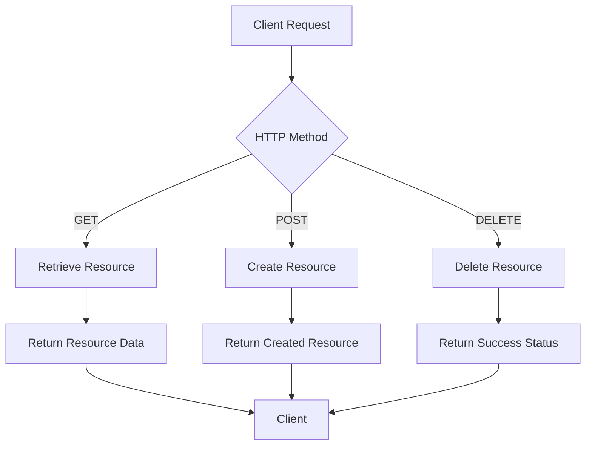
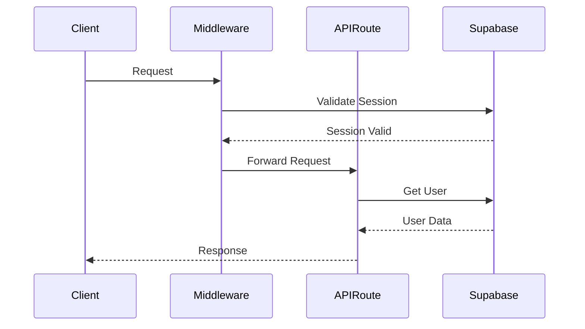

# API Endpoints

<cite>
**Referenced Files in This Document**   
- [middleware.ts](file://middleware.ts)
- [app/api/chat/route.ts](file://app/api/chat/route.ts)
- [app/api/files/route.ts](file://app/api/files/route.ts)
- [app/api/files/content/route.ts](file://app/api/files/content/route.ts)
- [app/api/files/batch/route.ts](file://app/api/files/batch/route.ts)
- [app/api/github/user/route.ts](file://app/api/github/user/route.ts)
- [app/api/github/repos/route.ts](file://app/api/github/repos/route.ts)
- [app/api/github/repos/[owner]/[repo]/route.ts](file://app/api/github/repos/[owner]/[repo]/route.ts)
- [app/api/github/orgs/route.ts](file://app/api/github/orgs/route.ts)
- [app/api/sandbox/route.ts](file://app/api/sandbox/route.ts)
- [app/api/sandbox/[sbxId]/files/route.ts](file://app/api/sandbox/[sbxId]/files/route.ts)
- [app/api/sandbox/[sbxId]/files/content/route.ts](file://app/api/sandbox/[sbxId]/files/content/route.ts)
- [app/api/tasks/route.ts](file://app/api/tasks/route.ts)
- [app/api/tasks/[taskId]/route.ts](file://app/api/tasks/[taskId]/route.ts)
- [app/api/terminal/route.ts](file://app/api/terminal/route.ts)
</cite>

## Table of Contents
1. [Introduction](#introduction)
2. [RESTful Design Patterns](#restful-design-patterns)
3. [Authentication and Security](#authentication-and-security)
4. [Chat Interactions](#chat-interactions)
5. [File Operations](#file-operations)
6. [GitHub Integration](#github-integration)
7. [Sandbox Management](#sandbox-management)
8. [Task Tracking](#task-tracking)
9. [Terminal Commands](#terminal-commands)
10. [Client Usage Patterns](#client-usage-patterns)

## Introduction
The CodingIT-1 backend implements a comprehensive API system using Next.js App Router with RESTful design patterns. The API endpoints are organized into logical groups that handle chat interactions, file operations, GitHub integration, sandbox management, task tracking, and terminal commands. Each endpoint follows consistent patterns for authentication, error handling, and response formatting. The system leverages Server Actions and route handlers to provide both client-side and server-side functionality, with middleware protections and rate-limiting measures in place.

**Section sources**
- [app/api/chat/route.ts](file://app/api/chat/route.ts#L1-L70)
- [app/api/files/route.ts](file://app/api/files/route.ts#L1-L160)

## RESTful Design Patterns
The API follows RESTful principles with clear URL structures and appropriate HTTP methods for each operation. Route handlers in the App Router context provide a clean separation of concerns, with each route file containing the necessary functions for handling different HTTP methods. The system uses dynamic routing with parameters like [taskId] and [sbxId] to handle resource-specific operations.



**Diagram sources**
- [app/api/chat/route.ts](file://app/api/chat/route.ts#L1-L70)
- [app/api/files/route.ts](file://app/api/files/route.ts#L1-L160)

**Section sources**
- [app/api/chat/route.ts](file://app/api/chat/route.ts#L1-L70)
- [app/api/files/route.ts](file://app/api/files/route.ts#L1-L160)

## Authentication and Security
The API implements multiple layers of security through middleware and authentication checks. The middleware.ts file contains a redirect function that validates user sessions and redirects unauthorized requests. Each API route performs authentication by checking the user's session via Supabase auth. Rate limiting is implemented for chat endpoints to prevent abuse, with configurable limits based on environment variables.



**Diagram sources**
- [middleware.ts](file://middleware.ts#L1-L22)
- [app/api/chat/route.ts](file://app/api/chat/route.ts#L1-L70)

**Section sources**
- [middleware.ts](file://middleware.ts#L1-L22)
- [app/api/chat/route.ts](file://app/api/chat/route.ts#L1-L70)

## Chat Interactions
The chat API endpoints handle interactions with the AI system, processing messages and returning responses. The main endpoint at /api/chat accepts POST requests with message history, user ID, team ID, template, model, and configuration. The system supports streaming responses for real-time chat experiences.

### HTTP Methods and URL Structures
- **POST /api/chat**: Process chat messages and return AI responses
- **POST /api/chat/morph-chat**: Transform code based on chat context

### Request Schema
```json
{
  "messages": "Array of chat messages",
  "userID": "User identifier",
  "teamID": "Team identifier",
  "template": "Chat template",
  "model": "LLM model",
  "config": "Model configuration"
}
```

### Response Schema
The endpoint returns a streaming text response with the AI's reply. Error responses include detailed information about the failure.

### Authentication Requirements
The endpoint requires user authentication through Supabase session. Rate limiting is applied to prevent abuse, with exceptions for requests that include an API key.

**Section sources**
- [app/api/chat/route.ts](file://app/api/chat/route.ts#L1-L70)
- [app/api/chat/morph-chat/route.ts](file://app/api/chat/morph-chat/route.ts#L1-L54)

## File Operations
The file operations API provides comprehensive functionality for managing workspace files, including creation, reading, updating, and deletion of files, as well as batch operations for importing multiple files.

### HTTP Methods and URL Structures
- **GET /api/files**: Retrieve the file tree structure
- **POST /api/files**: Create a new file
- **DELETE /api/files**: Delete a file or directory
- **GET /api/files/content**: Retrieve file content
- **POST /api/files/content**: Update file content
- **POST /api/files/batch**: Create multiple files in a single request

### Request/Response Schemas
For file creation:
```json
{
  "path": "File path",
  "isDirectory": "Boolean indicating if it's a directory",
  "content": "File content (optional for directories)"
}
```

For batch file creation:
```json
{
  "files": [
    {
      "path": "File path",
      "isDirectory": "Boolean",
      "content": "File content"
    }
  ]
}
```

### Authentication Requirements
All file operations require user authentication through Supabase session. The system verifies the user's identity before allowing any file operations.

**Section sources**
- [app/api/files/route.ts](file://app/api/files/route.ts#L1-L160)
- [app/api/files/content/route.ts](file://app/api/files/content/route.ts#L1-L93)
- [app/api/files/batch/route.ts](file://app/api/files/batch/route.ts#L1-L89)

## GitHub Integration
The GitHub integration API provides endpoints for accessing GitHub user data, repositories, and organization information, enabling seamless integration with GitHub services.

### HTTP Methods and URL Structures
- **GET /api/github/user**: Retrieve authenticated user's GitHub profile
- **GET /api/github/repos**: Retrieve repositories for a specific owner
- **GET /api/github/repos/[owner]/[repo]**: Retrieve content from a specific repository
- **GET /api/github/orgs**: Retrieve organizations for the authenticated user

### Request/Response Schemas
For repository content:
```json
{
  "type": "file or dir",
  "name": "Item name",
  "path": "Item path",
  "size": "Item size",
  "content": {
    "content": "Base64 encoded content",
    "encoding": "Content encoding"
  },
  "download_url": "Direct download URL"
}
```

### Authentication Requirements
The GitHub API endpoints use a configured GitHub token from environment variables to authenticate requests to the GitHub API. User authentication is not required for these endpoints as they use the service account token.

**Section sources**
- [app/api/github/user/route.ts](file://app/api/github/user/route.ts#L1-L33)
- [app/api/github/repos/route.ts](file://app/api/github/repos/route.ts#L1-L110)
- [app/api/github/repos/[owner]/[repo]/route.ts](file://app/api/github/repos/[owner]/[repo]/route.ts#L1-L72)
- [app/api/github/orgs/route.ts](file://app/api/github/orgs/route.ts#L1-L34)

## Sandbox Management
The sandbox management API handles the creation and management of E2B sandboxes for code execution and development environments.

### HTTP Methods and URL Structures
- **POST /api/sandbox**: Create a new sandbox environment
- **GET /api/sandbox/[sbxId]/files**: Retrieve file tree from a sandbox
- **GET /api/sandbox/[sbxId]/files/content**: Retrieve file content from a sandbox
- **POST /api/sandbox/[sbxId]/files/content**: Update file content in a sandbox

### Request/Response Schemas
For sandbox creation:
```json
{
  "fragment": "Fragment configuration",
  "userID": "User identifier",
  "teamID": "Team identifier",
  "accessToken": "Access token"
}
```

For file operations in sandbox:
```json
{
  "sbxId": "Sandbox identifier",
  "path": "File path",
  "content": "File content (for POST)"
}
```

### Authentication Requirements
The sandbox endpoints require both user authentication and validation of the E2B API key. The system connects to existing sandboxes using the provided sandbox ID and authenticates with team-specific headers when applicable.

**Section sources**
- [app/api/sandbox/route.ts](file://app/api/sandbox/route.ts#L1-L194)
- [app/api/sandbox/[sbxId]/files/route.ts](file://app/api/sandbox/[sbxId]/files/route.ts#L1-L56)
- [app/api/sandbox/[sbxId]/files/content/route.ts](file://app/api/sandbox/[sbxId]/files/content/route.ts#L1-L83)

## Task Tracking
The task tracking API manages the creation, retrieval, and deletion of tasks, providing a system for tracking development work and AI-assisted coding tasks.

### HTTP Methods and URL Structures
- **GET /api/tasks**: Retrieve all tasks
- **POST /api/tasks**: Create a new task
- **DELETE /api/tasks**: Delete tasks by status
- **GET /api/tasks/[taskId]**: Retrieve a specific task
- **DELETE /api/tasks/[taskId]**: Delete a specific task

### Request/Response Schemas
For task creation:
```json
{
  "prompt": "Task description",
  "repoUrl": "Repository URL",
  "selectedAgent": "AI agent to use",
  "selectedModel": "Model to use"
}
```

For task response:
```json
{
  "task": {
    "id": "Task identifier",
    "prompt": "Task description",
    "status": "Task status",
    "logs": "Task execution logs",
    "createdAt": "Creation timestamp",
    "updatedAt": "Last update timestamp"
  }
}
```

### Authentication Requirements
All task operations require user authentication through Supabase session. The system associates tasks with the authenticated user and validates permissions before allowing operations.

**Section sources**
- [app/api/tasks/route.ts](file://app/api/tasks/route.ts#L1-L217)
- [app/api/tasks/[taskId]/route.ts](file://app/api/tasks/[taskId]/route.ts#L1-L68)

## Terminal Commands
The terminal API provides a way to execute commands in a sandboxed environment, simulating a terminal interface for development tasks.

### HTTP Methods and URL Structures
- **POST /api/terminal**: Execute a terminal command

### Request/Response Schemas
For command execution:
```json
{
  "command": "Command to execute",
  "sbxId": "Sandbox identifier",
  "workingDirectory": "Working directory (optional)",
  "teamID": "Team identifier (optional)",
  "accessToken": "Access token (optional)"
}
```

For command response:
```json
{
  "stdout": "Standard output",
  "stderr": "Standard error",
  "exitCode": "Exit code",
  "workingDirectory": "Current working directory"
}
```

### Authentication Requirements
The terminal endpoint requires both a valid sandbox ID and user authentication. The system connects to the specified sandbox and executes the command with appropriate error handling and security measures.

**Section sources**
- [app/api/terminal/route.ts](file://app/api/terminal/route.ts#L1-L89)

## Client Usage Patterns
The API is designed to be consumed by both web and desktop applications, with consistent patterns for handling requests and responses. Client applications use fetch or similar APIs to interact with the endpoints, handling authentication through session management.

### Web Application Usage
Web applications use the App Router's Server Actions and route handlers to integrate with the API. Components make direct API calls using fetch, with error handling and loading states managed through React hooks.

### Desktop Application Usage
Desktop applications use similar patterns but may include additional security measures for handling sensitive data. The desktop client maintains session state and handles API responses with appropriate error recovery mechanisms.

### Error Handling
Both client types implement comprehensive error handling, parsing error responses to provide user-friendly messages. The system returns structured error responses with type and details to facilitate appropriate client-side handling.

**Section sources**
- [app/api/chat/route.ts](file://app/api/chat/route.ts#L1-L70)
- [app/api/files/route.ts](file://app/api/files/route.ts#L1-L160)
- [app/api/terminal/route.ts](file://app/api/terminal/route.ts#L1-L89)