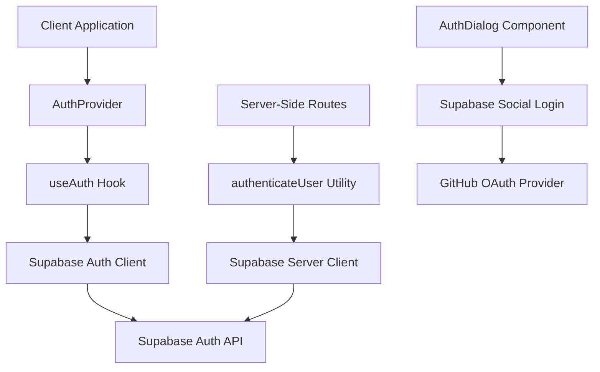
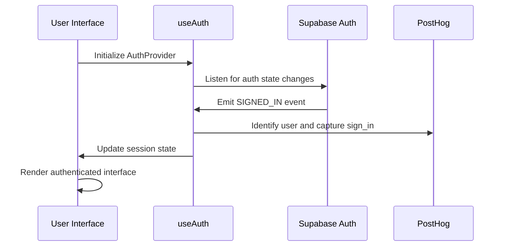
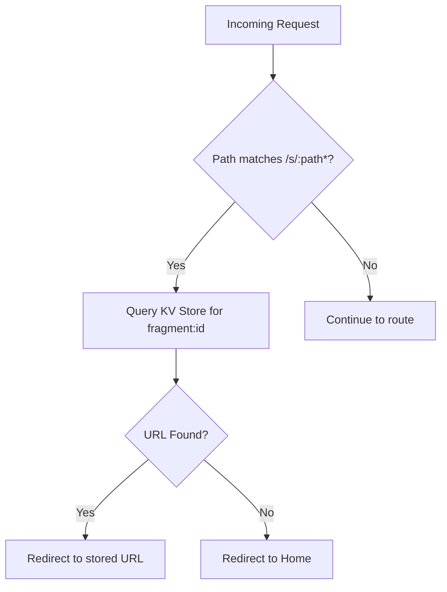
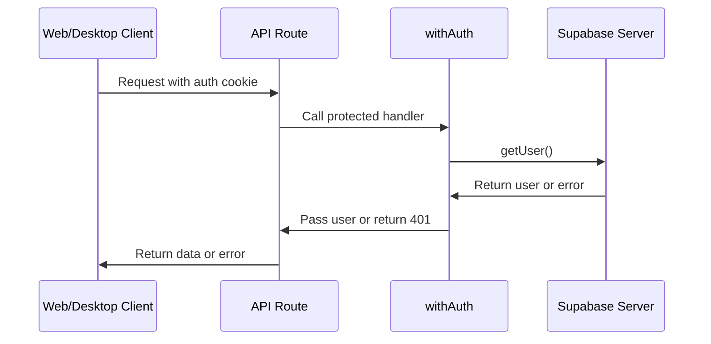

# Authentication Flow

<cite>
**Referenced Files in This Document**   
- [middleware.ts](file://middleware.ts)
- [auth-provider.tsx](file://lib/auth-provider.tsx)
- [auth-utils.ts](file://lib/auth-utils.ts)
- [auth.ts](file://lib/auth.ts)
- [auth-dialog.tsx](file://components/auth-dialog.tsx)
- [apps\desktop\app\lib\webcontainer\auth.client.ts](file://apps/desktop/app/lib/webcontainer/auth.client.ts)
</cite>

## Table of Contents
1. [Introduction](#introduction)
2. [Authentication Architecture](#authentication-architecture)
3. [User Registration and Login Flow](#user-registration-and-login-flow)
4. [Session Management and State Synchronization](#session-management-and-state-synchronization)
5. [Social Login Integration (GitHub OAuth)](#social-login-integration-github-oauth)
6. [Route Protection via Middleware](#route-protection-via-middleware)
7. [Team-Based Access Control](#team-based-access-control)
8. [Token Validation and Session Persistence](#token-validation-and-session-persistence)
9. [Security Considerations](#security-considerations)
10. [Troubleshooting Common Authentication Issues](#troubleshooting-common-authentication-issues)

## Introduction
The CodingIT-1 application implements a robust authentication system powered by Supabase Auth, supporting both web and desktop clients. This document details the end-to-end authentication flow, including user registration, login, session management, social logins (GitHub OAuth), and team-based access control. It also covers integration with application state stores, route-level protections, and security best practices such as token expiration and CSRF mitigation.

## Authentication Architecture
The authentication system is built on Supabase Auth and leverages React context for state management across the application. The core components include client-side hooks for session tracking, server-side utilities for request authentication, and UI components for user interaction.

**Diagram sources**
- [auth-provider.tsx](file://lib/auth-provider.tsx#L14-L24)
- [auth.ts](file://lib/auth.ts#L8-L83)
- [auth-utils.ts](file://lib/auth-utils.ts#L4-L30)

**Section sources**
- [auth-provider.tsx](file://lib/auth-provider.tsx)
- [auth.ts](file://lib/auth.ts)
- [auth-utils.ts](file://lib/auth-utils.ts)

## User Registration and Login Flow
Users can register and log in using email/password or via GitHub OAuth. The `AuthDialog` component renders the Supabase Auth UI with configured providers. Upon successful authentication, the session is stored and propagated through React context.

The login process involves:
1. Displaying the authentication modal via `AuthDialog`
2. Handling social or email-based sign-in through Supabase
3. Capturing PostHog analytics events for user tracking
4. Updating user metadata to mark them as active users

**Section sources**
- [auth-dialog.tsx](file://components/auth-dialog.tsx)
- [auth.ts](file://lib/auth.ts#L8-L83)

## Session Management and State Synchronization
Session state is managed using React's `useState` and `useEffect` hooks within the `useAuth` custom hook. The `onAuthStateChange` listener from Supabase monitors authentication events (SIGNED_IN, SIGNED_OUT, PASSWORD_RECOVERY) and updates the application state accordingly.

User sessions are synchronized with analytics tools (PostHog) to track user behavior. The `AuthProvider` wraps the application and provides session context to all child components, including the `UserTeamProvider` for team-based permissions.

**Diagram sources**
- [auth.ts](file://lib/auth.ts#L8-L83)
- [auth-provider.tsx](file://lib/auth-provider.tsx#L14-L24)

**Section sources**
- [auth.ts](file://lib/auth.ts)
- [auth-provider.tsx](file://lib/auth-provider.tsx)

## Social Login Integration (GitHub OAuth)
GitHub OAuth is configured as a social login provider in the `AuthDialog` component. When a user selects GitHub login, they are redirected to GitHub's authorization endpoint. Upon approval, GitHub redirects back to the application with an authorization code, which Supabase exchanges for an access token.

The integration ensures that new users are properly initialized with metadata (`is_fragments_user: true`) upon first login. This metadata is used for feature gating and user segmentation.

**Section sources**
- [auth-dialog.tsx](file://components/auth-dialog.tsx)
- [auth.ts](file://lib/auth.ts#L8-L83)

## Route Protection via Middleware
The `middleware.ts` file implements route-level protection by intercepting requests to short URLs (`/s/:path*`). It checks a Vercel KV store for valid URL mappings and redirects accordingly. If no valid session or mapping exists, users are redirected to the home page.

This middleware operates independently of Supabase session checks but could be extended to enforce authentication for protected routes.

**Diagram sources**
- [middleware.ts](file://middleware.ts)

**Section sources**
- [middleware.ts](file://middleware.ts)

## Team-Based Access Control
Team-based access is managed through the `UserTeamProvider` component, which receives the current session and determines user permissions based on team membership. While specific implementation details are not visible in the provided files, the pattern suggests that team data is fetched server-side and synchronized with the client upon authentication.

Access decisions are likely made by combining Supabase user roles with application-level team membership data stored in the database.

**Section sources**
- [auth-provider.tsx](file://lib/auth-provider.tsx#L14-L24)

## Token Validation and Session Persistence
Token validation occurs both client-side and server-side. Client-side, the Supabase library automatically manages JWT token validation and refresh. Server-side, the `authenticateUser` utility verifies the session using `supabase.auth.getUser()` on each protected request.

Sessions are persisted using Supabase's built-in session storage (cookies and localStorage). The `withAuth` higher-order function wraps API routes to ensure only authenticated users can access them, returning 401 responses for unauthorized requests.

**Diagram sources**
- [auth-utils.ts](file://lib/auth-utils.ts#L4-L43)

**Section sources**
- [auth-utils.ts](file://lib/auth-utils.ts)

## Security Considerations
The authentication system incorporates several security measures:
- **Token Expiration**: Supabase handles JWT expiration and refresh automatically
- **CSRF Protection**: While not explicitly shown, Next.js and Supabase provide built-in CSRF protections
- **Secure Metadata Updates**: User metadata updates are performed through Supabase's secure API
- **Error Handling**: Authentication errors are logged server-side without exposing sensitive information
- **Session Invalidation**: Proper cleanup occurs on sign-out, including PostHog reset

The use of `withAuth` ensures that all server-side API calls are properly authenticated before processing, preventing unauthorized data access.

**Section sources**
- [auth-utils.ts](file://lib/auth-utils.ts)
- [auth.ts](file://lib/auth.ts)

## Troubleshooting Common Authentication Issues
### Issue: User Not Persisting After Login
Ensure that the `AuthProvider` wraps the entire application and that `useAuthContext` is called within its subtree.

### Issue: GitHub OAuth Failing
Verify that GitHub OAuth is properly configured in the Supabase dashboard and that redirect URLs are correctly set.

### Issue: Session Not Refreshing
Check that the Supabase client is properly initialized and that network requests to `auth/token` are not being blocked.

### Issue: Protected Routes Accessible Without Login
Ensure that API routes use the `withAuth` wrapper and that middleware is properly deployed in the production environment.

### Issue: PostHog Events Not Firing
Confirm that the PostHog provider is initialized and that the `usePostHog` hook returns a valid instance before authentication events occur.

**Section sources**
- [auth.ts](file://lib/auth.ts)
- [auth-utils.ts](file://lib/auth-utils.ts)
- [auth-provider.tsx](file://lib/auth-provider.tsx)