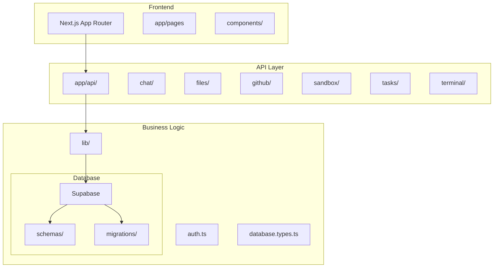
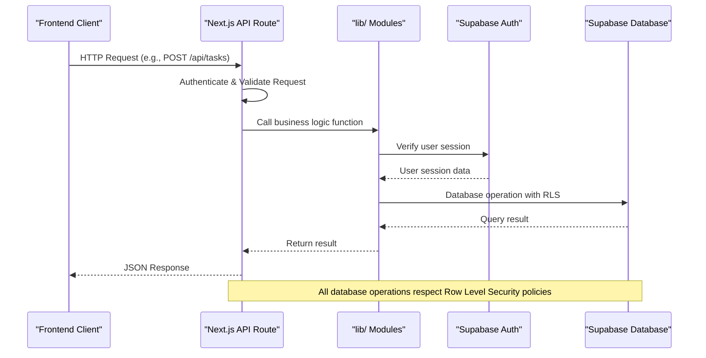
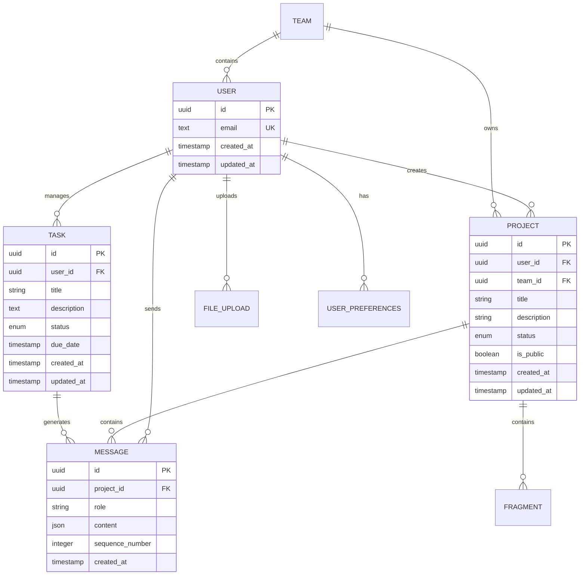
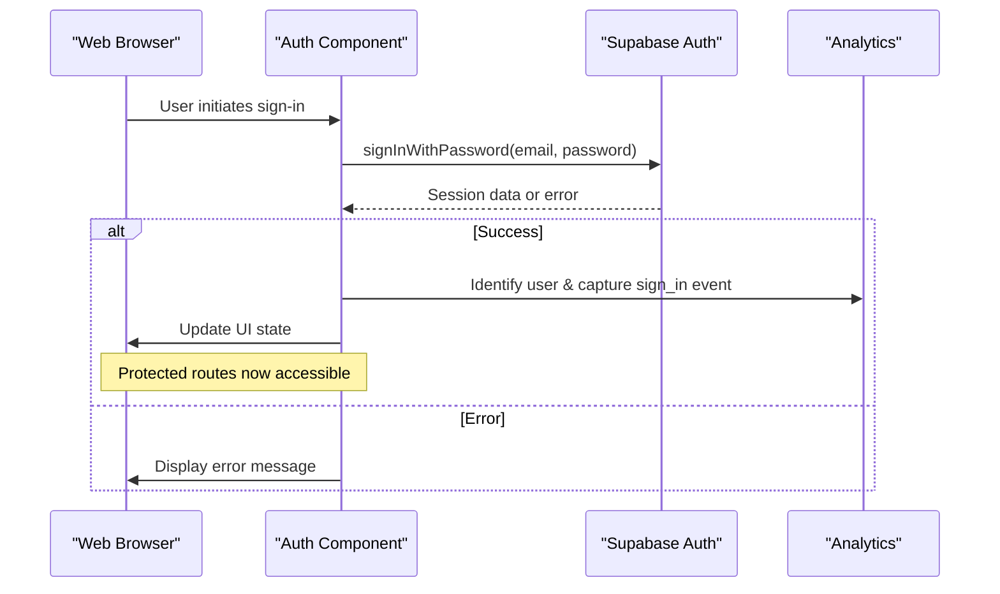
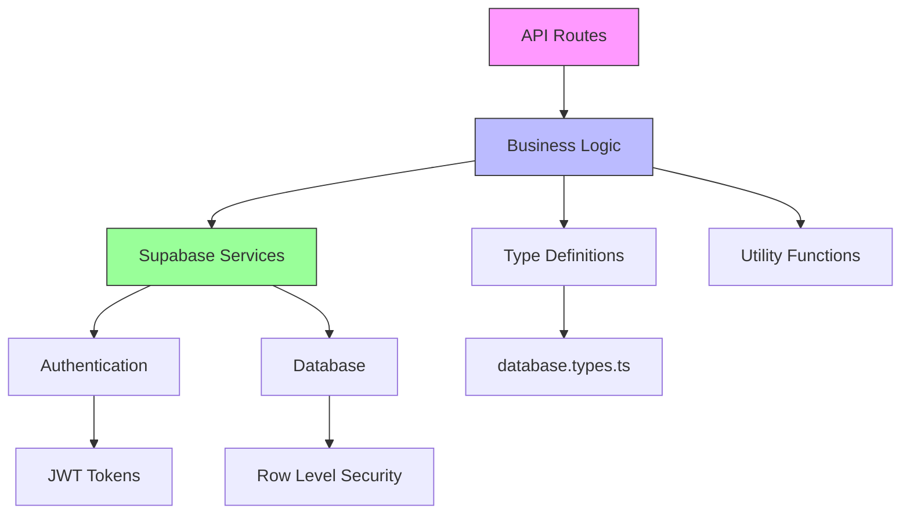

# Backend Architecture

<cite>
**Referenced Files in This Document**   
- [app/api/chat/route.ts](file://app/api/chat/route.ts)
- [app/api/files/route.ts](file://app/api/files/route.ts)
- [app/api/github/user/route.ts](file://app/api/github/user/route.ts)
- [app/api/sandbox/route.ts](file://app/api/sandbox/route.ts)
- [app/api/tasks/route.ts](file://app/api/tasks/route.ts)
- [lib/database.ts](file://lib/database.ts)
- [lib/database.types.ts](file://lib/database.types.ts)
- [lib/auth.ts](file://lib/auth.ts)
- [middleware.ts](file://middleware.ts)
- [supabase/README.md](file://supabase/README.md)
- [supabase/schemas/public.sql](file://supabase/schemas/public.sql)
- [supabase/schemas/auth.sql](file://supabase/schemas/auth.sql)
</cite>

## Table of Contents
1. [Introduction](#introduction)
2. [Project Structure](#project-structure)
3. [Core Components](#core-components)
4. [Architecture Overview](#architecture-overview)
5. [Detailed Component Analysis](#detailed-component-analysis)
6. [Dependency Analysis](#dependency-analysis)
7. [Performance Considerations](#performance-considerations)
8. [Troubleshooting Guide](#troubleshooting-guide)
9. [Conclusion](#conclusion)

## Introduction
The Backend Architecture of CodingIT-1 is built on a modern serverless stack using Next.js API routes and Supabase as the primary backend service. This architecture enables scalable handling of chat, file operations, GitHub integration, sandbox execution, and task management. The system leverages Supabase Auth for secure user authentication and Supabase Postgres for data persistence with Row Level Security (RLS) policies. Business logic is organized in the lib/ directory and accessed through API routes that serve as entry points for frontend interactions. The application is designed for deployment on Vercel with middleware protections and follows security-first principles throughout.

## Project Structure

The project follows a Next.js App Router structure with API routes organized under app/api/. Each major functionality has its dedicated directory: chat, files, github, sandbox, tasks, and terminal. The lib/ directory contains shared business logic, database operations, authentication utilities, and type definitions. Supabase schema files are organized in the supabase/ directory with migrations and schema definitions separated for clarity. The middleware.ts file handles URL redirection logic, while the components/ directory contains reusable UI components including authentication flows.

**Diagram sources**
- [app/api](file://app/api)
- [lib](file://lib)
- [supabase](file://supabase)

**Section sources**
- [app/api](file://app/api)
- [lib](file://lib)
- [supabase](file://supabase)

## Core Components

The core components of the backend architecture include API routes for handling specific domain operations, business logic modules in the lib/ directory, Supabase database with comprehensive schema and security policies, authentication system using Supabase Auth, and middleware protections. The API routes serve as entry points that validate requests and delegate to business logic functions. The lib/ modules contain the actual implementation of business rules and database interactions. Supabase provides both authentication and database services with Row Level Security ensuring data isolation between users. The middleware layer adds additional security and routing capabilities.

**Section sources**
- [app/api](file://app/api)
- [lib](file://lib)
- [middleware.ts](file://middleware.ts)

## Architecture Overview

The backend architecture follows a clean separation between API endpoints, business logic, and data persistence. Next.js API routes handle incoming HTTP requests and serve as controllers in the MVC pattern. These routes import and use functions from the lib/ directory which contain the business logic. The business logic modules interact with Supabase using both the client SDK and direct database queries. Supabase handles authentication through its built-in Auth system and data persistence through Postgres with Row Level Security policies. The architecture is designed for serverless deployment on Vercel, with stateless API routes that can scale horizontally.

**Diagram sources**
- [app/api](file://app/api)
- [lib](file://lib)
- [supabase](file://supabase)

## Detailed Component Analysis

### API Routes and Business Logic Integration
The API routes in the app/api directory serve as the entry points for all backend operations. Each route file exports handler functions (GET, POST, etc.) that process incoming requests. These handlers import functions from the lib/ directory to perform actual business logic. The separation ensures that API routes remain lightweight and focused on request/response handling, while complex logic is managed in reusable modules. For example, the tasks API route uses functions from lib/tasks.ts to create, read, update, and delete tasks, with proper authentication and authorization checks.

**Section sources**
- [app/api/tasks/route.ts](file://app/api/tasks/route.ts)
- [lib/tasks.ts](file://lib/tasks.ts)

### Supabase Database Architecture
The Supabase database schema is organized into multiple SQL files under the supabase/schemas directory. The architecture follows a strict loading order: extensions, sequences, auth, storage, and finally the public schema containing application data. The public schema includes tables for projects, messages, users, teams, and other entities, all protected by Row Level Security policies. The schema design emphasizes referential integrity with foreign key constraints and performance with comprehensive indexing. Migration files in the supabase/migrations directory contain incremental changes to the database structure.

**Diagram sources**
- [supabase/schemas/public.sql](file://supabase/schemas/public.sql)
- [lib/database.types.ts](file://lib/database.types.ts)

### Authentication System
The authentication system is built on Supabase Auth, leveraging its built-in user management, session handling, and security features. The lib/auth.ts module provides a React hook useAuth that manages the authentication state and integrates with PostHog for analytics. Authentication flows are handled through the components/auth.tsx component, which supports sign-in, sign-up, password recovery, and social login via GitHub and Google. All API routes automatically validate the user's session using Supabase's authentication tokens, ensuring that only authenticated users can access protected resources.

**Diagram sources**
- [lib/auth.ts](file://lib/auth.ts)
- [components/auth.tsx](file://components/auth.tsx)

### Data Flow and External Services
Data flows from API endpoints through business logic modules to the Supabase database, with additional interactions with external services like GitHub, Vercel, and Netlify. The API routes receive requests from the frontend, validate inputs, and call appropriate functions in the lib/ directory. These functions interact with Supabase for data persistence and may call external APIs using service-specific modules. For GitHub integration, the application uses GitHub's REST API to access repositories, organizations, and user data. Sandbox operations are handled through E2B, with API routes managing sandbox lifecycle and file operations.

**Section sources**
- [app/api/github/user/route.ts](file://app/api/github/user/route.ts)
- [app/api/sandbox/route.ts](file://app/api/sandbox/route.ts)
- [lib/github-oauth.ts](file://lib/github-oauth.ts)

## Dependency Analysis

The backend architecture has a clear dependency hierarchy with minimal circular dependencies. The API routes depend on business logic modules in the lib/ directory, which in turn depend on Supabase services for authentication and database operations. The lib/ modules have dependencies on type definitions in database.types.ts and utility functions in other lib/ modules. Third-party dependencies are managed through package.json and include Supabase client, PostHog analytics, and various UI component libraries. The architecture avoids tight coupling by using interface-based design and dependency injection where appropriate.

**Diagram sources**
- [package.json](file://package.json)
- [lib](file://lib)
- [app/api](file://app/api)

## Performance Considerations

The architecture incorporates several performance optimization strategies. Database queries are optimized with appropriate indexes on frequently queried columns, and the schema design minimizes expensive JOIN operations. The application uses caching at multiple levels: in-memory caching for frequently accessed data like user preferences and projects, and browser caching for static assets. API routes are designed to be stateless and lightweight, enabling efficient scaling on Vercel's serverless infrastructure. For data-intensive operations like chat message retrieval, the system uses pagination and selective field querying to minimize payload size. The Supabase database is configured with vector indexes for AI/ML features and full-text search capabilities for efficient content discovery.

**Section sources**
- [lib/caching.ts](file://lib/caching.ts)
- [lib/database.ts](file://lib/database.ts)
- [supabase/README.md](file://supabase/README.md)

## Troubleshooting Guide

Common issues in the backend architecture typically relate to authentication, database connectivity, or API route configuration. Authentication problems can be diagnosed by checking the Supabase client configuration and ensuring proper environment variables are set. Database issues often stem from missing migrations or RLS policy misconfigurations, which can be verified by examining the Supabase dashboard and schema files. API route errors should be investigated by checking the request/response cycle, validating input data, and reviewing server logs. The system includes comprehensive logging through PostHog and console logging for debugging purposes. For deployment issues on Vercel, verify that environment variables are properly configured and that the middleware rules are correctly defined.

**Section sources**
- [lib/auth.ts](file://lib/auth.ts)
- [lib/database.ts](file://lib/database.ts)
- [middleware.ts](file://middleware.ts)

## Conclusion

The Backend Architecture of CodingIT-1 demonstrates a well-structured, scalable design that effectively leverages modern web technologies. By combining Next.js API routes with Supabase as a backend-as-a-service, the architecture achieves a clean separation of concerns while maintaining developer productivity. The use of Row Level Security ensures data isolation and security by default, while the modular business logic in the lib/ directory promotes code reuse and maintainability. The system is optimized for serverless deployment on Vercel, with performance considerations built into the database schema and API design. Future enhancements could include more sophisticated caching strategies, enhanced monitoring and alerting, and additional integration points with developer tools.