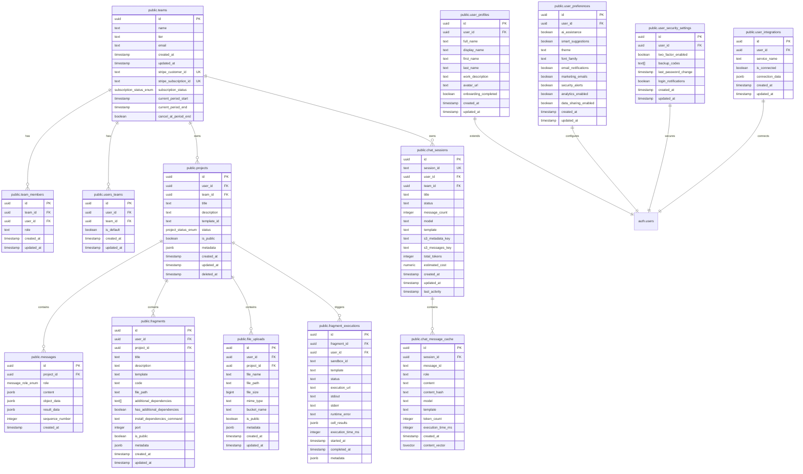

# Database Models

<cite>
**Referenced Files in This Document**   
- [20250104000000_create_workspace_files_table.sql](file://supabase/migrations/20250104000000_create_workspace_files_table.sql)
- [20250929060300_create_tasks_table.sql](file://supabase/migrations/20250929060300_create_tasks_table.sql)
- [20250929163414_create_save_message_function.sql](file://supabase/migrations/20250929163414_create_save_message_function.sql)
- [public.sql](file://supabase/schemas/public.sql)
- [auth.sql](file://supabase/schemas/auth.sql)
- [storage.sql](file://supabase/schemas/storage.sql)
- [database.types.ts](file://lib/database.types.ts)
- [database.ts](file://lib/database.ts)
- [tasks.ts](file://lib/tasks.ts)
</cite>

## Table of Contents
1. [Introduction](#introduction)
2. [Entity Relationship Model](#entity-relationship-model)
3. [Core Tables](#core-tables)
4. [Tasks Table](#tasks-table)
5. [Workspace Files Table](#workspace-files-table)
6. [Data Validation and Constraints](#data-validation-and-constraints)
7. [Row Level Security Policies](#row-level-security-policies)
8. [Indexing and Performance Optimization](#indexing-and-performance-optimization)
9. [Database Functions](#database-functions)
10. [Data Lifecycle Management](#data-lifecycle-management)
11. [Sample Queries](#sample-queries)
12. [Conclusion](#conclusion)

## Introduction

The CodingIT-1 application utilizes a Supabase PostgreSQL database to manage user data, workspace files, tasks, and AI-generated artifacts. This document provides comprehensive documentation of the database models, focusing on the entity relationships between users, workspaces, files, tasks, and related components. The schema is designed to support real-time collaboration, secure multi-tenancy, and efficient data access patterns for an AI-powered development environment.

The database schema is defined across multiple files in the supabase/schemas directory, with migrations in supabase/migrations that track the evolution of the database structure. The public.sql file contains the complete schema definition, while specialized schema files handle authentication (auth.sql) and storage (storage.sql) concerns. TypeScript type definitions in database.types.ts provide type safety for database interactions in the application code.

**Section sources**
- [public.sql](file://supabase/schemas/public.sql#L1-L1112)
- [database.types.ts](file://lib/database.types.ts#L1-L377)

## Entity Relationship Model

The database schema implements a comprehensive entity relationship model that supports the core functionality of the CodingIT-1 application. The model centers around users who can belong to teams, create projects, manage files, and execute tasks. The relationships between entities are designed to support both individual and collaborative workflows while maintaining data isolation through Row Level Security (RLS) policies.

The primary entities in the system include users, teams, projects, workspace files, tasks, and various supporting entities for chat sessions, fragments, and file uploads. Users are the central entity, with most other entities relating back to a user_id that references the auth.users table. Teams enable collaboration, with team_members and users_teams tables managing membership and default team associations.

Projects serve as containers for related work, with foreign keys to both user_id and optional team_id. Each project can contain messages (chat history), fragments (code snippets), and file uploads. The workspace_files table stores the file system structure for user workspaces, with hierarchical relationships managed through parent_path references.

Tasks represent AI-powered automation workflows, with each task belonging to a user and containing information about the AI agent, model, repository, and execution status. The schema also includes specialized tables for chat sessions, conversation threads, and usage tracking to support the application's collaborative and analytical features.


**Diagram sources**
- [public.sql](file://supabase/schemas/public.sql#L1-L1112)
- [auth.sql](file://supabase/schemas/auth.sql#L1-L435)

## Core Tables

The database schema consists of several core tables that form the foundation of the CodingIT-1 application. These tables are organized into logical groups based on their functionality: user management, teams and organizations, projects and fragments, file management, chat and messaging, usage tracking, and security.

The user management system is built around the auth.users table from Supabase's authentication system, extended with application-specific profiles and preferences in the public schema. The user_profiles table stores personal information such as full name, display name, and avatar URL, while user_preferences captures user interface and AI assistance preferences. User security settings, including two-factor authentication status, are stored in user_security_settings, and user_integrations tracks connections to external services like GitHub and Google Drive.

Team collaboration is supported by the teams, team_members, and users_teams tables. The teams table stores organization-level information including subscription status and billing details, while team_members manages the relationship between users and teams with role-based access control. The users_teams table serves as a junction table to track a user's membership in multiple teams and identify their default team.

Project management is handled by the projects table, which acts as a container for related work. Each project belongs to a user or team and can contain messages, fragments, and file uploads. The messages table stores chat history with structured content in JSONB format, allowing for rich message types including code, files, and AI-generated artifacts. Fragments represent reusable code snippets that can be executed in isolated environments, with fragment_executions tracking the results of these executions.

File management is implemented through both the workspace_files table for IDE file management and the file_uploads table for user-uploaded files. The workspace_files table stores the complete file system structure for user workspaces, including content, metadata, and hierarchical relationships. The file_uploads table tracks files uploaded by users, with references to storage buckets and metadata about the upload process.



**Diagram sources**
- [public.sql](file://supabase/schemas/public.sql#L1-L1112)

## Tasks Table

The tasks table is a central component of the CodingIT-1 application, designed to track AI-powered automation workflows initiated by users. This table stores information about tasks that involve AI agents processing code repositories, generating solutions, or performing other development-related operations. The table structure is optimized for efficient querying and status tracking, with appropriate constraints and indexes to ensure data integrity and performance.

The tasks table is defined with the following schema:

```sql
CREATE TABLE IF NOT EXISTS public.tasks (
  id bigint GENERATED ALWAYS AS IDENTITY NOT NULL,
  user_id uuid NOT NULL,
  status task_status_enum NOT NULL DEFAULT 'pending',
  progress integer NOT NULL DEFAULT 0 CHECK (progress >= 0 AND progress <= 100),
  prompt text NOT NULL,
  repo_url text,
  selected_agent text DEFAULT 'claude'::text,
  selected_model text,
  sandbox_url text,
  branch_name text,
  logs jsonb DEFAULT '[]'::jsonb,
  created_at timestamp with time zone NOT NULL DEFAULT now(),
  updated_at timestamp with time zone NOT NULL DEFAULT now(),
  CONSTRAINT tasks_pkey PRIMARY KEY (id),
  CONSTRAINT tasks_user_id_fkey FOREIGN KEY (user_id) REFERENCES auth.users(id) ON DELETE CASCADE,
  CONSTRAINT tasks_prompt_check CHECK (char_length(prompt) >= 1)
);
```

The table uses a bigint identity column as the primary key, which provides efficient auto-incrementing values. The user_id column is a foreign key referencing the auth.users table, ensuring that each task is associated with a valid user account. The status column uses a custom enum type (task_status_enum) with values 'pending', 'processing', 'completed', and 'error', providing a constrained set of valid states for task lifecycle management.

The progress column is an integer with a CHECK constraint ensuring values between 0 and 100, representing percentage completion. The prompt column stores the user's request or instruction for the AI agent, with a CHECK constraint ensuring non-empty values. Optional fields include repo_url (the GitHub repository to process), selected_agent (the AI provider, defaulting to 'claude'), selected_model (specific AI model), sandbox_url (execution environment), and branch_name (target branch).

The logs column uses JSONB to store an array of log entries, allowing for flexible storage of task execution details including timestamps, message types, and content. This structure enables rich logging without requiring a separate table for log entries, while still allowing for querying and indexing on JSON fields.

The table includes three indexes for performance optimization:
- idx_tasks_user_id on user_id for filtering tasks by user
- idx_tasks_status on status for filtering by task state
- idx_tasks_created_at on created_at DESC for chronological ordering

Row Level Security (RLS) is enabled with a policy that allows users to manage only their own tasks:
```sql
CREATE POLICY "Users can manage their own tasks" ON public.tasks
  FOR ALL USING (auth.uid() = user_id);
```

This policy ensures data isolation between users while allowing full CRUD operations on a user's own tasks. The application code in lib/tasks.ts provides a comprehensive API for task management, including functions to create tasks, retrieve all tasks, update task status and progress, add log entries, and delete tasks by status.

**Section sources**
- [public.sql](file://supabase/schemas/public.sql#L1-L1112)
- [20250929060300_create_tasks_table.sql](file://supabase/migrations/20250929060300_create_tasks_table.sql#L1-L35)
- [tasks.ts](file://lib/tasks.ts#L1-L263)

## Workspace Files Table

The workspace_files table is designed to manage the file system structure within user workspaces for the CodingIT-1 IDE. This table stores both file metadata and content, enabling a complete representation of a user's development environment. The schema is optimized for hierarchical file organization, efficient file retrieval, and real-time collaboration features.

The table is defined with the following schema:

```sql
CREATE TABLE IF NOT EXISTS public.workspace_files (
  id uuid NOT NULL DEFAULT gen_random_uuid(),
  user_id uuid NOT NULL,
  project_id uuid,
  path text NOT NULL,
  name text NOT NULL,
  content text NOT NULL DEFAULT '',
  is_directory boolean DEFAULT false,
  parent_path text,
  mime_type text,
  size_bytes bigint DEFAULT 0,
  metadata jsonb DEFAULT '{}'::jsonb,
  created_at timestamp with time zone DEFAULT now(),
  updated_at timestamp with time zone DEFAULT now(),
  CONSTRAINT workspace_files_pkey PRIMARY KEY (id),
  CONSTRAINT workspace_files_user_id_fkey FOREIGN KEY (user_id) REFERENCES auth.users(id) ON DELETE CASCADE,
  CONSTRAINT workspace_files_project_id_fkey FOREIGN KEY (project_id) REFERENCES public.projects(id) ON DELETE CASCADE,
  CONSTRAINT workspace_files_unique_path UNIQUE (user_id, path),
  CONSTRAINT workspace_files_path_check CHECK (char_length(path) >= 1),
  CONSTRAINT workspace_files_name_check CHECK (char_length(name) >= 1),
  CONSTRAINT workspace_files_size_check CHECK (size_bytes >= 0)
);
```

The table uses a UUID primary key (id) generated with gen_random_uuid() for global uniqueness and distributed system compatibility. The user_id column establishes ownership by linking to the auth.users table, while the optional project_id creates an association with a specific project when applicable.

The path column stores the full file path (e.g., "src/components/Button.tsx"), serving as a unique identifier within a user's workspace when combined with user_id in the workspace_files_unique_path constraint. The name column stores just the filename or directory name. The content column stores the actual file content as text, with a default empty string for directories.

The is_directory boolean flag distinguishes between files and directories, enabling proper file system navigation. The parent_path column stores the path of the parent directory, facilitating hierarchical queries and tree structure rendering. The mime_type column stores the MIME type for proper file handling, while size_bytes tracks the file size in bytes with a constraint ensuring non-negative values.

The metadata column uses JSONB to store additional file properties that may vary by file type or user preferences, such as editor settings, git status, or AI analysis results. This flexible structure allows for extensibility without requiring schema changes.

The table includes five indexes for performance optimization:
- idx_workspace_files_user_id on user_id for filtering by user
- idx_workspace_files_project_id on project_id for filtering by project
- idx_workspace_files_path on (user_id, path) for efficient file lookup
- idx_workspace_files_parent_path on (user_id, parent_path) for directory content queries
- idx_workspace_files_created_at on created_at DESC for chronological ordering

Row Level Security (RLS) is enabled with policies that restrict access to a user's own files:
```sql
CREATE POLICY "Users can view their own workspace files" ON public.workspace_files
  FOR SELECT USING (auth.uid() = user_id);

CREATE POLICY "Users can insert their own workspace files" ON public.workspace_files
  FOR INSERT WITH CHECK (auth.uid() = user_id);

CREATE POLICY "Users can update their own workspace files" ON public.workspace_files
  FOR UPDATE USING (auth.uid() = user_id);

CREATE POLICY "Users can delete their own workspace files" ON public.workspace_files
  FOR DELETE USING (auth.uid() = user_id);
```

A trigger is also defined to automatically update the updated_at timestamp on modifications:
```sql
CREATE TRIGGER update_workspace_files_updated_at BEFORE UPDATE ON public.workspace_files
  FOR EACH ROW EXECUTE FUNCTION update_updated_at_column();
```

This comprehensive design supports the IDE's file management needs while ensuring data isolation, performance, and extensibility for future features.

**Section sources**
- [20250104000000_create_workspace_files_table.sql](file://supabase/migrations/20250104000000_create_workspace_files_table.sql#L1-L57)

## Data Validation and Constraints

The database schema implements comprehensive data validation and constraints to ensure data integrity, consistency, and reliability across all tables. These constraints are applied at multiple levels, including column-level constraints, table-level constraints, custom data types, and application-level validation through the API.

At the type level, the schema defines several custom ENUM types to constrain values to a predefined set of options. These include:
- subscription_status_enum: 'active', 'canceled', 'past_due', 'unpaid', 'incomplete'
- project_status_enum: 'active', 'archived', 'deleted'
- message_role_enum: 'user', 'assistant'
- task_status_enum: 'pending', 'processing', 'completed', 'error'

These ENUM types ensure that critical status fields can only contain valid values, preventing data corruption and simplifying application logic. The use of ENUM types also provides better performance compared to text fields with CHECK constraints, as they are stored more efficiently and can be indexed effectively.

Column-level constraints are implemented using CHECK constraints to validate data at the database level. For example, the tasks table includes:
```sql
CONSTRAINT tasks_prompt_check CHECK (char_length(prompt) >= 1)
CONSTRAINT tasks_progress_check CHECK (progress >= 0 AND progress <= 100)
```

Similarly, the workspace_files table includes:
```sql
CONSTRAINT workspace_files_path_check CHECK (char_length(path) >= 1)
CONSTRAINT workspace_files_name_check CHECK (char_length(name) >= 1)
CONSTRAINT workspace_files_size_check CHECK (size_bytes >= 0)
```

These constraints ensure that essential fields are not empty and that numeric values fall within valid ranges. The schema also includes NOT NULL constraints on required fields and DEFAULT values for optional fields with sensible defaults.

Table-level constraints include PRIMARY KEY constraints to ensure row uniqueness, FOREIGN KEY constraints to maintain referential integrity, and UNIQUE constraints to prevent duplicate entries. For example:
```sql
CONSTRAINT tasks_user_id_fkey FOREIGN KEY (user_id) REFERENCES auth.users(id) ON DELETE CASCADE
CONSTRAINT workspace_files_unique_path UNIQUE (user_id, path)
```

The ON DELETE CASCADE clause ensures that when a user is deleted, all their associated tasks and workspace files are automatically removed, maintaining referential integrity without requiring application-level cleanup.

The schema also includes constraints on JSONB fields to ensure data quality. For example, the user_integrations table includes:
```sql
CONSTRAINT user_integrations_service_name_check CHECK (service_name = ANY (ARRAY['github'::text, 'google_drive'::text, 'gmail'::text, 'google_calendar'::text, 'artifacts'::text]))
CONSTRAINT user_integrations_unique UNIQUE (user_id, service_name)
```

These constraints ensure that integration records are valid and that a user can have only one connection per service.

Application-level validation is implemented through the TypeScript interfaces in database.types.ts, which provide type safety for database interactions. These interfaces define the expected structure of data, including required fields, optional fields, and specific value types. For example, the Task interface defines:
```typescript
export interface Task {
  id: string
  user_id?: string
  status: 'pending' | 'processing' | 'completed' | 'error'
  progress: number
  prompt: string
  repo_url?: string
  selected_agent?: string
  selected_model?: string
  sandbox_url?: string
  branch_name?: string
  logs: TaskLog[]
  created_at: string
  updated_at: string
}
```

This type definition ensures that task data conforms to the expected structure throughout the application, catching potential errors at compile time rather than runtime.

The combination of database-level constraints and application-level type safety creates a robust validation system that protects data integrity while providing clear error messages for invalid operations.

**Section sources**
- [public.sql](file://supabase/schemas/public.sql#L1-L1112)
- [database.types.ts](file://lib/database.types.ts#L1-L377)

## Row Level Security Policies

The database implements a comprehensive Row Level Security (RLS) system to ensure data isolation and secure multi-tenancy. RLS policies are enabled on all tables in the public schema, restricting access to data based on the authenticated user's identity. This security model allows multiple users to share the same database while ensuring that each user can only access their own data or data they have been explicitly granted access to.

RLS is enabled on all public tables with ALTER TABLE statements:
```sql
ALTER TABLE public.teams ENABLE ROW LEVEL SECURITY;
ALTER TABLE public.team_members ENABLE ROW LEVEL SECURITY;
-- ... (all public tables)
```

The policies are designed around the principle of least privilege, granting users only the permissions they need to perform their tasks. Most policies follow a consistent pattern based on the user_id field, which references the auth.users table.

For user-specific data, policies typically allow full access to a user's own records. For example, the user_profiles table has:
```sql
CREATE POLICY "Users can view their own profile" ON public.user_profiles
  FOR SELECT USING (auth.uid() = user_id);

CREATE POLICY "Users can insert their own profile" ON public.user_profiles
  FOR INSERT WITH CHECK (auth.uid() = user_id);

CREATE POLICY "Users can update their own profile" ON public.user_profiles
  FOR UPDATE USING (auth.uid() = user_id);
```

Similar policies exist for other user-specific tables like user_preferences, user_security_settings, and api_keys, allowing users to manage their own settings and credentials.

For collaborative data, policies are more complex. The projects table allows users to view their own projects or public projects:
```sql
CREATE POLICY "Users can view their own projects" ON public.projects
  FOR SELECT USING (auth.uid() = user_id OR is_public = true);
```

The teams table uses a more sophisticated policy that allows team members to view their teams:
```sql
CREATE POLICY "Team members can view their teams" ON public.teams
  FOR SELECT USING (
    EXISTS (
      SELECT 1 FROM public.team_members
      WHERE team_members.team_id = teams.id
      AND team_members.user_id = auth.uid()
    )
  );
```

This policy checks the team_members junction table to determine if the current user is a member of a team before allowing access to that team's data.

The tasks table has a simple but effective policy:
```sql
CREATE POLICY "Users can manage their own tasks" ON public.tasks
  FOR ALL USING (auth.uid() = user_id);
```

This policy allows users to perform all operations (SELECT, INSERT, UPDATE, DELETE) on tasks they own, ensuring complete isolation between users' tasks.

The workspace_files table has separate policies for each operation:
```sql
CREATE POLICY "Users can view their own workspace files" ON public.workspace_files
  FOR SELECT USING (auth.uid() = user_id);

CREATE POLICY "Users can insert their own workspace files" ON public.workspace_files
  FOR INSERT WITH CHECK (auth.uid() = user_id);

CREATE POLICY "Users can update their own workspace files" ON public.workspace_files
  FOR UPDATE USING (auth.uid() = user_id);

CREATE POLICY "Users can delete their own workspace files" ON public.workspace_files
  FOR DELETE USING (auth.uid() = user_id);
```

This granular approach allows for fine-tuned control over file operations while maintaining the principle of user ownership.

The auth schema also implements RLS for authentication-related tables:
```sql
CREATE POLICY "Users can view own user data" ON auth.users
  FOR SELECT USING (auth.uid() = id);

CREATE POLICY "Users can update own user data" ON auth.users
  FOR UPDATE USING (auth.uid() = id);
```

These policies ensure that users can only view and modify their own authentication data, protecting sensitive information.

The storage schema implements RLS for file storage:
```sql
CREATE POLICY "Users can view objects in accessible buckets" ON storage.objects
  FOR SELECT USING (
    auth.uid() = owner OR
    EXISTS (
      SELECT 1 FROM storage.buckets
      WHERE buckets.id = objects.bucket_id
      AND (buckets.owner = auth.uid() OR buckets.public = true)
    )
  );
```

This policy allows users to access objects they own or objects in buckets they own or that are public, supporting both private and shared file storage.

The RLS system is complemented by appropriate GRANT statements that give authenticated users the necessary permissions:
```sql
GRANT ALL ON public.workspace_files TO authenticated;
GRANT ALL ON public.tasks TO authenticated;
-- ... (other tables)
```

This comprehensive security model ensures that the database supports secure multi-tenancy, protecting user data while enabling collaboration through explicitly shared resources.

**Section sources**
- [public.sql](file://supabase/schemas/public.sql#L1-L1112)
- [auth.sql](file://supabase/schemas/auth.sql#L1-L435)
- [storage.sql](file://supabase/schemas/storage.sql#L1-L356)

## Indexing and Performance Optimization

The database schema includes a comprehensive indexing strategy designed to optimize query performance for common access patterns. Indexes are strategically created on columns frequently used in WHERE clauses, JOIN conditions, and ORDER BY operations to ensure fast data retrieval and efficient query execution.

The indexing strategy follows several key principles:
1. Primary keys are automatically indexed by PostgreSQL
2. Foreign key columns are indexed to optimize JOIN operations
3. Frequently filtered columns are indexed for WHERE clause performance
4. Sort-order columns are indexed for ORDER BY efficiency
5. Composite indexes are used for multi-column filtering
6. Specialized indexes (GIN, ivfflat) are used for advanced data types

For the tasks table, three indexes are created to support common query patterns:
```sql
CREATE INDEX IF NOT EXISTS idx_tasks_user_id ON public.tasks (user_id);
CREATE INDEX IF NOT EXISTS idx_tasks_status ON public.tasks (status);
CREATE INDEX IF NOT EXISTS idx_tasks_created_at ON public.tasks (created_at DESC);
```

The idx_tasks_user_id index optimizes queries that filter tasks by user, which is a common operation when loading a user's task dashboard. The idx_tasks_status index supports filtering by task state (e.g., showing only completed tasks), while idx_tasks_created_at enables efficient chronological ordering with the DESC option for displaying the most recent tasks first.

The workspace_files table includes five indexes:
```sql
CREATE INDEX IF NOT EXISTS idx_workspace_files_user_id ON public.workspace_files (user_id);
CREATE INDEX IF NOT EXISTS idx_workspace_files_project_id ON public.workspace_files (project_id);
CREATE INDEX IF NOT EXISTS idx_workspace_files_path ON public.workspace_files (user_id, path);
CREATE INDEX IF NOT EXISTS idx_workspace_files_parent_path ON public.workspace_files (user_id, parent_path);
CREATE INDEX IF NOT EXISTS idx_workspace_files_created_at ON public.workspace_files (created_at DESC);
```

The composite idx_workspace_files_path index on (user_id, path) is particularly important as it supports the unique constraint and enables fast file lookups by path within a user's workspace. The idx_workspace_files_parent_path index optimizes directory listing operations by allowing efficient queries for all files in a specific directory.

The projects table has indexes on user_id, team_id, status, and timestamps:
```sql
CREATE INDEX IF NOT EXISTS idx_projects_user_id ON public.projects (user_id);
CREATE INDEX IF NOT EXISTS idx_projects_team_id ON public.projects (team_id);
CREATE INDEX IF NOT EXISTS idx_projects_status ON public.projects (status);
CREATE INDEX IF NOT EXISTS idx_projects_created_at ON public.projects (created_at DESC);
CREATE INDEX IF NOT EXISTS idx_projects_updated_at ON public.projects (updated_at DESC);
```

These indexes support common project management operations such as listing a user's projects, filtering by status, and sorting by creation or update time.

The chat_message_cache table includes a GIN index on the content_vector column for full-text search:
```sql
CREATE INDEX IF NOT EXISTS idx_chat_message_cache_content_vector ON public.chat_message_cache USING GIN (content_vector);
```

This specialized index enables efficient text search across chat message content using PostgreSQL's full-text search capabilities.

The code_embeddings table uses an ivfflat index for vector similarity search:
```sql
CREATE INDEX IF NOT EXISTS idx_code_embeddings_embedding ON public.code_embeddings USING ivfflat (embedding vector_cosine_ops);
```

This index is optimized for vector similarity searches, enabling fast retrieval of code snippets with similar embeddings for AI-powered code search and recommendation features.

Additional performance optimizations include:
- Using appropriate data types (e.g., UUID for distributed systems, bigint for large counters)
- Normalizing data to reduce redundancy
- Using JSONB for flexible, schema-less data storage
- Implementing RLS policies at the database level to reduce application-level filtering
- Using generated columns and constraints to maintain data integrity

The indexing strategy is designed to balance query performance with write performance, avoiding excessive indexing that could slow down INSERT, UPDATE, and DELETE operations. The indexes support the application's primary use cases while maintaining overall database efficiency.

**Section sources**
- [public.sql](file://supabase/schemas/public.sql#L1-L1112)

## Database Functions

The database schema includes several custom functions that encapsulate complex business logic and ensure data consistency. These functions are implemented in PL/pgSQL and are designed to be called from application code through the Supabase client. They provide atomic operations that maintain data integrity and reduce the need for multiple round-trips between the application and database.

The primary database function is save_message_and_update_project, which handles the creation or update of messages while simultaneously updating the parent project's timestamp. This function is defined as:

```sql
CREATE OR REPLACE FUNCTION public.save_message_and_update_project(
  project_id_param UUID,
  role_param TEXT,
  content_param JSONB,
  object_data_param JSONB DEFAULT NULL,
  result_data_param JSONB DEFAULT NULL,
  sequence_number_param INTEGER
)
RETURNS VOID
LANGUAGE plpgsql
SECURITY DEFINER
AS $$
BEGIN
  -- Insert or update the message (upsert to handle duplicates)
  INSERT INTO public.messages (
    project_id,
    role,
    content,
    object_data,
    result_data,
    sequence_number
  ) VALUES (
    project_id_param,
    role_param,
    content_param,
    object_data_param,
    result_data_param,
    sequence_number_param
  )
  ON CONFLICT (project_id, sequence_number)
  DO UPDATE SET
    role = EXCLUDED.role,
    content = EXCLUDED.content,
    object_data = EXCLUDED.object_data,
    result_data = EXCLUDED.result_data;

  -- Update the project's updated_at timestamp
  UPDATE public.projects
  SET updated_at = NOW()
  WHERE id = project_id_param;
END;
$$;
```

This function performs two critical operations atomically:
1. Inserts or updates a message in the messages table using UPSERT (INSERT ... ON CONFLICT) to handle both new messages and updates to existing messages based on the project_id and sequence_number.
2. Updates the parent project's updated_at timestamp to reflect the latest activity.

The function uses SECURITY DEFINER to run with the privileges of the function owner, allowing it to perform operations that might be restricted by RLS policies. It is granted execute permission to authenticated users:

```sql
GRANT EXECUTE ON FUNCTION public.save_message_and_update_project TO authenticated;
```

In the application code (lib/database.ts), this function is called through the Supabase RPC (Remote Procedure Call) interface:

```typescript
export async function saveMessage(
  supabase: SupabaseClient<any, 'public', any> | null = browserSupabase,
  projectId: string,
  message: Message,
  sequenceNumber: number,
): Promise<boolean> {
  return safeApiCall(
    supabase!,
    async () => {
      const { error } = await supabase!.rpc('save_message_and_update_project', {
        project_id_param: projectId,
        role_param: message.role,
        content_param: message.content,
        object_data_param: message.object,
        result_data_param: message.result,
        sequence_number_param: sequenceNumber,
      })

      if (error) throw error
      return true
    },
    false,
    'saveMessage',
  )
}
```

This implementation ensures that every message creation or update automatically updates the project's timestamp, maintaining data consistency without requiring separate database operations.

The auth schema includes several additional functions for authentication operations:

```sql
-- Function to handle user creation with profile setup
CREATE OR REPLACE FUNCTION auth.on_auth_user_created()
RETURNS TRIGGER AS $$
BEGIN
  -- Create user profile
  INSERT INTO public.user_profiles (user_id, created_at, updated_at)
  VALUES (NEW.id, NOW(), NOW());

  -- Create user preferences with defaults
  INSERT INTO public.user_preferences (user_id, created_at, updated_at)
  VALUES (NEW.id, NOW(), NOW());

  -- Create user security settings
  INSERT INTO public.user_security_settings (user_id, created_at, updated_at)
  VALUES (NEW.id, NOW(), NOW());

  -- Create user analytics record
  INSERT INTO public.user_chat_analytics (user_id, created_at, updated_at)
  VALUES (NEW.id, NOW(), NOW());

  RETURN NEW;
END;
$$ LANGUAGE plpgsql SECURITY DEFINER;
```

This trigger function automatically creates related records in user_profiles, user_preferences, user_security_settings, and user_chat_analytics when a new user is created in the auth.users table. It ensures that all necessary user data structures are initialized atomically.

Other auth functions include:
- cleanup_expired_sessions: Removes expired sessions and refresh tokens
- revoke_user_sessions: Revokes all sessions for a specific user (useful for security operations)

The storage schema includes utility functions:
```sql
-- Function to get file level in hierarchy
CREATE OR REPLACE FUNCTION storage.get_level(file_path text)
RETURNS integer AS $$
BEGIN
  RETURN array_length(string_to_array(file_path, '/'), 1) - 1;
END;
$$ LANGUAGE plpgsql IMMUTABLE;

-- Function to calculate total bucket size
CREATE OR REPLACE FUNCTION storage.get_bucket_size(bucket_name text)
RETURNS bigint AS $$
DECLARE
  total_size bigint := 0;
BEGIN
  SELECT COALESCE(SUM((metadata->>'size')::bigint), 0)
  INTO total_size
  FROM storage.objects
  WHERE bucket_id = bucket_name
  AND metadata->>'size' IS NOT NULL;

  RETURN total_size;
END;
$$ LANGUAGE plpgsql;
```

These functions provide reusable logic for file system operations and storage management.

The database functions play a crucial role in maintaining data integrity, reducing network overhead, and encapsulating complex business logic within the database layer.

**Section sources**
- [20250929163414_create_save_message_function.sql](file://supabase/migrations/20250929163414_create_save_message_function.sql#L1-L46)
- [auth.sql](file://supabase/schemas/auth.sql#L1-L435)
- [storage.sql](file://supabase/schemas/storage.sql#L1-L356)
- [database.ts](file://lib/database.ts#L1-L334)

## Data Lifecycle Management

The database schema implements comprehensive data lifecycle management through a combination of constraints, policies, triggers, and application-level operations. This ensures that data is properly created, maintained, and eventually cleaned up according to business requirements and retention policies.

Data creation is handled through standard INSERT operations with appropriate constraints and default values. When a new user is created in the auth.users table, a trigger automatically creates related records in user_profiles, user_preferences, user_security_settings, and user_chat_analytics:

```sql
CREATE TRIGGER on_auth_user_created
  AFTER INSERT ON auth.users
  FOR EACH ROW EXECUTE FUNCTION auth.on_auth_user_created();
```

This ensures that all necessary user data structures are initialized atomically when a new user account is created.

Data modification is governed by Row Level Security (RLS) policies that restrict users to modifying only their own data. The schema also includes triggers to maintain data consistency, such as the update_updated_at_column trigger that automatically updates the updated_at timestamp on any modification:

```sql
CREATE TRIGGER update_workspace_files_updated_at BEFORE UPDATE ON public.workspace_files
  FOR EACH ROW EXECUTE FUNCTION update_updated_at_column();
```

This trigger is applied to multiple tables including workspace_files, projects, and messages, ensuring consistent timestamp management across the system.

Data retention policies are implemented through a combination of soft deletes and hard deletes. For projects, the deleteProject function in lib/database.ts implements a soft delete by setting the deleted_at timestamp and status to 'deleted':

```typescript
export async function deleteProject(
  supabase: SupabaseClient<any, "public", any> | null = browserSupabase,
  id: string, 
  permanent: boolean = false
): Promise<boolean> {
  // ... 
  if (permanent) {
    const { error } = await supabase!
      .from('projects')
      .delete()
      .eq('id', id)
  } else {
    const { error } = await supabase!
      .from('projects')
      .update({ 
        deleted_at: new Date().toISOString(),
        status: 'deleted'
      })
      .eq('id', id)
  }
  // ...
}
```

This approach allows for both temporary archiving (soft delete) and permanent removal (hard delete) of projects.

Task cleanup is handled by the deleteTasksByStatus function in lib/tasks.ts, which allows deletion of tasks by status:

```typescript
export async function deleteTasksByStatus(
  supabase: SupabaseClient,
  statuses: Task['status'][]
): Promise<number> {
  const { data, error } = await supabase
    .from('tasks')
    .delete()
    .in('status', statuses)
    .select()

  if (error) {
    console.error('Error deleting tasks:', error)
    return 0
  }

  return data?.length || 0
}
```

This function is used in the UI to allow users to clean up completed or failed tasks, helping to manage data volume and maintain a clean task dashboard.

The application also implements periodic cleanup operations. The auth schema includes a function to clean up expired sessions:

```sql
CREATE OR REPLACE FUNCTION auth.cleanup_expired_sessions()
RETURNS void AS $$
BEGIN
  DELETE FROM auth.sessions
  WHERE not_after < NOW();

  DELETE FROM auth.refresh_tokens
  WHERE created_at < NOW() - INTERVAL '30 days'
  AND revoked = true;
END;
$$ LANGUAGE plpgsql SECURITY DEFINER;
```

While this function is defined, it would need to be scheduled as a periodic job to run automatically.

File storage lifecycle is managed through the storage schema, which includes functions to clean up old multipart uploads:

```sql
CREATE OR REPLACE FUNCTION storage.cleanup_old_multipart_uploads()
RETURNS void AS $$
BEGIN
  -- Delete uploads older than 7 days that were never completed
  DELETE FROM storage.s3_multipart_uploads
  WHERE created_at < NOW() - INTERVAL '7 days';
END;
$$ LANGUAGE plpgsql SECURITY DEFINER;
```

This prevents orphaned upload data from accumulating in the system.

Data retention is also influenced by the RLS policies, which ensure that users can only access their own data or explicitly shared data. When a user account is deleted, the ON DELETE CASCADE constraints ensure that all their associated data is automatically removed:

```sql
CONSTRAINT tasks_user_id_fkey FOREIGN KEY (user_id) REFERENCES auth.users(id) ON DELETE CASCADE
```

This cascade deletion applies to tasks, workspace_files, projects, and other user-specific data, ensuring complete data cleanup when an account is terminated.

The combination of these mechanisms creates a robust data lifecycle management system that balances data persistence with storage efficiency and user control.

**Section sources**
- [database.ts](file://lib/database.ts#L1-L334)
- [tasks.ts](file://lib/tasks.ts#L1-L263)
- [auth.sql](file://supabase/schemas/auth.sql#L1-L435)
- [storage.sql](file://supabase/schemas/storage.sql#L1-L356)

## Sample Queries

This section provides sample queries demonstrating common access patterns for the CodingIT-1 database. These queries illustrate how to retrieve and manipulate data for key application features, including task management, file operations, and project interactions.

### Retrieve All Tasks for a User
```sql
SELECT 
  id,
  status,
  progress,
  prompt,
  repo_url,
  selected_agent,
  selected_model,
  sandbox_url,
  branch_name,
  logs,
  created_at,
  updated_at
FROM public.tasks 
WHERE user_id = auth.uid()
ORDER BY created_at DESC;
```

This query retrieves all tasks for the currently authenticated user, ordered by creation time with the most recent first. The auth.uid() function returns the UUID of the authenticated user, leveraging Row Level Security to ensure data isolation.

### Create a New Task
```sql
INSERT INTO public.tasks (
  user_id,
  status,
  progress,
  prompt,
  repo_url,
  selected_agent,
  selected_model,
  logs
) VALUES (
  auth.uid(),
  'pending',
  0,
  'Fix the authentication bug in the login component',
  'https://github.com/username/repo',
  'claude',
  'claude-3-5-sonnet',
  '[{"id": "abc123", "timestamp": "2025-01-15T10:30:00Z", "type": "info", "message": "Task created, preparing to start..."}]'
)
RETURNING id, created_at;
```

This query creates a new task with initial status and logs. The RETURNING clause provides the generated ID and creation timestamp for immediate use in the application.

### Update Task Progress and Add Log
```sql
UPDATE public.tasks 
SET 
  progress = 50,
  logs = logs || '[{"id": "def456", "timestamp": "2025-01-15T11:00:00Z", "type": "info", "message": "Analyzing repository structure..."}]'::jsonb,
  updated_at = NOW()
WHERE id = 'task-uuid-here' 
  AND user_id = auth.uid();
```

This query updates a task's progress and appends a new log entry to the existing logs array using the JSONB concatenation operator (||).

### Get Workspace Files for a Directory
```sql
SELECT 
  id,
  name,
  is_directory,
  mime_type,
  size_bytes,
  created_at,
  updated_at
FROM public.workspace_files 
WHERE user_id = auth.uid()
  AND (parent_path = 'src/components/' OR (parent_path IS NULL AND path = 'src/components/'))
ORDER BY is_directory DESC, name ASC;
```

This query retrieves all files and subdirectories within a specific directory path, ordering directories before files for proper tree display.

### Get File Content by Path
```sql
SELECT 
  id,
  content,
  updated_at
FROM public.workspace_files 
WHERE user_id = auth.uid()
  AND path = 'src/components/Button.tsx';
```

This query retrieves the content of a specific file by its full path, used when opening files in the IDE.

### Search Messages by Content
```sql
SELECT 
  m.id,
  m.role,
  m.content,
  m.created_at,
  p.title as project_title
FROM public.messages m
JOIN public.projects p ON m.project_id = p.id
WHERE p.user_id = auth.uid()
  AND to_tsvector('english', m.content::text) @@ to_tsquery('english', 'authentication & bug')
ORDER BY m.created_at DESC;
```

This query searches message content using PostgreSQL's full-text search capabilities, finding messages containing specific terms.

### Get Project with Latest Message
```sql
SELECT 
  p.id,
  p.title,
  p.description,
  p.updated_at,
  COALESCE(m.content, '{}'::jsonb) as latest_message_content,
  COALESCE(m.created_at, p.created_at) as last_activity
FROM public.projects p
LEFT JOIN (
  SELECT 
    project_id,
    content,
    created_at 
  FROM public.messages 
  WHERE (project_id, created_at) IN (
    SELECT project_id, MAX(created_at)
    FROM public.messages 
    GROUP BY project_id
  )
) m ON p.id = m.project_id
WHERE p.user_id = auth.uid()
  AND p.status = 'active'
ORDER BY p.updated_at DESC;
```

This query retrieves projects along with their latest message content, useful for displaying a project dashboard.

### Count Tasks by Status
```sql
SELECT 
  status,
  COUNT(*) as count
FROM public.tasks 
WHERE user_id = auth.uid()
GROUP BY status
ORDER BY count DESC;
```

This query provides task statistics by status, useful for dashboard displays.

### Call Save Message Function
```sql
SELECT public.save_message_and_update_project(
  project_id_param := 'project-uuid-here',
  role_param := 'user',
  content_param := '{"type": "text", "value": "How do I fix this bug?"}'::jsonb,
  sequence_number_param := 5
);
```

This query calls the database function to save a message and update the project timestamp atomically.

These sample queries demonstrate the key access patterns for the application, showing how to leverage the database schema, constraints, and functions to implement core features efficiently.

**Section sources**
- [public.sql](file://supabase/schemas/public.sql#L1-L1112)
- [database.ts](file://lib/database.ts#L1-L334)

## Conclusion

The Supabase PostgreSQL database for CodingIT-1 is a comprehensive, well-structured system designed to support an AI-powered development environment with real-time collaboration and secure multi-tenancy. The schema effectively models the relationships between users, workspaces, files, tasks, and AI-generated artifacts through a thoughtful entity relationship model that balances normalization with performance considerations.

Key strengths of the database design include:

1. **Comprehensive Entity Modeling**: The schema thoroughly captures the application's domain with well-defined tables for users, teams, projects, files, tasks, and related entities. The use of UUIDs for primary keys ensures global uniqueness and scalability.

2. **Robust Security Model**: Row Level Security (RLS) policies are implemented consistently across all tables, ensuring data isolation between users while enabling controlled sharing through team memberships and public resources. The security model is comprehensive, covering authentication, authorization, and data access.

3. **Performance Optimization**: The indexing strategy is well-considered, with indexes on frequently queried columns and specialized indexes for JSONB and vector data types. The schema supports efficient querying for common access patterns while maintaining write performance.

4. **Data Integrity**: The schema implements comprehensive constraints including ENUM types, CHECK constraints, foreign key relationships, and unique constraints to ensure data quality and consistency. Default values and generated columns reduce application-level complexity.

5. **Extensibility**: The use of JSONB columns for flexible data storage (metadata, logs, content) allows for schema evolution without requiring frequent migrations. Custom database functions encapsulate complex business logic and ensure atomic operations.

6. **Lifecycle Management**: The schema supports complete data lifecycle management with soft deletes, cascade deletions, and cleanup operations. Data retention policies are implemented through a combination of application logic and database triggers.

7. **Real-time Collaboration**: The design supports real-time features through efficient querying, timestamp management, and change tracking. The workspace_files table enables a complete IDE file system, while the tasks table supports AI-powered automation workflows.

The database schema is well-documented through both SQL definitions and TypeScript type interfaces, providing type safety and clear documentation for developers. The migration system ensures version control and reproducible database states.

For future improvements, consider:
- Adding more specialized indexes for analytics queries
- Implementing partitioning for large tables like messages and logs
- Enhancing the full-text search capabilities with more sophisticated ranking
- Adding materialized views for complex aggregations
- Implementing more comprehensive monitoring and alerting for database performance

Overall, the database design effectively supports the requirements of the CodingIT-1 application, providing a solid foundation for an AI-powered development environment with robust security, performance, and extensibility.

**Section sources**
- [public.sql](file://supabase/schemas/public.sql#L1-L1112)
- [database.types.ts](file://lib/database.types.ts#L1-L377)
- [database.ts](file://lib/database.ts#L1-L334)