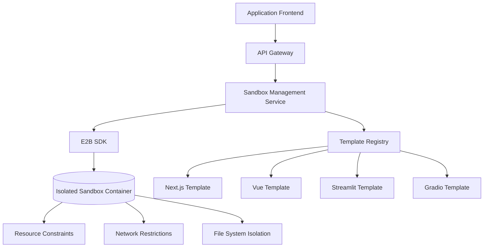
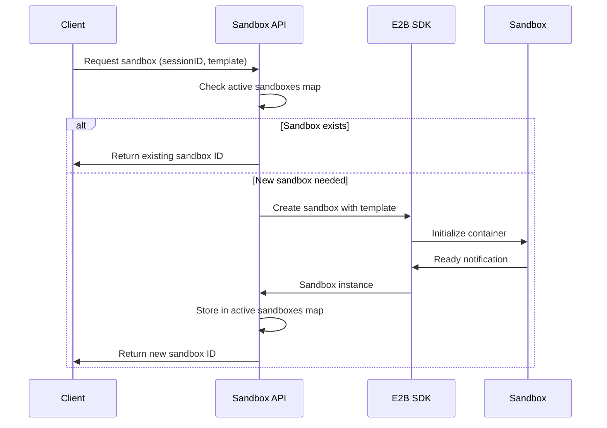
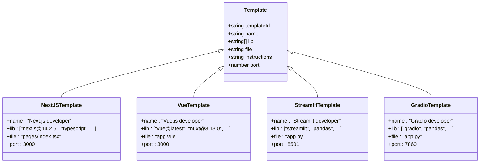

# Code Execution Environment

<cite>
**Referenced Files in This Document**   
- [lib/sandbox.ts](file://lib/sandbox.ts)
- [app/api/sandbox/route.ts](file://app/api/sandbox/route.ts)
- [app/api/sandbox/[sbxId]/files/route.ts](file://app/api/sandbox/[sbxId]/files/route.ts)
- [app/api/sandbox/[sbxId]/files/content/route.ts](file://app/api/sandbox/[sbxId]/files/content/route.ts)
- [lib/templates.json](file://lib/templates.json)
- [sandbox-templates/nextjs-developer/e2b.toml](file://sandbox-templates/nextjs-developer/e2b.toml)
- [sandbox-templates/nextjs-developer/e2b.Dockerfile](file://sandbox-templates/nextjs-developer/e2b.Dockerfile)
- [sandbox-templates/vue-developer/e2b.toml](file://sandbox-templates/vue-developer/e2b.toml)
- [sandbox-templates/streamlit-developer/e2b.toml](file://sandbox-templates/streamlit-developer/e2b.toml)
- [sandbox-templates/gradio-developer/e2b.toml](file://sandbox-templates/gradio-developer/e2b.toml)
- [README.md](file://README.md)
</cite>

## Table of Contents
1. [Introduction](#introduction)
2. [Secure Sandbox Architecture](#secure-sandbox-architecture)
3. [Container Lifecycle Management](#container-lifecycle-management)
4. [API Routes for Sandbox Control](#api-routes-for-sandbox-control)
5. [Sandbox Template System](#sandbox-template-system)
6. [Security Model](#security-model)
7. [Performance Characteristics](#performance-characteristics)
8. [Debugging and Monitoring](#debugging-and-monitoring)
9. [Conclusion](#conclusion)

## Introduction
The Code Execution Environment in CodingIT-1 provides a secure, isolated platform for executing AI-generated code through the E2B SDK. This architecture enables safe code interpretation and web application development across multiple frameworks while maintaining strict security boundaries. The system supports various development environments including Next.js, Vue, Streamlit, and Gradio through pre-configured sandbox templates.

## Secure Sandbox Architecture
The secure sandbox architecture leverages E2B's cloud-based sandboxing technology to create isolated execution environments for code interpretation and web application hosting. Each sandbox runs in a containerized environment with restricted access to host resources, preventing malicious code execution and data exfiltration.

The architecture follows a zero-trust model where all code execution occurs in ephemeral containers that are destroyed after use or timeout. Sandboxes are created with specific resource limits and network restrictions to prevent abuse. The E2B SDK provides a secure API layer between the application and sandbox environments, ensuring that all interactions are properly authenticated and authorized.



**Diagram sources**
- [lib/sandbox.ts](file://lib/sandbox.ts#L1-L27)
- [app/api/sandbox/route.ts](file://app/api/sandbox/route.ts#L40-L89)

**Section sources**
- [lib/sandbox.ts](file://lib/sandbox.ts#L1-L27)
- [app/api/sandbox/route.ts](file://app/api/sandbox/route.ts#L40-L89)

## Container Lifecycle Management
Container lifecycle management is handled through the `getSandbox` function in `lib/sandbox.ts`, which manages the creation, reuse, and cleanup of sandbox instances. The system maintains a map of active sandboxes indexed by session ID, allowing for efficient reuse of existing containers within the same session.

When a new sandbox is requested, the system first checks if an existing sandbox is available for the session. If not, it creates a new sandbox using the specified template or defaults to 'code-interpreter-v1'. Each sandbox is configured with a 10-minute timeout period after which it will automatically terminate. The E2B API key is required for all sandbox operations and is validated before any container creation.



**Diagram sources**
- [lib/sandbox.ts](file://lib/sandbox.ts#L1-L27)
- [app/api/sandbox/route.ts](file://app/api/sandbox/route.ts#L86-L126)

**Section sources**
- [lib/sandbox.ts](file://lib/sandbox.ts#L1-L27)

## API Routes for Sandbox Control
The API routes in `app/api/sandbox` provide comprehensive control over sandbox instances. The main POST endpoint at `/api/sandbox` handles the creation and initialization of new sandbox environments based on provided fragment data. This route validates input, creates the sandbox with appropriate metadata, writes code files, and executes the necessary commands.

Additional routes provide file system access to running sandboxes:
- `GET /api/sandbox/[sbxId]/files` retrieves the file tree structure
- `GET /api/sandbox/[sbxId]/files/content` reads specific file content
- `POST /api/sandbox/[sbxId]/files/content` writes content to specific files

These routes implement path sanitization to prevent directory traversal attacks by ensuring all file operations occur within the `/home/user` directory. The API also includes comprehensive error handling and cleanup procedures, automatically terminating sandboxes if execution errors occur.

```mermaid
flowchart TD
A[POST /api/sandbox] --> B{Validate Input}
B --> |Invalid| C[Return 400 Error]
B --> |Valid| D[Create Sandbox]
D --> E{Template Type}
E --> |Interpreter| F[Run Code Directly]
E --> |Web App| G[Install Dependencies]
G --> H[Start Server]
H --> I[Return URL]
F --> J[Return Results]
K[GET /api/sandbox/{id}/files] --> L[List Files]
M[GET/POST /content] --> N{Operation}
N --> |GET| O[Read File]
N --> |POST| P[Write File]
O --> Q[Return Content]
P --> R[Update File]
```

**Diagram sources**
- [app/api/sandbox/route.ts](file://app/api/sandbox/route.ts#L40-L194)
- [app/api/sandbox/[sbxId]/files/route.ts](file://app/api/sandbox/[sbxId]/files/route.ts#L0-L46)
- [app/api/sandbox/[sbxId]/files/content/route.ts](file://app/api/sandbox/[sbxId]/files/content/route.ts#L0-L157)

**Section sources**
- [app/api/sandbox/route.ts](file://app/api/sandbox/route.ts#L40-L194)
- [app/api/sandbox/[sbxId]/files/route.ts](file://app/api/sandbox/[sbxId]/files/route.ts#L0-L46)
- [app/api/sandbox/[sbxId]/files/content/route.ts](file://app/api/sandbox/[sbxId]/files/content/route.ts#L0-L157)

## Sandbox Template System
The sandbox template system provides pre-configured environments for different development frameworks, including Next.js, Vue, Streamlit, and Gradio. Templates are defined in the `sandbox-templates` directory with corresponding `e2b.toml` configuration files and Dockerfiles that specify the environment setup.

Each template includes:
- Base Docker image with required dependencies
- Startup command to launch the development server
- Resource allocation (CPU and memory)
- Team identifier for billing and access control
- Template-specific configuration

The `lib/templates.json` file registers all available templates with their metadata, including name, required libraries, default file, instructions, and port configuration. This allows the system to present appropriate options to users based on their development needs.



**Diagram sources**
- [lib/templates.json](file://lib/templates.json#L1-L52)
- [sandbox-templates/nextjs-developer/e2b.toml](file://sandbox-templates/nextjs-developer/e2b.toml#L1-L18)
- [sandbox-templates/vue-developer/e2b.toml](file://sandbox-templates/vue-developer/e2b.toml#L1-L16)

**Section sources**
- [lib/templates.json](file://lib/templates.json#L1-L52)
- [sandbox-templates/](file://sandbox-templates/)
- [README.md](file://README.md#L252-L291)

## Security Model
The security model implements multiple layers of protection to prevent malicious code execution and data exfiltration. All sandboxes run in isolated containers with restricted system access and network connectivity. The system enforces strict input validation and implements path sanitization to prevent directory traversal attacks.

Key security features include:
- Environment isolation through containerization
- Resource limits (10-minute timeout, CPU, and memory constraints)
- Network restrictions preventing external connections
- File system isolation within `/home/user` directory
- Path normalization and validation for all file operations
- Automatic sandbox cleanup on errors or completion
- Metadata tagging for audit and monitoring

The API routes validate the E2B API key before any sandbox operation and include comprehensive error handling to ensure proper cleanup even when execution fails. File operations are restricted to the user's home directory through path normalization that verifies all accessed paths remain within the allowed directory structure.

**Section sources**
- [lib/sandbox.ts](file://lib/sandbox.ts#L1-L27)
- [app/api/sandbox/route.ts](file://app/api/sandbox/route.ts#L40-L194)
- [app/api/sandbox/[sbxId]/files/content/route.ts](file://app/api/sandbox/[sbxId]/files/content/route.ts#L40-L78)

## Performance Characteristics
The code execution environment demonstrates predictable performance characteristics with cold start times typically under 15 seconds for most templates. Resource allocation varies by template, with web development templates (Next.js, Vue, Streamlit, Gradio) allocated 4 CPU cores and 4GB of memory, while the code interpreter template uses default E2B settings.

Cold start performance is influenced by several factors:
- Template complexity and dependency installation time
- Network latency between the application and E2B infrastructure
- Current E2B platform load and resource availability
- Size and complexity of initial code to be executed

The system implements connection reuse through the active sandboxes map, allowing subsequent operations within the same session to bypass the cold start phase. This optimization significantly improves performance for interactive development workflows where multiple code executions occur in sequence.

Resource allocation strategies prioritize responsiveness for development workflows while maintaining cost efficiency. The 10-minute timeout balances session longevity with resource utilization, automatically cleaning up inactive sandboxes to free resources for other users.

**Section sources**
- [lib/sandbox.ts](file://lib/sandbox.ts#L5-L6)
- [sandbox-templates/*/e2b.toml](file://sandbox-templates/)
- [app/api/sandbox/route.ts](file://app/api/sandbox/route.ts#L5-L6)

## Debugging and Monitoring
The sandbox environment provides comprehensive debugging and monitoring capabilities through integrated API endpoints and client-side tools. Developers can inspect file contents, monitor execution output, and track application state through the available interfaces.

Key debugging features include:
- Real-time file system access through API endpoints
- Standard output and error stream capture
- Runtime error reporting with detailed messages
- File tree visualization and navigation
- Code execution result inspection

The client interface integrates with the sandbox API to provide a seamless debugging experience, allowing users to select files from the sandbox file tree and view their contents in the editor. The system also captures analytics on sandbox creation and usage patterns, providing insights into performance and reliability.

Monitoring is implemented through structured logging of sandbox operations, including creation failures, execution errors, and cleanup procedures. This logging enables proactive issue detection and performance optimization.

**Section sources**
- [app/api/sandbox/[sbxId]/files/route.ts](file://app/api/sandbox/[sbxId]/files/route.ts#L0-L46)
- [app/api/sandbox/[sbxId]/files/content/route.ts](file://app/api/sandbox/[sbxId]/files/content/route.ts#L0-L157)
- [app/page.tsx](file://app/page.tsx#L146-L185)
- [components/preview.tsx](file://components/preview.tsx#L40-L78)

## Conclusion
The Code Execution Environment in CodingIT-1 provides a robust, secure platform for isolated code execution using the E2B SDK. The architecture combines container lifecycle management, comprehensive API controls, and pre-configured templates to support multiple development frameworks. Security is prioritized through isolation, resource constraints, and input validation, while performance is optimized through connection reuse and appropriate resource allocation. The integrated debugging and monitoring capabilities enable effective development and troubleshooting within the sandboxed environment.