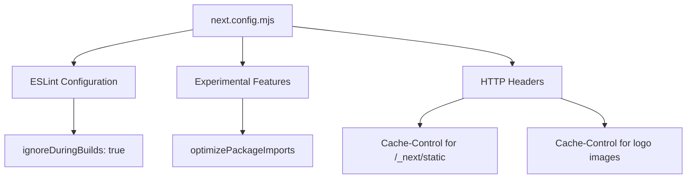
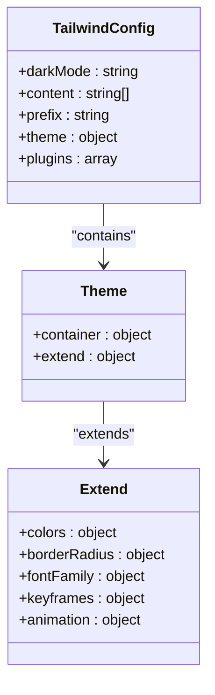
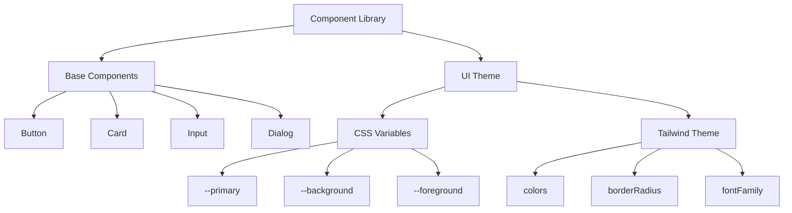

# Configuration Guide

<cite>
**Referenced Files in This Document**   
- [next.config.mjs](file://next.config.mjs)
- [tailwind.config.ts](file://tailwind.config.ts)
- [tsconfig.json](file://tsconfig.json)
- [apps/desktop/.env.example](file://apps/desktop/.env.example)
- [README.md](file://README.md)
</cite>

## Table of Contents
1. [Introduction](#introduction)
2. [Environment Variables Setup](#environment-variables-setup)
3. [Next.js Configuration](#nextjs-configuration)
4. [Tailwind CSS Customization](#tailwind-css-customization)
5. [TypeScript Configuration](#typescript-configuration)
6. [Component Library and UI Theme Extension](#component-library-and-ui-theme-extension)
7. [Common Customization Scenarios](#common-customization-scenarios)
8. [Configuration Validation and Troubleshooting](#configuration-validation-and-troubleshooting)

## Introduction
The CodingIT-1 platform provides extensive configuration options to customize its behavior, appearance, and integration capabilities. This guide details the key configuration files and approaches for tailoring the platform to specific development needs, including environment variables, build settings, UI theming, and type safety configurations.

## Environment Variables Setup

The platform uses environment variables to manage API keys, database connections, and feature flags across different environments. Configuration is handled through `.env.local` files with service-specific keys.

For the web application, essential environment variables include:
- `E2B_API_KEY`: Required for secure code execution in isolated sandboxes
- `NEXT_PUBLIC_SUPABASE_URL` and `NEXT_PUBLIC_SUPABASE_ANON_KEY`: Required for authentication and database operations
- `SUPABASE_SERVICE_ROLE_KEY`: Required for server-side database access
- AI provider keys (e.g., `OPENAI_API_KEY`, `ANTHROPIC_API_KEY`): Required for AI model access
- Optional service keys for Stripe, Upstash Redis, and other integrations

The desktop application uses a similar pattern with VITE-prefixed variables for client-side integrations, including GitHub, GitLab, Vercel, Netlify, and Supabase access tokens. These enable seamless integration with external services for repository management, deployment, and data storage.

**Section sources**
- [apps/desktop/.env.example](file://apps/desktop/.env.example#L1-L210)
- [README.md](file://README.md#L65-L117)

## Next.js Configuration

The `next.config.mjs` file configures core Next.js behaviors including ESLint settings, performance optimizations, and HTTP headers. The configuration disables ESLint checks during builds to improve development workflow efficiency.

Key experimental features include package import optimization for UI libraries like `lucide-react` and `@radix-ui/react-icons`, which improves application loading performance by automatically optimizing imports.

The headers configuration sets appropriate cache policies for static assets:
- Static Next.js assets are cached for one year with immutable caching
- Logo images are cached for 24 hours to balance performance with update flexibility

This configuration enhances performance while maintaining security through proper content delivery policies.

**Diagram sources**
- [next.config.mjs](file://next.config.mjs#L1-L43)

**Section sources**
- [next.config.mjs](file://next.config.mjs#L1-L43)

## Tailwind CSS Customization

The `tailwind.config.ts` file defines the platform's visual design system using Tailwind CSS with CSS variables for theme management. The configuration supports dark mode exclusively, as indicated by the 'class' value in the darkMode setting.

The content configuration specifies the file patterns to scan for Tailwind class usage, including pages, components, app directory files, and src directory files, ensuring all relevant files are processed.

Key theme extensions include:
- Color palette using CSS variables (e.g., `hsl(var(--primary))`)
- Border radius values with calculations based on a base radius variable
- Font families with fallback stacks for sans-serif and monospace fonts
- Animation keyframes and presets for accordions and star movement effects

The configuration also includes the `tailwindcss-animate` plugin to provide enhanced animation capabilities for UI components.

**Diagram sources**
- [tailwind.config.ts](file://tailwind.config.ts#L1-L131)

**Section sources**
- [tailwind.config.ts](file://tailwind.config.ts#L1-L131)

## TypeScript Configuration

The `tsconfig.json` file configures TypeScript compilation options for the CodingIT-1 platform. The configuration enables strict type checking while optimizing the development experience.

Key compiler options include:
- `strict: true` for comprehensive type safety
- `esModuleInterop: true` for better module interoperability
- `moduleResolution: bundler` for modern bundler compatibility
- `jsx: preserve` to maintain JSX syntax for framework processing
- `incremental: true` for faster rebuilds

The paths configuration establishes module aliases:
- `@/*` maps to the root directory for simplified imports
- `@/hooks/*` specifically maps to the hooks directory

The include and exclude arrays define the scope of TypeScript processing, covering all TypeScript files while excluding the node_modules directory.

**Section sources**
- [tsconfig.json](file://tsconfig.json#L1-L28)

## Component Library and UI Theme Extension

The platform's UI is built on a component library that can be extended and customized. The theme system uses CSS variables defined in conjunction with Tailwind CSS, allowing for comprehensive visual customization.

Components are organized in the `components/ui` directory and follow the shadcn/ui pattern of re-usable, accessible primitives. The theme configuration supports dark mode exclusively, with color values derived from CSS variables that can be overridden to create custom themes.

UI customization can be achieved through:
- Modifying CSS variables in the global stylesheet
- Extending Tailwind configuration with new theme values
- Creating custom component variants
- Overriding default component styles

The platform's design system includes comprehensive styling for buttons, cards, inputs, dialogs, and other UI elements, all of which can be customized through the theme configuration.

**Diagram sources**
- [tailwind.config.ts](file://tailwind.config.ts#L1-L131)
- [components/ui](file://components/ui)

**Section sources**
- [tailwind.config.ts](file://tailwind.config.ts#L1-L131)
- [components/ui](file://components/ui)

## Common Customization Scenarios

### Adding New AI Providers
To integrate additional AI providers, developers need to:
1. Add the provider's API key to environment variables
2. Register the model in `lib/models.json` with appropriate metadata
3. Configure the provider in `lib/models.ts`
4. Ensure the API endpoint is properly configured for the provider

The platform supports over 50 AI models across 10 providers, with extensible architecture for adding new services.

### Changing Deployment Settings
Deployment configurations can be modified by:
- Updating environment variables for different deployment targets
- Configuring service integration tokens for Vercel, Netlify, or other platforms
- Adjusting build settings in `next.config.mjs`
- Modifying deployment scripts in package.json

The platform supports both web deployment via Vercel and desktop application deployment with Electron, allowing flexibility in deployment strategies.

**Section sources**
- [README.md](file://README.md#L381-L420)
- [apps/desktop/.env.example](file://apps/desktop/.env.example#L1-L210)

## Configuration Validation and Troubleshooting

The platform implements comprehensive input validation and security measures to ensure configuration integrity. All user inputs are validated before processing, with specific validation rules for package names, GitHub repository names, and path traversal prevention.

Common troubleshooting steps include:
- Verifying environment variables are properly set in `.env.local`
- Checking API key validity and permissions
- Validating service integration tokens have required scopes
- Ensuring network connectivity to external services
- Reviewing browser developer tools for client-side errors

Configuration issues often manifest as failed service integrations or missing functionality, which can typically be resolved by verifying the corresponding environment variables and connection settings.

The platform's logging system provides debug information to help diagnose configuration issues, with log levels configurable through environment variables.

**Section sources**
- [CHANGELOG.md](file://CHANGELOG.md#L244-L278)
- [README.md](file://README.md#L381-L420)