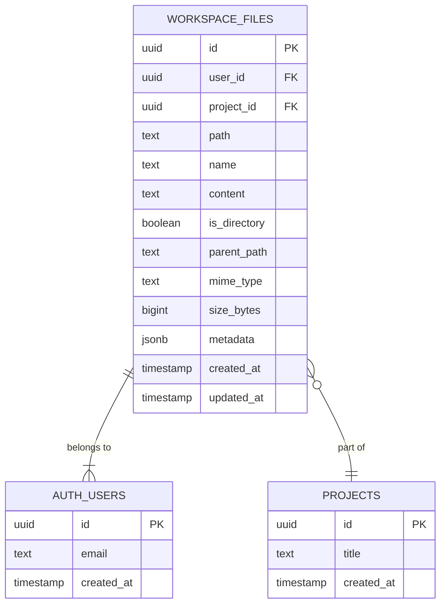
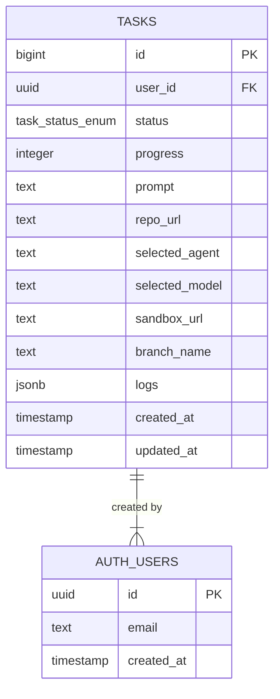
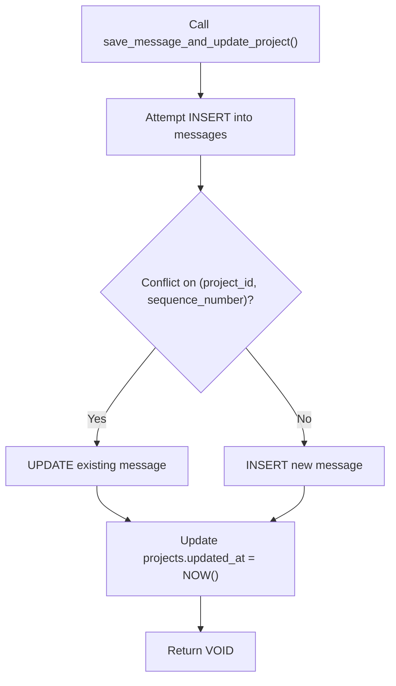
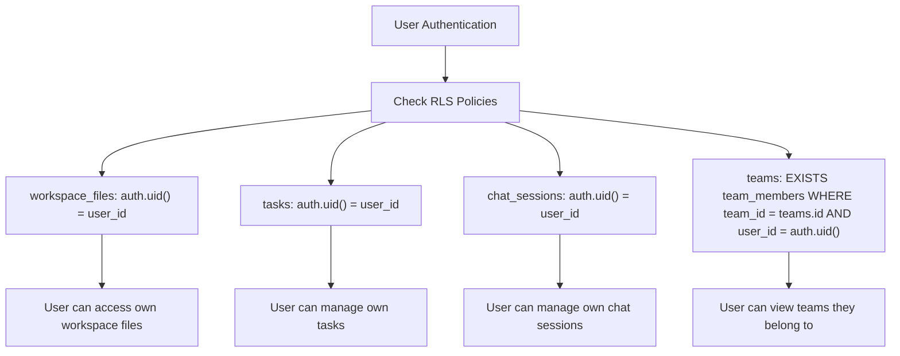

# Database Schema Design

<cite>
**Referenced Files in This Document**  
- [public.sql](file://supabase/schemas/public.sql)
- [20250104000000_create_workspace_files_table.sql](file://supabase/migrations/20250104000000_create_workspace_files_table.sql)
- [20250929060300_create_tasks_table.sql](file://supabase/migrations/20250929060300_create_tasks_table.sql)
- [20250929163414_create_save_message_function.sql](file://supabase/migrations/20250929163414_create_save_message_function.sql)
- [database.types.ts](file://lib/database.types.ts)
</cite>

## Table of Contents
1. [Introduction](#introduction)
2. [Core Entity Relationships](#core-entity-relationships)
3. [Workspace Files Table](#workspace-files-table)
4. [Tasks Table](#tasks-table)
5. [Save Message Function](#save-message-function)
6. [Row Level Security Policies](#row-level-security-policies)
7. [Data Access Patterns](#data-access-patterns)
8. [Performance Considerations](#performance-considerations)
9. [Conclusion](#conclusion)

## Introduction

The database schema for CodingIT-1 is designed to support a comprehensive development environment with collaborative features, task management, and persistent workspace state. The schema is implemented in Supabase, leveraging PostgreSQL's robust features including Row Level Security (RLS), JSONB for flexible data storage, and vector extensions for AI capabilities. This document details the core data model focusing on the relationships between users, workspaces, files, tasks, and chat messages as defined in the Supabase schema files.

The architecture follows a user-centric model where all data is ultimately tied to user identities through Supabase's authentication system. The schema supports both individual and team workflows through a comprehensive team management system with appropriate access controls. Key design principles include data integrity through foreign key constraints, performance optimization through strategic indexing, and security through comprehensive RLS policies.

**Section sources**
- [public.sql](file://supabase/schemas/public.sql#L1-L50)

## Core Entity Relationships

The database schema establishes a hierarchical relationship between core entities, with users at the foundation. Users can belong to teams, which serve as organizational units for collaboration. Each user has a personal workspace and can create projects that may be associated with a team. Within projects, users can create fragments (code snippets), messages (chat conversations), and files (workspace content).

The workspace_files table serves as the backbone of the IDE functionality, storing the file system state for each user's development environment. This table is directly connected to users and optionally to projects, allowing for both personal and project-specific file organization. The tasks table tracks user workflows and operations, with each task belonging to a specific user. Chat sessions and messages provide the conversational interface, with sessions belonging to users and optionally to teams.

```mermaid
erDiagram
USER {
uuid id PK
text email UK
timestamp created_at
timestamp updated_at
}
TEAM {
uuid id PK
text name
text tier
subscription_status_enum subscription_status
timestamp created_at
timestamp updated_at
}
PROJECT {
uuid id PK
uuid user_id FK
uuid team_id FK
text title
project_status_enum status
boolean is_public
timestamp created_at
timestamp updated_at
}
WORKSPACE_FILES {
uuid id PK
uuid user_id FK
uuid project_id FK
text path
text name
text content
boolean is_directory
text parent_path
bigint size_bytes
jsonb metadata
timestamp created_at
timestamp updated_at
}
TASKS {
bigint id PK
uuid user_id FK
task_status_enum status
integer progress
text prompt
text repo_url
text selected_agent
text selected_model
text sandbox_url
text branch_name
jsonb logs
timestamp created_at
timestamp updated_at
}
CHAT_SESSIONS {
uuid id PK
character varying session_id UK
uuid user_id FK
uuid team_id FK
text title
character varying status
integer message_count
timestamp created_at
timestamp updated_at
timestamp last_activity
}
MESSAGES {
uuid id PK
uuid project_id FK
message_role_enum role
jsonb content
jsonb object_data
jsonb result_data
integer sequence_number
timestamp created_at
}
USER ||--o{ PROJECT : "creates"
USER ||--o{ WORKSPACE_FILES : "owns"
USER ||--o{ TASKS : "creates"
USER ||--o{ CHAT_SESSIONS : "initiates"
USER ||--o{ MESSAGES : "sends"
TEAM ||--o{ PROJECT : "contains"
TEAM ||--o{ CHAT_SESSIONS : "contains"
PROJECT ||--o{ WORKSPACE_FILES : "contains"
PROJECT ||--o{ MESSAGES : "contains"
CHAT_SESSIONS ||--o{ MESSAGES : "contains"
```

**Diagram sources**
- [public.sql](file://supabase/schemas/public.sql#L100-L600)
- [database.types.ts](file://lib/database.types.ts#L100-L200)

**Section sources**
- [public.sql](file://supabase/schemas/public.sql#L1-L1000)

## Workspace Files Table

The workspace_files table is central to the IDE functionality, providing persistent storage for the user's development environment. Each record represents a file or directory in the user's workspace, with comprehensive metadata to support IDE features like file browsing, content management, and version tracking.

The table includes essential fields such as path (full path including filename), name (filename only), content (file contents), and is_directory (boolean flag). The parent_path field enables efficient hierarchical queries for directory browsing. The metadata field, stored as JSONB, provides extensibility for additional file properties without requiring schema changes. Size tracking is implemented through the size_bytes field, enabling storage usage monitoring.

Foreign key constraints ensure data integrity by linking each file to a user (via user_id) and optionally to a project (via project_id). The user_id constraint references auth.users(id) with CASCADE deletion, ensuring that when a user is deleted, all their workspace files are automatically removed. Similarly, the project_id constraint references public.projects(id) with CASCADE deletion, maintaining referential integrity when projects are removed.



**Diagram sources**
- [20250104000000_create_workspace_files_table.sql](file://supabase/migrations/20250104000000_create_workspace_files_table.sql#L1-L25)
- [public.sql](file://supabase/schemas/public.sql#L200-L250)

**Section sources**
- [20250104000000_create_workspace_files_table.sql](file://supabase/migrations/20250104000000_create_workspace_files_table.sql#L1-L60)
- [public.sql](file://supabase/schemas/public.sql#L200-L250)

## Tasks Table

The tasks table is designed to track user-initiated operations and workflows within the CodingIT-1 platform. Each task represents a discrete unit of work, such as code generation, repository processing, or deployment operations. The table structure supports both simple and complex workflows through its flexible schema.

Key fields include status (task_status_enum with values: pending, processing, completed, error), progress (integer from 0-100 for tracking completion percentage), and prompt (the user's input that initiated the task). The table also stores execution context with fields like repo_url (target repository), selected_agent (AI agent used), selected_model (LLM model), sandbox_url (execution environment), and branch_name (target branch).

The tasks table is directly linked to users through the user_id foreign key, which references auth.users(id) with CASCADE deletion. This ensures that when a user account is deleted, all their associated tasks are automatically removed, maintaining data integrity and preventing orphaned records. The table includes comprehensive constraints to ensure data quality, including a check constraint on the prompt field to ensure it contains at least one character.



**Diagram sources**
- [20250929060300_create_tasks_table.sql](file://supabase/migrations/20250929060300_create_tasks_table.sql#L1-L15)
- [public.sql](file://supabase/schemas/public.sql#L500-L550)

**Section sources**
- [20250929060300_create_tasks_table.sql](file://supabase/migrations/20250929060300_create_tasks_table.sql#L1-L40)
- [public.sql](file://supabase/schemas/public.sql#L500-L550)

## Save Message Function

The save_message_and_update_project function is a critical database function that handles the creation and updating of messages while maintaining data consistency across related entities. This function implements an upsert pattern for messages, allowing for idempotent operations that can handle both new message creation and existing message updates.

The function accepts parameters for project_id, role, content, object_data, result_data, and sequence_number, with object_data and result_data having default NULL values. It first attempts to insert a new message record, and if a conflict occurs on the (project_id, sequence_number) unique constraint, it updates the existing record with the new values. This ensures that messages can be safely retried or updated without creating duplicates.

A key feature of this function is its side effect of updating the project's updated_at timestamp whenever a message is saved. This provides a simple mechanism for tracking when a project was last modified, which is useful for UI updates, caching invalidation, and activity monitoring. The function is defined with SECURITY DEFINER to ensure it executes with the privileges of the function owner, allowing it to perform operations that might be restricted to the calling user.



**Diagram sources**
- [20250929163414_create_save_message_function.sql](file://supabase/migrations/20250929163414_create_save_message_function.sql#L1-L45)
- [public.sql](file://supabase/schemas/public.sql#L1000-L1100)

**Section sources**
- [20250929163414_create_save_message_function.sql](file://supabase/migrations/20250929163414_create_save_message_function.sql#L1-L46)

## Row Level Security Policies

The database implements comprehensive Row Level Security (RLS) policies to ensure data isolation and privacy. These policies are enabled on all tables and define precise access controls based on user authentication and ownership. The RLS system is a fundamental security layer that prevents unauthorized access to data, even if application-level security is compromised.

For the workspace_files table, RLS policies ensure that users can only access files they own. The SELECT policy allows users to view their own files, while INSERT, UPDATE, and DELETE policies restrict these operations to the file owner. This prevents users from accessing or modifying files belonging to other users, even if they know the file IDs.

The tasks table follows a similar ownership model, with a single policy that allows users to manage all aspects of their own tasks (FOR ALL USING). This comprehensive policy grants full CRUD operations on tasks where the user_id matches the authenticated user's ID. The chat_sessions table also uses a user ownership model, allowing users to manage their own chat sessions.

Team-based access is implemented through the teams and team_members tables. The teams table has a more complex SELECT policy that allows team members to view their teams by checking the team_members table for membership. This enables collaborative features while maintaining appropriate access controls.



**Diagram sources**
- [public.sql](file://supabase/schemas/public.sql#L1500-L1700)

**Section sources**
- [public.sql](file://supabase/schemas/public.sql#L1500-L1700)

## Data Access Patterns

The database schema supports efficient data access patterns through a combination of foreign key relationships, strategic indexing, and type-safe client integration. The Supabase client libraries provide a robust interface for interacting with the database while maintaining type safety and security.

The database.types.ts file provides TypeScript interfaces that mirror the database schema, enabling compile-time type checking for database operations. This type safety extends to row types, insert types (with omitted auto-generated fields), and update types (with partial updates). For example, the Insert type for workspace_files omits the id, created_at, and updated_at fields, which are automatically generated by the database.

Indexing strategies are designed to optimize common query patterns. The workspace_files table has indexes on user_id, project_id, and path for efficient filtering and hierarchical queries. The tasks table is indexed on user_id, status, and created_at to support filtering by owner, status, and time range. Composite indexes like idx_messages_sequence (project_id, sequence_number) enable efficient message retrieval in sequence order.

The schema also supports advanced querying capabilities through JSONB fields and specialized extensions. The pg_trgm extension enables fuzzy text search on content fields, while the vector extension supports AI-powered semantic search through the code_embeddings table. Full-text search is implemented on the chat_message_cache table using tsvector for efficient content searching.

**Section sources**
- [database.types.ts](file://lib/database.types.ts#L1-L377)
- [public.sql](file://supabase/schemas/public.sql#L1200-L1400)

## Performance Considerations

The database schema incorporates several performance optimization strategies to ensure responsive user experiences even with large datasets. These optimizations include strategic indexing, efficient data types, and query patterns that leverage PostgreSQL's advanced features.

Indexing is implemented on all frequently queried columns and combinations. Single-column indexes are used for simple filtering (e.g., idx_tasks_user_id), while composite indexes support multi-column queries (e.g., idx_messages_sequence). Specialized indexes include a GIN index on the content_vector field for full-text search and an IVFFLAT index on the embedding field for vector similarity search.

The schema uses appropriate data types to balance precision and storage efficiency. UUIDs are used for primary keys to ensure global uniqueness and prevent enumeration attacks. JSONB is used for flexible metadata storage, allowing for schema evolution without migrations. The vector type from the pgvector extension enables efficient storage and querying of AI embeddings.

Query optimization is supported through the save_message_and_update_project function, which combines message insertion with project timestamp updates in a single atomic operation. This reduces the number of round trips to the database and ensures data consistency. The use of upsert patterns (INSERT ... ON CONFLICT) prevents duplicate records and simplifies error handling in concurrent environments.

Data archiving and soft deletion are implemented through status fields and deleted_at timestamps rather than physical deletion. This preserves data integrity for auditing and recovery while allowing for efficient filtering of active records. For example, projects have a status field with values like 'active', 'archived', and 'deleted', enabling efficient filtering of current projects.

**Section sources**
- [public.sql](file://supabase/schemas/public.sql#L1200-L1500)

## Conclusion

The database schema for CodingIT-1 demonstrates a well-architected approach to managing complex development workflows with robust security and performance characteristics. By leveraging Supabase's capabilities, the schema provides a solid foundation for a collaborative IDE platform with AI-powered features.

Key strengths of the design include comprehensive Row Level Security policies that ensure data isolation, strategic indexing for optimal query performance, and type-safe client integration through generated TypeScript interfaces. The schema effectively balances flexibility with data integrity through the use of JSONB fields for extensible metadata while maintaining strong relationships through foreign key constraints.

The implementation of specialized database functions like save_message_and_update_project demonstrates thoughtful consideration of data consistency and operational efficiency. These functions encapsulate complex business logic at the database level, reducing application complexity and ensuring consistent behavior across different clients.

Overall, the schema provides a scalable and secure foundation for the CodingIT-1 platform, supporting both individual and team workflows with appropriate access controls and performance optimizations. The design principles of security, performance, and type safety are consistently applied throughout the schema, resulting in a robust and maintainable data architecture.