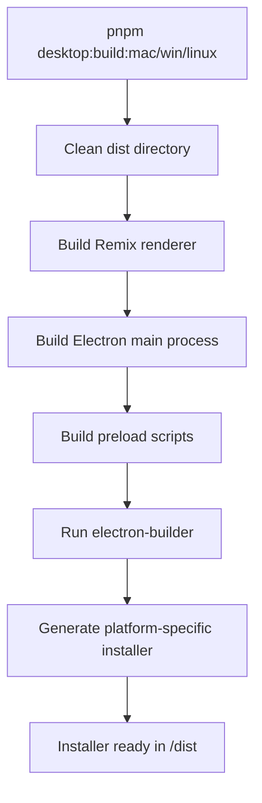
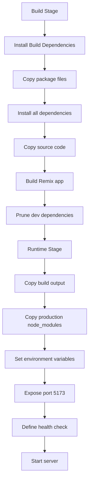
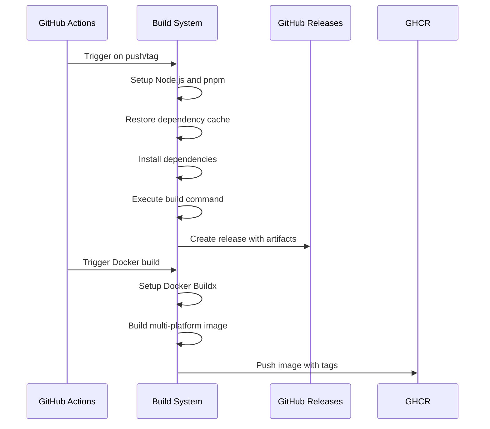

# Deployment Options

<cite>
**Referenced Files in This Document**   
- [vercel.json](file://vercel.json)
- [electron-builder.yml](file://apps/desktop/electron-builder.yml)
- [Dockerfile](file://apps/desktop/Dockerfile)
- [package.json](file://apps/desktop/package.json)
- [WORKSPACE.md](file://WORKSPACE.md)
- [.github/workflows/electron.yml](file://apps/desktop/.github/workflows/electron.yml)
- [.github/workflows/docker.yaml](file://apps/desktop/.github/workflows/docker.yaml)
- [api.vercel-deploy.ts](file://apps/desktop/app/routes/api.vercel-deploy.ts)
- [api.vercel-user.ts](file://apps/desktop/app/routes/api.vercel-user.ts)
</cite>

## Table of Contents
1. [Web Deployment with Vercel](#web-deployment-with-vercel)
2. [Desktop Application Packaging with Electron](#desktop-application-packaging-with-electron)
3. [Docker Containerization](#docker-containerization)
4. [Deployment Automation and CI/CD](#deployment-automation-and-cicd)
5. [Troubleshooting Common Issues](#troubleshooting-common-issues)
6. [Performance Optimization Recommendations](#performance-optimization-recommendations)

## Web Deployment with Vercel

The web application component of CodingIT-1 is designed for seamless deployment on Vercel using the configuration defined in `vercel.json`. This file specifies critical build and deployment settings including the build command (`pnpm build`), installation command (`pnpm install --filter @codinit/web`), and output directory (`.next`). The deployment process automatically excludes the desktop application via `.vercelignore`, ensuring only the web application is deployed.

Environment variables required for deployment include essential keys for E2B API, Supabase authentication, and at least one LLM provider (such as OpenAI, Anthropic, or Google AI). Optional variables include caching configuration with KV REST API and analytics tracking with PostHog. Deployment can be triggered automatically through GitHub integration by pushing to the main branch, or manually using the Vercel CLI with `vercel --prod`. The configuration also includes performance optimizations such as cache control headers for API routes and URL rewriting for redirect functionality.

**Section sources**
- [vercel.json](file://vercel.json#L1-L30)
- [WORKSPACE.md](file://WORKSPACE.md#L201-L267)

## Desktop Application Packaging with Electron

Desktop application packaging is managed through Electron and configured via `electron-builder.yml`. This configuration defines the application identifier (`com.codinit.dev`), product name (`CodinIT.dev`), and build directories. The packaging process includes specific configurations for each target platform: macOS uses DMG format with custom installer window layout, Windows uses NSIS installer, and Linux targets AppImage format for broad compatibility.

The build process is optimized by excluding development dependencies and source directories while including only necessary production files from the build output. Performance and security optimizations include disabling ASAR packing (to prevent hanging issues), skipping npm rebuilds, and removing package scripts. The configuration also specifies platform-specific icons and installer behaviors, such as the macOS DMG layout that positions the application file and creates a symbolic link to the Applications folder. Build scripts in `package.json` provide platform-specific commands (`pnpm desktop:build:mac`, `pnpm desktop:build:win`, `pnpm desktop:build:linux`) to generate installers for each operating system.

**Diagram sources**
- [electron-builder.yml](file://apps/desktop/electron-builder.yml#L1-L70)
- [package.json](file://apps/desktop/package.json#L1-L246)

**Section sources**
- [electron-builder.yml](file://apps/desktop/electron-builder.yml#L1-L70)
- [package.json](file://apps/desktop/package.json#L1-L246)

## Docker Containerization

Containerization is achieved through the Dockerfile located in the desktop application directory, which implements a multi-stage build process. The build stage uses Node.js 22 on Debian Bookworm Slim, installs build dependencies (Python, make, g++), and leverages pnpm for dependency management. It copies the application source, installs dependencies, builds the Remix application, and prunes development dependencies to minimize the final image size.

The runtime stage creates a lean production image containing only the built application, production dependencies, and Node.js runtime. This stage exposes port 5173 and includes a health check using curl to verify server responsiveness. The Docker configuration supports environment variable injection at build time for public URLs and at runtime for API keys, enabling flexible deployment across different environments. The image can be built and run using scripts defined in `package.json` (`dockerbuild:prod`, `dockerrun`), making it suitable for deployment on platforms like Coolify or other container orchestration systems.

**Diagram sources**
- [Dockerfile](file://apps/desktop/Dockerfile#L1-L104)

**Section sources**
- [Dockerfile](file://apps/desktop/Dockerfile#L1-L104)
- [package.json](file://apps/desktop/package.json#L1-L246)

## Deployment Automation and CI/CD

Deployment automation is implemented through GitHub Actions workflows that handle both Electron installer generation and Docker image publishing. The Electron build workflow (`electron.yml`) runs on push to specific branches or tags, targeting three platforms (Ubuntu, Windows, macOS) in parallel. It sets up pnpm caching, installs dependencies, builds platform-specific installers, and automatically creates GitHub Releases with the generated artifacts.

The Docker workflow (`docker.yaml`) triggers on pushes to main or stable branches and on tag creation. It builds multi-platform images (AMD64 and ARM64) using Docker Buildx, pushes them to GitHub Container Registry with appropriate tags (latest, stable, version-specific), and supports manual triggering via workflow dispatch. Both workflows implement concurrency controls to prevent overlapping runs and include appropriate permissions for artifact publishing.

For Vercel deployments, the application provides API endpoints (`api.vercel-deploy.ts`) that enable programmatic deployment creation, project management, and status polling. These endpoints handle authentication via Vercel tokens, framework detection from source files, and deployment configuration based on project type. The system can create new Vercel projects automatically when no project ID is provided, using a naming convention that incorporates the chat ID for traceability.

**Diagram sources**
- [.github/workflows/electron.yml](file://apps/desktop/.github/workflows/electron.yml#L1-L99)
- [.github/workflows/docker.yaml](file://apps/desktop/.github/workflows/docker.yaml#L1-L67)
- [api.vercel-deploy.ts](file://apps/desktop/app/routes/api.vercel-deploy.ts#L1-L452)

**Section sources**
- [.github/workflows/electron.yml](file://apps/desktop/.github/workflows/electron.yml#L1-L99)
- [.github/workflows/docker.yaml](file://apps/desktop/.github/workflows/docker.yaml#L1-L67)
- [api.vercel-deploy.ts](file://apps/desktop/app/routes/api.vercel-deploy.ts#L1-L452)

## Troubleshooting Common Issues

Common deployment issues include missing environment variables, dependency installation failures, and platform-specific build errors. For Vercel deployments, ensure all required environment variables (E2B_API_KEY, SUPABASE_URL, SUPABASE_ANON_KEY) are configured in the Vercel dashboard, and verify that `.vercelignore` properly excludes the desktop application to prevent deployment conflicts.

Electron build failures often stem from missing system dependencies or insufficient memory. On Linux, ensure rpm is installed for Windows installer generation. Increase Node.js memory allocation using `--max-old-space-size` if encountering out-of-memory errors during the build process. For macOS code signing issues, the configuration sets `identity: null` and disables hardened runtime to simplify development builds.

Docker build issues may arise from missing build tools or network connectivity problems. Ensure Python, make, and g++ are available in the build container. For health check failures in production, verify that the application is binding to `0.0.0.0` rather than `localhost` and that the port mapping is correctly configured. When using the desktop application's Vercel deployment feature, ensure the user has properly connected their Vercel account and that the API token has sufficient permissions.

**Section sources**
- [WORKSPACE.md](file://WORKSPACE.md#L201-L267)
- [Dockerfile](file://apps/desktop/Dockerfile#L1-L104)
- [electron-builder.yml](file://apps/desktop/electron-builder.yml#L1-L70)

## Performance Optimization Recommendations

For web deployments on Vercel, leverage the built-in performance features such as automatic static optimization, edge caching, and image optimization. The configuration already includes optimal cache headers for API routes (`Cache-Control: no-store, max-age=0`) to prevent unwanted caching of dynamic content. Consider implementing Vercel's incremental static regeneration for pages that can be pre-rendered to improve load times.

For Electron applications, the build configuration already includes several performance optimizations such as disabling ASAR packing and skipping npm rebuilds. Further improvements can be achieved by code splitting the application bundle and implementing lazy loading for non-essential components. The multi-stage Docker build significantly reduces image size by pruning development dependencies, resulting in faster deployment and reduced attack surface.

When deploying Docker containers, use the production target (`codinit-ai-production`) to ensure only necessary files are included. Implement resource limits in container orchestration systems to prevent memory overconsumption. For high-traffic deployments, consider adding a reverse proxy with caching capabilities in front of the application server. Monitor application performance using the built-in health check endpoint and adjust Node.js memory settings based on actual usage patterns observed in production.

**Section sources**
- [vercel.json](file://vercel.json#L1-L30)
- [Dockerfile](file://apps/desktop/Dockerfile#L1-L104)
- [electron-builder.yml](file://apps/desktop/electron-builder.yml#L1-L70)