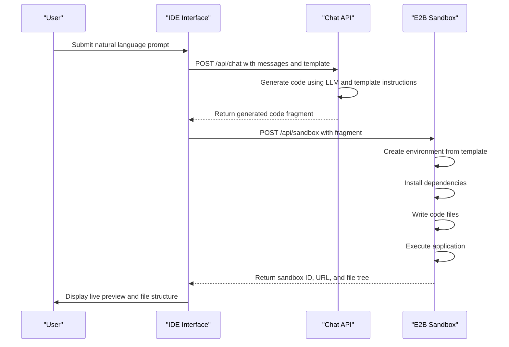
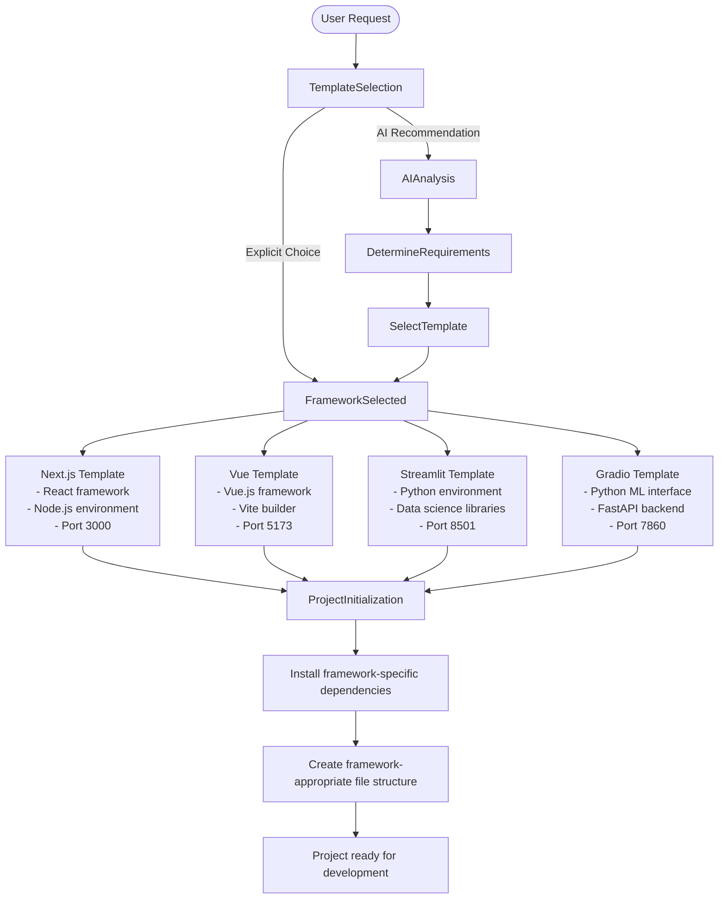
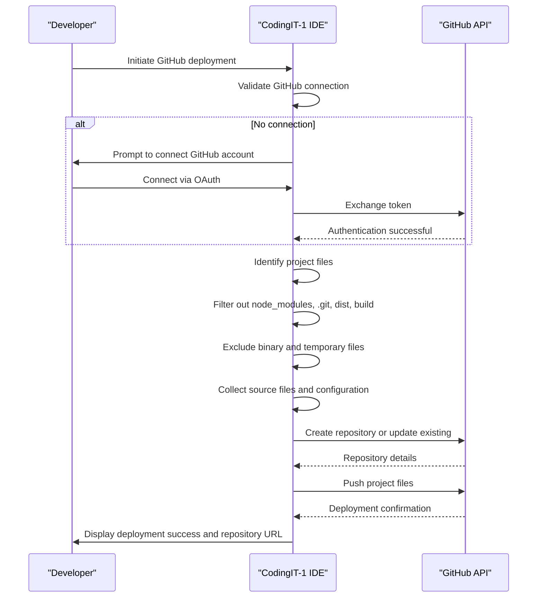

# Development Workflows

<cite>
**Referenced Files in This Document**   
- [app/api/chat/route.ts](file://app/api/chat/route.ts)
- [app/api/sandbox/route.ts](file://app/api/sandbox/route.ts)
- [lib/templates.ts](file://lib/templates.ts)
- [components/slash-command-menu.tsx](file://components/slash-command-menu.tsx)
- [apps/desktop/app/components/deploy/GitHubDeploy.client.tsx](file://apps/desktop/app/components/deploy/GitHubDeploy.client.tsx)
- [lib/slash-commands.ts](file://lib/slash-commands.ts)
- [apps/desktop/app/utils/selectStarterTemplate.ts](file://apps/desktop/app/utils/selectStarterTemplate.ts)
- [lib/prompt.ts](file://lib/prompt.ts)
</cite>

## Table of Contents
1. [Natural Language to Application Workflow](#natural-language-to-application-workflow)
2. [Code Editing and Live Execution](#code-editing-and-live-execution)
3. [Multi-Framework Development Process](#multi-framework-development-process)
4. [Collaboration and Version Control](#collaboration-and-version-control)
5. [Workflow Customization and Productivity Features](#workflow-customization-and-productivity-features)
6. [Step-by-Step Examples](#step-by-step-examples)

## Natural Language to Application Workflow

The primary workflow in CodingIT-1 begins with a natural language prompt and culminates in a working application through AI-powered code generation, real-time preview, and iterative refinement. When a user submits a prompt, the system processes it through the chat API endpoint, which integrates template instructions and model configuration to guide the AI response. The AI generates code fragments based on the selected template and project requirements, which are then executed in isolated environments for immediate feedback.

This workflow enables users to describe their desired application in plain language, such as "create a Next.js app with a contact form," and receive fully functional code that can be immediately tested. The system maintains context across interactions, allowing for progressive enhancement of the generated application through follow-up prompts and iterative improvements.

**Section sources**
- [app/api/chat/route.ts](file://app/api/chat/route.ts#L0-L70)
- [lib/prompt.ts](file://lib/prompt.ts#L0-L14)

## Code Editing and Live Execution

CodingIT-1 provides a seamless code editing experience with live execution capabilities through E2B sandboxes. When code is generated or modified, it is automatically deployed to an isolated sandbox environment where it can be executed and tested in real time. The sandbox API creates environment instances based on specified templates, installs dependencies, and executes code while capturing stdout, stderr, and runtime errors for immediate feedback.

Developers can interact with their applications through a live preview pane that updates automatically when changes are saved. The system supports both web applications and code interpreters, with different execution flows based on the template type. For web applications, the system starts a server and provides a public URL for access, while code interpreter templates execute scripts and return results directly in the interface.



**Diagram sources**
- [app/api/chat/route.ts](file://app/api/chat/route.ts#L0-L70)
- [app/api/sandbox/route.ts](file://app/api/sandbox/route.ts#L0-L194)

**Section sources**
- [app/api/sandbox/route.ts](file://app/api/sandbox/route.ts#L0-L194)

## Multi-Framework Development Process

CodingIT-1 supports multi-framework development through template-based project creation. The system includes predefined templates for various frameworks and development scenarios, including Next.js, Vue, Streamlit, and Gradio applications. These templates are defined in the templates configuration and provide framework-specific setup instructions, file structures, and dependency requirements.

When creating a new project, users can select from available templates or allow the system to recommend an appropriate template based on their prompt. The template system specifies critical parameters such as required dependencies, entry point files, and port configurations, ensuring that each framework is properly initialized. This approach enables developers to work with their preferred frameworks while maintaining consistency in the development environment.



**Diagram sources**
- [lib/templates.ts](file://lib/templates.ts#L0-L9)
- [apps/desktop/app/utils/selectStarterTemplate.ts](file://apps/desktop/app/utils/selectStarterTemplate.ts#L0-L47)

**Section sources**
- [lib/templates.ts](file://lib/templates.ts#L0-L9)
- [apps/desktop/app/utils/selectStarterTemplate.ts](file://apps/desktop/app/utils/selectStarterTemplate.ts#L0-L209)

## Collaboration and Version Control

CodingIT-1 integrates with GitHub and GitLab for collaboration and version control, enabling teams to share projects and manage code repositories directly from the development environment. The system provides deployment workflows that prepare project files for repository submission, including filtering out temporary files and build artifacts while preserving source code and configuration files.

Users can connect their GitHub accounts through the settings interface and deploy projects directly to their repositories. The deployment process collects all relevant project files, validates their content, and prepares them for repository creation or update. This integration supports common development workflows such as creating feature branches, submitting pull requests, and managing team repositories, all within the CodingIT-1 interface.



**Diagram sources**
- [apps/desktop/app/components/deploy/GitHubDeploy.client.tsx](file://apps/desktop/app/components/deploy/GitHubDeploy.client.tsx#L0-L168)

**Section sources**
- [apps/desktop/app/components/deploy/GitHubDeploy.client.tsx](file://apps/desktop/app/components/deploy/GitHubDeploy.client.tsx#L0-L168)

## Workflow Customization and Productivity Features

CodingIT-1 enhances developer productivity through customizable workflows and slash commands. The system includes a command menu interface that displays available slash commands with descriptions and categories, allowing users to quickly access common actions without memorizing command syntax. These commands support various development tasks such as code review, help access, and workflow automation.

The slash command system is extensible and categorized by functionality, with commands like `/review` for code analysis and `/help` for accessing documentation. The command menu appears contextually when users begin typing a slash, providing immediate feedback on available options and their descriptions. This feature reduces cognitive load and accelerates common development tasks.

```mermaid
flowchart TD
A[/ typed] --> B{Command Menu}
B --> C["/review - Review code for issues"]
B --> D["/help - Show available commands"]
B --> E["/create - Generate new component"]
B --> F["/test - Run tests"]
B --> G["/docs - Access documentation"]
C --> H[Code Analysis]
D --> I[Command Reference]
E --> J[Component Generation]
F --> K[Test Execution]
G --> L[Documentation Browser]
H --> M[Identify potential bugs]
H --> N[Suggest improvements]
I --> O[Display all commands]
J --> P[Generate boilerplate code]
K --> Q[Run test suite]
L --> R[Search documentation]
M --> Output
N --> Output
O --> Output
P --> Output
Q --> Output
R --> Output
Output[Enhanced Development Workflow]
```

**Diagram sources**
- [components/slash-command-menu.tsx](file://components/slash-command-menu.tsx#L0-L76)
- [lib/slash-commands.ts](file://lib/slash-commands.ts#L59-L92)

**Section sources**
- [components/slash-command-menu.tsx](file://components/slash-command-menu.tsx#L0-L76)
- [lib/slash-commands.ts](file://lib/slash-commands.ts#L59-L92)

## Step-by-Step Examples

### Creating a Next.js Application from Prompt

To create a Next.js application from a natural language prompt, users begin by describing their desired application in the chat interface. The system analyzes the prompt and selects the appropriate Next.js template based on keywords and requirements. The AI generates the necessary files including page components, layout structures, and configuration files according to the template specifications. Once generated, the code is automatically deployed to an E2B sandbox where the Next.js development server starts on the designated port, and a live preview becomes available for immediate testing and iteration.

**Section sources**
- [lib/templates.ts](file://lib/templates.ts#L0-L9)
- [app/api/sandbox/route.ts](file://app/api/sandbox/route.ts#L0-L194)

### Debugging Generated Code

When debugging generated code, developers can use the integrated terminal and file system browser to inspect the sandbox environment. If runtime errors occur, the system captures stack traces and error messages, displaying them in context with the relevant code files. Developers can modify code directly in the editor, and changes are automatically synchronized with the sandbox. The system supports iterative debugging by allowing developers to make incremental changes, re-execute the application, and observe the results in real time without restarting the entire development environment.

**Section sources**
- [app/api/sandbox/route.ts](file://app/api/sandbox/route.ts#L122-L165)
- [app/api/sandbox/[sbxId]/files/content/route.ts](file://app/api/sandbox/[sbxId]/files/content/route.ts#L0-L157)