# Directory Structure Breakdown

<cite>
**Referenced Files in This Document**   
- [app](file://app)
- [apps/desktop](file://apps/desktop)
- [components/ui](file://components/ui)
- [lib](file://lib)
- [sandbox-templates](file://sandbox-templates)
- [supabase](file://supabase)
- [pnpm-workspace.yaml](file://pnpm-workspace.yaml)
- [components.json](file://components.json)
- [supabase/README.md](file://supabase/README.md)
- [apps/desktop/vite.config.ts](file://apps/desktop/vite.config.ts)
- [apps/desktop/electron/main/index.ts](file://apps/desktop/electron/main/index.ts)
- [apps/desktop/app/root.tsx](file://apps/desktop/app/root.tsx)
- [apps/desktop/electron/main/ui/window.ts](file://apps/desktop/electron/main/ui/window.ts)
- [apps/desktop/electron/main/ui/menu.ts](file://apps/desktop/electron/main/ui/menu.ts)
- [apps/desktop/electron/main/utils/constants.ts](file://apps/desktop/electron/main/utils/constants.ts)
- [apps/desktop/app/lib/stores/theme.ts](file://apps/desktop/app/lib/stores/theme.ts)
</cite>

## Table of Contents
1. [Top-Level Directory Overview](#top-level-directory-overview)
2. [app/ - Next.js Web Application](#app---nextjs-web-application)
3. [apps/desktop/ - Electron Desktop Client](#appsdesktop---electron-desktop-client)
4. [components/ - Shared UI Library](#components---shared-ui-library)
5. [lib/ - Business Logic](#lib---business-logic)
6. [sandbox-templates/ - Development Environments](#sandbox-templates---development-environments)
7. [supabase/ - Database](#supabase---database)
8. [Monorepo Configuration](#monorepo-configuration)
9. [Directory Hierarchy Visualization](#directory-hierarchy-visualization)

## Top-Level Directory Overview

The CodingIT-1 monorepo follows a well-organized structure designed to support multiple applications, shared components, and centralized business logic. The repository contains six primary directories at the root level, each serving a distinct purpose in the overall architecture. This organization enables code sharing, consistent development practices, and efficient maintenance across the different parts of the application ecosystem.

## app/ - Next.js Web Application

The `app/` directory contains the primary Next.js web application that serves as the main interface for the platform. This directory follows the App Router pattern introduced in Next.js 13, with server components and React Server Components (RSC) enabled. The structure includes page routes, API routes, and shared components specific to the web application.

Key subdirectories include:
- `[taskId]` - Dynamic route for task-specific pages
- `actions` - Server actions for form handling and data mutations
- `api` - API routes for backend functionality including chat, file management, GitHub integration, and terminal services
- `settings` - User settings pages for account, integrations, privacy, and profile management
- `tasks` - Task management interface

The web application leverages server-side rendering and API routes to provide a responsive user experience with direct access to backend services.

**Section sources**
- [app](file://app)

## apps/desktop/ - Electron Desktop Client

The `apps/desktop/` directory contains the Electron-based desktop client built using Remix for routing and Vite for development. This application provides a native desktop experience while sharing much of the same UI and business logic as the web application.

### Remix Routes and Application Structure

The desktop client uses Remix for routing and server-side rendering. The `app/` subdirectory contains:
- `routes/` - Remix route handlers for various API endpoints and page routes
- `components/` - Shared UI components organized by feature (chat, deploy, editor, sidebar, workbench)
- `lib/` - Business logic, hooks, services, and utilities specific to the desktop application
- `styles/` - SCSS stylesheets and UnoCSS configuration
- `types/` - TypeScript type definitions
- `utils/` - Utility functions for various operations

The `root.tsx` file serves as the entry point for the Remix application, setting up providers, theme management, and global styles.

### Electron Main Process

The `electron/main/` directory contains the Electron main process code that manages the desktop application lifecycle:
- `index.ts` - Main entry point that initializes the application, sets up protocol handling, and creates the browser window
- `ui/window.ts` - Window creation and management, including bounds persistence
- `ui/menu.ts` - Custom menu implementation with navigation controls
- `utils/` - Utilities for auto-updating, constants, cookie management, and development server integration

The main process handles communication between the Electron shell and the web content, manages window state, and implements native desktop features.

### Shared Utilities

The desktop application includes several shared utilities:
- `scripts/` - Development and build scripts
- Configuration files for Docker, electron-builder, and testing
- `vite.config.ts` - Vite configuration with UnoCSS, polyfills, and development server setup

**Section sources**
- [apps/desktop](file://apps/desktop)
- [apps/desktop/app/root.tsx](file://apps/desktop/app/root.tsx)
- [apps/desktop/electron/main/index.ts](file://apps/desktop/electron/main/index.ts)
- [apps/desktop/electron/main/ui/window.ts](file://apps/desktop/electron/main/ui/window.ts)
- [apps/desktop/electron/main/ui/menu.ts](file://apps/desktop/electron/main/ui/menu.ts)
- [apps/desktop/vite.config.ts](file://apps/desktop/vite.config.ts)

## components/ - Shared UI Library

The `components/` directory houses a shared UI component library that can be used across both the web and desktop applications. This library promotes consistency in design and reduces code duplication.

### Component Library Structure

The `components/ui/` subdirectory contains primitive UI components built with shadcn/ui, including:
- Interactive elements (Button, Input, Select, Switch, Tabs)
- Layout components (Card, Dialog, Dropdown, Popover)
- Feedback components (Alert, Badge, Progress, Spinner)
- Navigation components (Breadcrumb, Sidebar, Tooltip)
- Form components (Checkbox, Label, Textarea)

These components are designed to be composable and theme-aware, following the shadcn/ui patterns.

### Integration with shadcn/ui

The component library is configured through `components.json`, which specifies:
- The shadcn/ui schema
- Style preferences (using the "new-york" style)
- RSC (React Server Components) support
- TypeScript support
- Tailwind CSS configuration
- Import aliases for easier imports

The configuration establishes aliases such as `@/components/ui` for the UI components and `@/lib/utils` for utility functions, enabling consistent imports across the codebase.

**Section sources**
- [components/ui](file://components/ui)
- [components.json](file://components.json)

## lib/ - Business Logic

The `lib/` directory contains shared business logic and utilities that can be used across both the web and desktop applications. This separation ensures that core functionality is centralized and maintainable.

Key modules include:
- `api-errors.ts` - API error handling
- `auth-provider.tsx` - Authentication provider implementation
- `database.ts` - Database connection and queries
- `messages.ts` - Message handling and processing
- `tasks.ts` - Task management functionality
- `utils.ts` - General utility functions
- `supabase-*` - Supabase-specific utilities for authentication, credentials, and server communication

The directory also contains configuration files like `models.json` and `templates.json` that define available models and templates for the application.

**Section sources**
- [lib](file://lib)

## sandbox-templates/ - Development Environments

The `sandbox-templates/` directory contains templates for different development environments that can be used within the application. Each template represents a specific development stack and includes the necessary configuration files.

Available templates include:
- `gradio-developer` - Template for Gradio development with Python
- `nextjs-developer` - Template for Next.js development
- `streamlit-developer` - Template for Streamlit development with Python
- `vue-developer` - Template for Vue.js development

Each template includes:
- `e2b.Dockerfile` - Docker configuration for the environment
- `e2b.toml` - Configuration file for the E2B sandbox
- Stack-specific files (e.g., `app.py` for Python templates, `nuxt.config.ts` for Vue)

These templates enable users to quickly set up development environments for different technology stacks within the platform.

**Section sources**
- [sandbox-templates](file://sandbox-templates)

## supabase/ - Database

The `supabase/` directory contains the complete database schema and migration files for the application, using Supabase as the backend database service.

### Schema Organization

The database schema is organized into logical files within the `schemas/` subdirectory:
- `extensions.sql` - PostgreSQL extensions and system setup (loaded first)
- `sequences.sql` - Database sequences and auto-increment management (loaded second)
- `auth.sql` - Supabase authentication schema with user management and security policies (loaded third)
- `storage.sql` - Supabase storage schema for file management (loaded fourth)
- `public.sql` - Main application schema with all business logic tables and functions (loaded last)

### Migration Management

The `migrations/` subdirectory contains incremental database migrations:
- `20250104000000_create_workspace_files_table.sql` - Creates the workspace files table
- `20250929060300_create_tasks_table.sql` - Creates the tasks table
- `20250929163414_create_save_message_function.sql` - Creates a function for saving messages

The README.md file in this directory provides detailed instructions for loading the schema in the correct order and describes key features including security, performance, and scalability considerations.

**Section sources**
- [supabase](file://supabase)
- [supabase/README.md](file://supabase/README.md)

## Monorepo Configuration

The monorepo is managed using pnpm workspaces, with configuration in `pnpm-workspace.yaml`. This file defines the workspace packages and various overrides to ensure consistent dependency versions.

The configuration includes:
- Packages: `'.'` (root) and `'apps/*'` (all apps in the apps directory)
- Only built dependencies for specific packages that require compilation
- Version overrides for several dependencies to ensure compatibility

This setup enables shared dependencies across the monorepo while allowing specific version constraints where necessary.

**Section sources**
- [pnpm-workspace.yaml](file://pnpm-workspace.yaml)

## Directory Hierarchy Visualization

```mermaid
graph TD
A[CodingIT-1 Monorepo] --> B[app/]
A --> C[apps/desktop/]
A --> D[components/]
A --> E[lib/]
A --> F[sandbox-templates/]
A --> G[supabase/]
B --> B1[Next.js Web Application]
B --> B2[App Router Structure]
B --> B3[API Routes]
C --> C1[Electron Desktop Client]
C --> C2[Remix Routes]
C --> C3[Electron Main Process]
C --> C4[Preload Scripts]
D --> D1[Shared UI Components]
D --> D2[shadcn/ui Integration]
D --> D3[Primitive Components]
E --> E1[Business Logic]
E --> E2[API Utilities]
E --> E3[Database Functions]
F --> F1[Development Templates]
F --> F2[Gradio Template]
F --> F3[Next.js Template]
F --> F4[Streamlit Template]
F --> F5[Vue Template]
G --> G1[Database Schema]
G --> G2[Migrations]
G --> G3[Supabase Configuration]
```

**Diagram sources**
- [app](file://app)
- [apps/desktop](file://apps/desktop)
- [components](file://components)
- [lib](file://lib)
- [sandbox-templates](file://sandbox-templates)
- [supabase](file://supabase)

**Section sources**
- [app](file://app)
- [apps/desktop](file://apps/desktop)
- [components](file://components)
- [lib](file://lib)
- [sandbox-templates](file://sandbox-templates)
- [supabase](file://supabase)