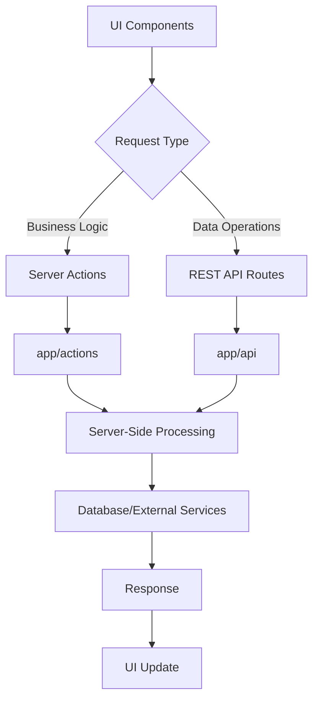
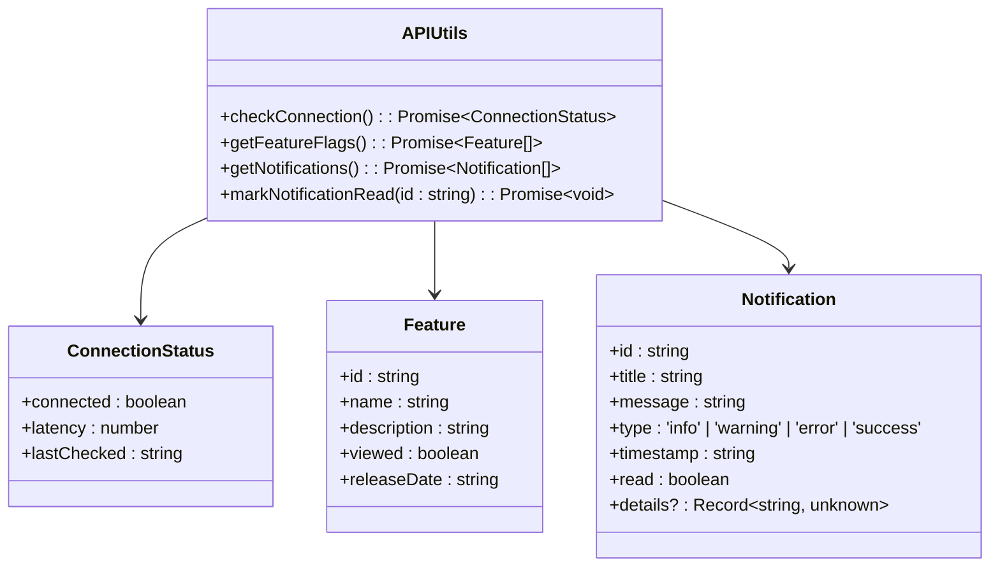
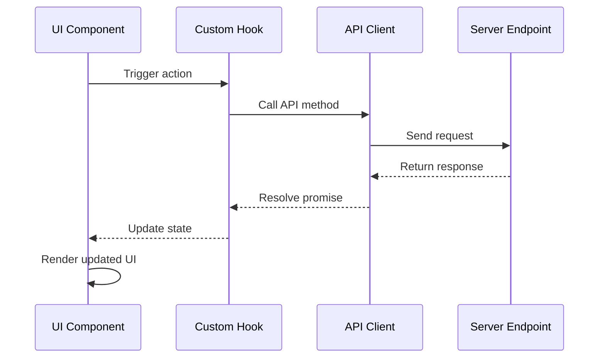
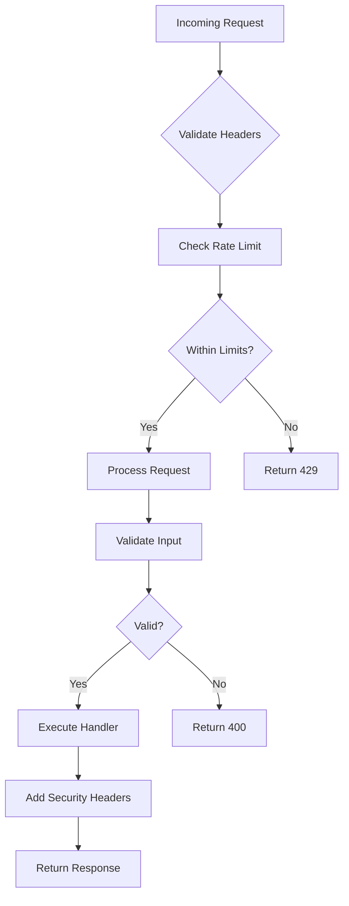

# API Clients

<cite>
**Referenced Files in This Document**   
- [publish.ts](file://app/actions/publish.ts)
- [validate-email.ts](file://app/actions/validate-email.ts)
- [route.ts](file://app/api/chat/route.ts)
- [route.ts](file://app/api/files/route.ts)
- [user/route.ts](file://app/api/github/user/route.ts)
- [route.ts](file://app/api/sandbox/route.ts)
- [api-errors.ts](file://lib/api-errors.ts)
- [auth-utils.ts](file://lib/auth-utils.ts)
- [security.ts](file://lib/security.ts)
- [connection.ts](file://apps/desktop/app/lib/api/connection.ts)
- [features.ts](file://apps/desktop/app/lib/api/features.ts)
- [notifications.ts](file://apps/desktop/app/lib/api/notifications.ts)
- [fetch.ts](file://apps/desktop/app/lib/fetch.ts)
- [security.ts](file://apps/desktop/app/lib/security.ts)
</cite>

## Table of Contents
1. [Introduction](#introduction)
2. [Dual API Architecture](#dual-api-architecture)
3. [Client-Side API Utilities](#client-side-api-utilities)
4. [Key Endpoint Implementations](#key-endpoint-implementations)
5. [Data Flow and UI Integration](#data-flow-and-ui-integration)
6. [File Operations](#file-operations)
7. [Streaming and Real-Time Updates](#streaming-and-real-time-updates)
8. [Security Considerations](#security-considerations)
9. [Extending the API Client](#extending-the-api-client)
10. [Debugging API Interactions](#debugging-api-interactions)

## Introduction
The API Client architecture in CodingIT-1 implements a dual communication strategy using both Next.js Server Actions and RESTful API routes to facilitate server communication. This documentation details the implementation of client-side utilities, key endpoints, data flow patterns, and security measures across the application. The system supports various operations including chat processing, file management, GitHub integration, sandbox execution, and terminal interactions, with comprehensive error handling and authentication mechanisms.

## Dual API Architecture

The application employs a dual approach for server communication through Next.js Server Actions in `app/actions` and RESTful API routes in `app/api`. Server Actions are used for specific business logic operations such as email validation and content publishing, while RESTful endpoints handle data retrieval and manipulation for various resources.

**Diagram sources**
- [publish.ts](file://app/actions/publish.ts)
- [validate-email.ts](file://app/actions/validate-email.ts)
- [route.ts](file://app/api/chat/route.ts)

**Section sources**
- [publish.ts](file://app/actions/publish.ts)
- [validate-email.ts](file://app/actions/validate-email.ts)
- [route.ts](file://app/api/chat/route.ts)

## Client-Side API Utilities

Client-side API utilities are implemented in `lib/api.ts` and `apps/desktop/app/lib/api` to handle authentication, error handling, and request lifecycle management. These utilities provide a consistent interface for interacting with the backend services and include specialized modules for connection status monitoring, feature flag management, and notifications.

**Diagram sources**
- [connection.ts](file://apps/desktop/app/lib/api/connection.ts)
- [features.ts](file://apps/desktop/app/lib/api/features.ts)
- [notifications.ts](file://apps/desktop/app/lib/api/notifications.ts)

**Section sources**
- [connection.ts](file://apps/desktop/app/lib/api/connection.ts)
- [features.ts](file://apps/desktop/app/lib/api/features.ts)
- [notifications.ts](file://apps/desktop/app/lib/api/notifications.ts)

## Key Endpoint Implementations

### Chat Endpoint
The chat endpoint in `app/api/chat/route.ts` handles POST requests for chat interactions with rate limiting, model configuration, and streaming responses. It validates user authentication and processes messages through the selected language model.

**Section sources**
- [route.ts](file://app/api/chat/route.ts)

### Files Endpoint
The files endpoint in `app/api/files/route.ts` provides CRUD operations for workspace files with proper authentication and error handling. It supports retrieving file trees, creating new files, and deleting files with recursive path handling.

**Section sources**
- [route.ts](file://app/api/files/route.ts)

### GitHub Endpoint
The GitHub user endpoint in `app/api/github/user/route.ts` retrieves user information from GitHub's API using configured tokens. It handles authentication and error responses appropriately.

**Section sources**
- [user/route.ts](file://app/api/github/user/route.ts)

### Sandbox Endpoint
The sandbox endpoint in `app/api/sandbox/route.ts` manages code execution environments with template-based sandbox creation, dependency installation, and file operations. It handles both interpreter and web application templates.

**Section sources**
- [route.ts](file://app/api/sandbox/route.ts)

## Data Flow and UI Integration

Data flows from UI components through hooks to API clients and back, with proper handling of loading states and errors. The architecture ensures smooth user experience by managing asynchronous operations and providing feedback during requests.

**Diagram sources**
- [route.ts](file://app/api/chat/route.ts)
- [route.ts](file://app/api/files/route.ts)

## File Operations

File upload and download operations are handled through the files API endpoint with proper content encoding and size calculation. The system supports batch operations and maintains file metadata including paths, sizes, and directory structure.

**Section sources**
- [route.ts](file://app/api/files/route.ts)

## Streaming and Real-Time Updates

The application supports streaming chat responses and real-time updates through polling mechanisms. Chat responses are streamed using the `streamObject` function, while connection status and notifications are updated through periodic polling.

**Section sources**
- [route.ts](file://app/api/chat/route.ts)
- [connection.ts](file://apps/desktop/app/lib/api/connection.ts)

## Security Considerations

### Token Management
Authentication tokens are securely managed through environment variables and request headers. The system implements proper token validation and error handling for unauthorized access attempts.

### Input Validation
Comprehensive input validation is implemented through security utilities that validate package names, GitHub identifiers, and Git references. These utilities prevent injection attacks and ensure data integrity.

### CSRF Protection
The application implements CSRF protection through security headers and request validation. The Content Security Policy restricts script sources and prevents cross-site scripting attacks.

**Diagram sources**
- [security.ts](file://lib/security.ts)
- [security.ts](file://apps/desktop/app/lib/security.ts)

**Section sources**
- [security.ts](file://lib/security.ts)
- [security.ts](file://apps/desktop/app/lib/security.ts)

## Extending the API Client

To extend the API client for new endpoints, create corresponding route handlers in the `app/api` directory following the existing pattern. Implement proper authentication, input validation, and error handling. Update client-side utilities to include methods for the new endpoints and ensure proper type definitions.

## Debugging API Interactions

API interactions can be debugged using the provided utilities and logging mechanisms. The system includes error handling functions that provide meaningful error messages while preventing information leakage. Use the debug tools in `apps/desktop/app/lib/api/debug.ts` to monitor API calls and responses.

**Section sources**
- [api-errors.ts](file://lib/api-errors.ts)
- [auth-utils.ts](file://lib/auth-utils.ts)