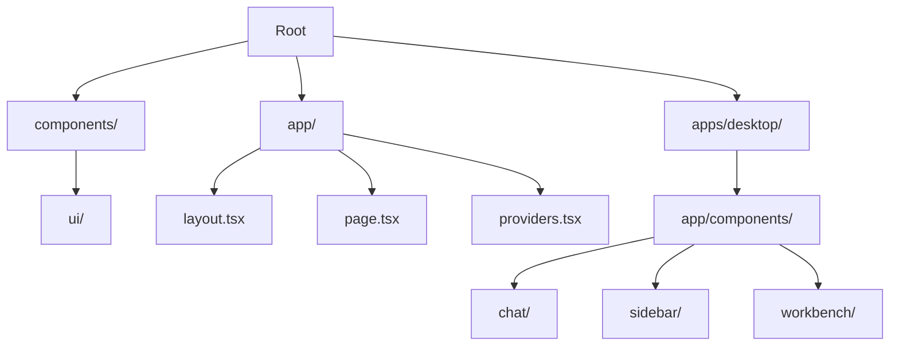
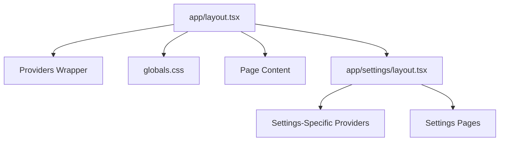
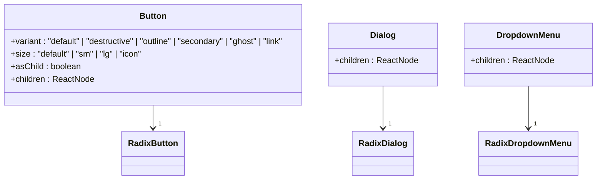
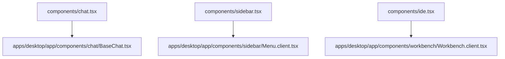
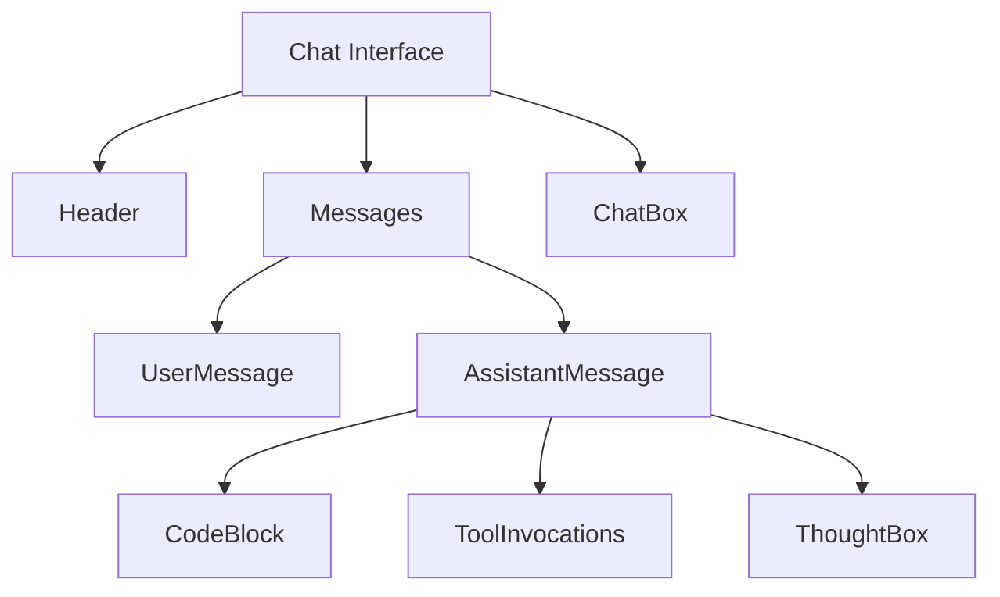

# Component Tree

<cite>
**Referenced Files in This Document**   
- [app/layout.tsx](file://app/layout.tsx)
- [app/page.tsx](file://app/page.tsx)
- [app/providers.tsx](file://app/providers.tsx)
- [components/ui](file://components/ui)
- [apps/desktop/app/components](file://apps/desktop/app/components)
- [app/settings/layout.tsx](file://app/settings/layout.tsx)
- [apps/desktop/app/components/chat/BaseChat.tsx](file://apps/desktop/app/components/chat/BaseChat.tsx)
- [apps/desktop/app/components/sidebar/Menu.client.tsx](file://apps/desktop/app/components/sidebar/Menu.client.tsx)
- [apps/desktop/app/components/workbench/Workbench.client.tsx](file://apps/desktop/app/components/workbench/Workbench.client.tsx)
- [components/chat.tsx](file://components/chat.tsx)
- [components/file-tree.tsx](file://components/file-tree.tsx)
- [components/sidebar.tsx](file://components/sidebar.tsx)
</cite>

## Table of Contents
1. [Introduction](#introduction)
2. [Project Structure Overview](#project-structure-overview)
3. [Root Layout and Page Architecture](#root-layout-and-page-architecture)
4. [Provider Composition and State Management](#provider-composition-and-state-management)
5. [Shared UI Components and Design System](#shared-ui-components-and-design-system)
6. [Desktop-Specific Component Extensions](#desktop-specific-component-extensions)
7. [Atomic Component Composition Patterns](#atomic-component-composition-patterns)
8. [Cross-Platform Consistency and Responsive Design](#cross-platform-consistency-and-responsive-design)
9. [Accessibility and UX Best Practices](#accessibility-and-ux-best-practices)
10. [Component Creation and Integration Guidelines](#component-creation-and-integration-guidelines)

## Introduction

The Component Tree architecture in CodingIT-1 is a hierarchical, modular system designed to support both web and desktop clients with shared UI principles and platform-specific adaptations. This documentation details the structure from root layout components through atomic UI elements, explaining how layout wrappers, providers, and shared components form a cohesive design system. The architecture emphasizes reusability, consistency, and scalability across platforms while enabling rich, interactive interfaces for chat, file management, and settings.

## Project Structure Overview

The project follows a Next.js App Router structure with a monorepo organization. The core application resides in the `app/` directory, while desktop-specific implementations are located in `apps/desktop/`. Shared UI components are centralized in `components/ui`, based on shadcn/ui and Radix UI primitives. This separation enables cross-platform consistency while allowing platform-specific enhancements in the desktop application.

**Diagram sources**
- [app/layout.tsx](file://app/layout.tsx#L1-L10)
- [apps/desktop/app/components](file://apps/desktop/app/components#L1-L5)
- [components/ui](file://components/ui#L1-L3)

**Section sources**
- [app/layout.tsx](file://app/layout.tsx#L1-L50)
- [apps/desktop/app/components](file://apps/desktop/app/components#L1-L20)

## Root Layout and Page Architecture

The application's component hierarchy begins with `app/layout.tsx`, which serves as the root layout wrapper for all pages. This component provides the top-level structure, including global styles, metadata, and shared UI elements that persist across route changes. It wraps all pages with consistent navigation, theming, and accessibility features.

The `app/page.tsx` file represents the main entry point for the application, composing high-level components such as the sidebar, workbench, and chat interface. Route-specific pages like `app/settings/page.tsx` and `app/tasks/page.tsx` extend this pattern, using their own layout files (e.g., `app/settings/layout.tsx`) to define section-specific wrappers while inheriting the root layout's global providers and styling.

**Diagram sources**
- [app/layout.tsx](file://app/layout.tsx#L15-L40)
- [app/settings/layout.tsx](file://app/settings/layout.tsx#L5-L25)
- [app/page.tsx](file://app/page.tsx#L10-L30)

**Section sources**
- [app/layout.tsx](file://app/layout.tsx#L1-L100)
- [app/page.tsx](file://app/page.tsx#L1-L80)
- [app/settings/layout.tsx](file://app/settings/layout.tsx#L1-L60)

## Provider Composition and State Management

The `app/providers.tsx` file orchestrates the application's state management and dependency injection through a layered provider pattern. This component wraps the application with context providers for theme, authentication, notifications, and other global states, ensuring that all child components have access to necessary services without prop drilling.

Providers are composed in a specific order to manage dependencies correctly—for example, the theme provider must be initialized before components that depend on theme context. The desktop application extends this pattern with additional providers for Electron-specific features like window management and system integration, while maintaining compatibility with the web version's provider interface.

**Section sources**
- [app/providers.tsx](file://app/providers.tsx#L1-L120)
- [apps/desktop/app/components](file://apps/desktop/app/components#L1-L10)

## Shared UI Components and Design System

The `components/ui` directory contains a comprehensive library of reusable components based on shadcn/ui and Radix UI primitives. These components follow the headless UI pattern, providing accessible, unstyled primitives that are enhanced with Tailwind CSS for consistent visual design. The library includes foundational elements such as buttons, dialogs, dropdowns, tabs, and form controls, all designed to work seamlessly together.

Each component is implemented as a composition of lower-level primitives, ensuring consistency in behavior and appearance. For example, the `Button.tsx` component combines Radix UI's button primitive with Tailwind classes for styling, while the `Dialog.tsx` component orchestrates multiple Radix primitives (trigger, content, overlay) into a cohesive modal interface.

**Diagram sources**
- [components/ui/button.tsx](file://components/ui/button.tsx#L5-L40)
- [components/ui/dialog.tsx](file://components/ui/dialog.tsx#L10-L50)
- [components/ui/dropdown-menu.tsx](file://components/ui/dropdown-menu.tsx#L8-L35)

**Section sources**
- [components/ui](file://components/ui#L1-L500)

## Desktop-Specific Component Extensions

The desktop application extends the shared component library with platform-specific implementations in `apps/desktop/app/components`. This directory contains specialized versions of core UI elements tailored for desktop use cases, including enhanced file tree navigation, terminal integration, and system tray functionality.

The component hierarchy in the desktop app maintains compatibility with the web version while adding desktop-specific features. For example, the `chat` directory contains `BaseChat.tsx`, which extends the shared chat functionality with desktop notification integration and system-level file access. Similarly, the `workbench` components provide advanced window management and multi-panel layouts optimized for larger screens.

**Diagram sources**
- [components/chat.tsx](file://components/chat.tsx#L1-L20)
- [apps/desktop/app/components/chat/BaseChat.tsx](file://apps/desktop/app/components/chat/BaseChat.tsx#L1-L30)
- [components/sidebar.tsx](file://components/sidebar.tsx#L1-L15)
- [apps/desktop/app/components/sidebar/Menu.client.tsx](file://apps/desktop/app/components/sidebar/Menu.client.tsx#L1-L25)

**Section sources**
- [apps/desktop/app/components](file://apps/desktop/app/components#L1-L100)

## Atomic Component Composition Patterns

Complex UIs in CodingIT-1 are built through the composition of atomic components following a hierarchical pattern. This approach enables the creation of sophisticated interfaces like chat systems, file trees, and settings panels by combining smaller, reusable elements.

The chat interface, implemented in `BaseChat.tsx`, composes atomic components such as `UserMessage`, `AssistantMessage`, `CodeBlock`, and `ToolInvocations` into a cohesive conversation flow. These components are orchestrated by the `Messages.client.tsx` container, which manages message rendering and state updates.

The file tree component, found in `FileTree.tsx`, uses a recursive composition pattern where each node represents a file or directory. It combines `FileIcon`, `BranchSelector`, and `StatusIndicator` components to provide rich visual feedback about file states and version control status.

**Diagram sources**
- [apps/desktop/app/components/chat/BaseChat.tsx](file://apps/desktop/app/components/chat/BaseChat.tsx#L50-L200)
- [apps/desktop/app/components/chat/UserMessage.tsx](file://apps/desktop/app/components/chat/UserMessage.tsx#L5-L30)
- [apps/desktop/app/components/chat/CodeBlock.tsx](file://apps/desktop/app/components/chat/CodeBlock.tsx#L10-L40)

**Section sources**
- [apps/desktop/app/components/chat](file://apps/desktop/app/components/chat#L1-L500)

## Cross-Platform Consistency and Responsive Design

CodingIT-1 achieves cross-platform consistency through a shared component library and responsive design principles implemented with Tailwind CSS. The same atomic components are used across web and desktop clients, ensuring visual and behavioral consistency while allowing platform-specific adaptations where necessary.

Responsive design is implemented through Tailwind's breakpoint system, with components adapting their layout and behavior based on screen size. For example, the sidebar component collapses to a navigation rail on smaller screens, while the workbench interface reflows panels vertically on mobile devices. The desktop application leverages the same responsive classes while adding Electron-specific window management for optimal desktop experience.

**Section sources**
- [components/ui](file://components/ui#L1-L100)
- [apps/desktop/app/components](file://apps/desktop/app/components#L1-L50)
- [app/globals.css](file://app/globals.css#L1-L20)

## Accessibility and UX Best Practices

The component tree architecture prioritizes accessibility through semantic HTML, ARIA attributes, and keyboard navigation support. All interactive components are built on Radix UI primitives, which provide built-in accessibility features such as focus management, screen reader support, and keyboard interaction patterns.

UX best practices are enforced through consistent design patterns, predictable interactions, and performance optimization. Components use React's server and client component patterns appropriately, with heavy UI elements like the code editor and terminal implemented as client components to ensure interactivity, while static content is rendered server-side for performance.

**Section sources**
- [components/ui](file://components/ui#L1-L50)
- [apps/desktop/app/components](file://apps/desktop/app/components#L1-L30)

## Component Creation and Integration Guidelines

New components should follow the established patterns in the component tree architecture. Atomic components should be placed in `components/ui` if they represent general-purpose UI elements, or in the appropriate feature directory if they are domain-specific.

When creating new components:
1. Extend existing primitives rather than duplicating functionality
2. Use Tailwind CSS for styling with consistent class naming
3. Implement responsive behavior using Tailwind's breakpoint system
4. Ensure accessibility by leveraging Radix UI primitives
5. Document component props and usage patterns

To integrate components into the hierarchy:
1. Import from the appropriate directory (`components/ui` for shared elements)
2. Compose within existing layout structures
3. Ensure proper provider context is available
4. Test across platforms and screen sizes
5. Verify accessibility with automated and manual testing

**Section sources**
- [components/ui](file://components/ui#L1-L20)
- [apps/desktop/app/components](file://apps/desktop/app/components#L1-L15)
- [app/providers.tsx](file://app/providers.tsx#L1-L10)