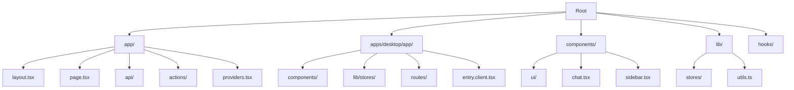
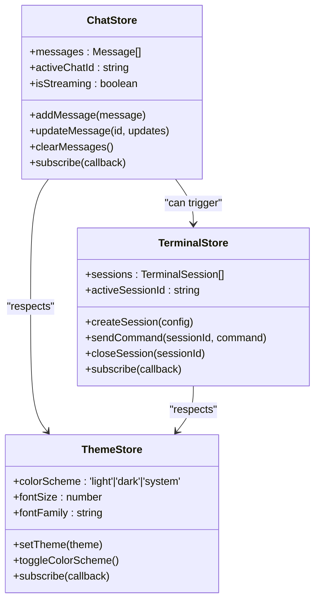
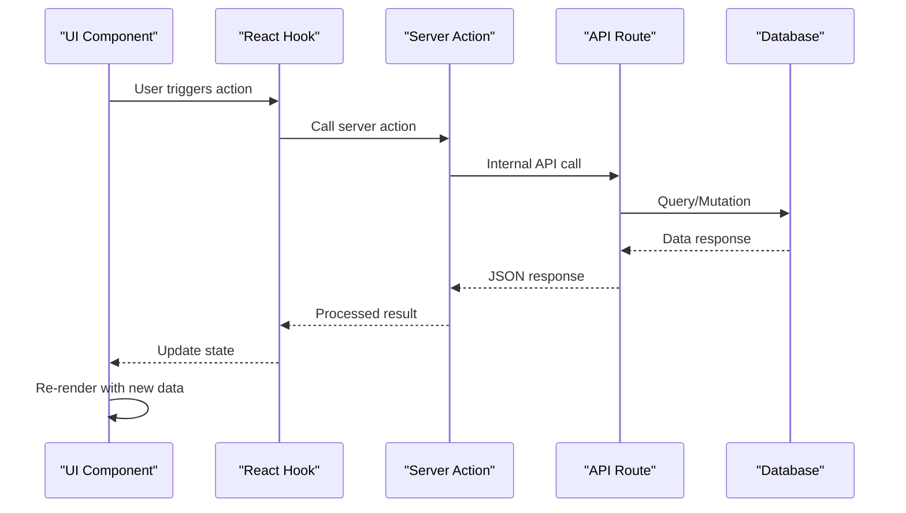

# Frontend Architecture

<cite>
**Referenced Files in This Document**   
- [app/layout.tsx](file://app/layout.tsx)
- [app/page.tsx](file://app/page.tsx)
- [app/providers.tsx](file://app/providers.tsx)
- [components/ui/button.tsx](file://components/ui/button.tsx)
- [lib/stores/chat.ts](file://lib/stores/chat.ts)
- [apps/desktop/app/lib/stores/theme.ts](file://apps/desktop/app/lib/stores/theme.ts)
- [app/api/tasks/route.ts](file://app/api/tasks/route.ts)
- [app/actions/publish.ts](file://app/actions/publish.ts)
- [apps/desktop/app/components/chat/BaseChat.tsx](file://apps/desktop/app/components/chat/BaseChat.tsx)
- [apps/desktop/app/components/ui/Tabs.tsx](file://apps/desktop/app/components/ui/Tabs.tsx)
</cite>

## Table of Contents
1. [Introduction](#introduction)
2. [Project Structure](#project-structure)
3. [Component Hierarchy and Layout System](#component-hierarchy-and-layout-system)
4. [State Management with Nanostores](#state-management-with-nanostores)
5. [Data Flow and API Integration](#data-flow-and-api-integration)
6. [UI Component System and shadcn/ui Integration](#ui-component-system-and-shadcnui-integration)
7. [Responsive Design and Cross-Platform Consistency](#responsive-design-and-cross-platform-consistency)
8. [Conclusion](#conclusion)

## Introduction
The frontend architecture of CodingIT-1 is built on a modern React stack utilizing both Next.js App Router and Remix patterns to deliver a unified experience across web and desktop platforms. The system employs a component-based design philosophy with clear separation of concerns, leveraging Nanostores for lightweight state management and implementing a robust data flow from API routes to UI components through server actions and React hooks. This documentation provides a comprehensive overview of the architectural patterns, component composition, state propagation, and cross-platform integration strategies that define the frontend implementation.

## Project Structure
The project follows a monorepo structure with distinct directories for shared components, application-specific implementations, and desktop-specific adaptations. The root `app/` directory contains the Next.js App Router implementation, while `apps/desktop/app/` houses the desktop-optimized version with platform-specific components and Electron integration. Shared UI components are located in `components/ui/`, following the shadcn/ui pattern, while business logic and utilities are organized in `lib/` and `hooks/` directories.

**Diagram sources**
- [app/layout.tsx](file://app/layout.tsx#L1-L10)
- [apps/desktop/app/lib/stores/theme.ts](file://apps/desktop/app/lib/stores/theme.ts#L1-L5)
- [components/ui/button.tsx](file://components/ui/button.tsx#L1-L8)

**Section sources**
- [app/layout.tsx](file://app/layout.tsx#L1-L50)
- [apps/desktop/app/](file://apps/desktop/app/#L1-L5)

## Component Hierarchy and Layout System
The UI component hierarchy is rooted in the Next.js App Router's `layout.tsx` and `page.tsx` files, which serve as the entry points for the application. The root layout in `app/layout.tsx` wraps all pages with essential providers and global styles, while individual pages compose their specific UI by importing shared components from both `components/` and `apps/desktop/app/components/`. The desktop application extends this pattern with its own layout system in `apps/desktop/app/root.tsx`, maintaining consistency while adapting to desktop-specific requirements.

The component composition follows a nested pattern where high-level layouts contain specialized sections such as headers, sidebars, and workbenches, each implemented as reusable components. For example, the chat interface is composed of `BaseChat.tsx` which orchestrates `ChatBox`, `Messages`, and `Sidebar` components, creating a cohesive user experience. This hierarchical approach enables consistent UI patterns across different views while allowing for contextual customization.

**Section sources**
- [app/layout.tsx](file://app/layout.tsx#L15-L40)
- [app/page.tsx](file://app/page.tsx#L1-L30)
- [apps/desktop/app/components/chat/BaseChat.tsx](file://apps/desktop/app/components/chat/BaseChat.tsx#L20-L60)

## State Management with Nanostores
The application employs Nanostores for state management, providing a lightweight and efficient solution for managing both global and feature-specific state. The state stores are organized in two locations: shared stores in `lib/stores/` and desktop-specific stores in `apps/desktop/app/lib/stores/`. Each store follows a modular pattern, with dedicated files for different domains such as `chat.ts`, `theme.ts`, and `terminal.ts`.

Nanostores are implemented as reactive primitives that can be easily subscribed to by React components using custom hooks. The stores expose actions for state mutations and provide observables for state consumption, enabling a unidirectional data flow. For example, the `theme.ts` store manages the application's color scheme and UI preferences, while the `chat.ts` store handles chat session state, message history, and conversation metadata. This decentralized approach to state management reduces coupling between components and improves maintainability.

**Diagram sources**
- [lib/stores/chat.ts](file://lib/stores/chat.ts#L5-L40)
- [apps/desktop/app/lib/stores/theme.ts](file://apps/desktop/app/lib/stores/theme.ts#L5-L25)
- [apps/desktop/app/lib/stores/terminal.ts](file://apps/desktop/app/lib/stores/terminal.ts#L5-L35)

**Section sources**
- [lib/stores/chat.ts](file://lib/stores/chat.ts#L1-L100)
- [apps/desktop/app/lib/stores/theme.ts](file://apps/desktop/app/lib/stores/theme.ts#L1-L50)

## Data Flow and API Integration
The data flow architecture follows a server-centric pattern where API routes in `app/api/` serve as the primary interface between the frontend and backend services. These routes implement RESTful endpoints for various features including tasks, chat, GitHub integration, and file operations. The frontend consumes these APIs through a combination of server actions, React hooks, and direct fetch calls, depending on the use case and performance requirements.

Server actions in `app/actions/` provide a way to perform mutations on the server from client components, abstracting away the complexity of API calls and error handling. For example, the `publish.ts` action handles content publishing workflows, while `validate-email.ts` manages email validation logic. Client components interact with these actions through React hooks that provide loading states, error handling, and result processing.

The data flow typically follows this pattern: UI event → React hook → server action or API call → server processing → database interaction → response → state update → UI re-render. This ensures that all data mutations go through a controlled pipeline with proper validation, error handling, and state synchronization.

**Diagram sources**
- [app/actions/publish.ts](file://app/actions/publish.ts#L1-L20)
- [app/api/tasks/route.ts](file://app/api/tasks/route.ts#L1-L30)
- [apps/desktop/app/lib/stores/chat.ts](file://apps/desktop/app/lib/stores/chat.ts#L1-L15)

**Section sources**
- [app/api/tasks/route.ts](file://app/api/tasks/route.ts#L1-L50)
- [app/actions/publish.ts](file://app/actions/publish.ts#L1-L30)
- [apps/desktop/app/lib/stores/chat.ts](file://apps/desktop/app/lib/stores/chat.ts#L1-L40)

## UI Component System and shadcn/ui Integration
The UI component system is built on the shadcn/ui design pattern, with base components in `components/ui/` providing foundational elements such as buttons, cards, dialogs, and form controls. These components are implemented as unstyled primitives that receive their appearance through Tailwind CSS classes, enabling consistent theming and easy customization. The project extends these base components with project-specific implementations in both `components/` and `apps/desktop/app/components/`.

The integration with shadcn/ui follows the compositional pattern where higher-level components import and wrap the base components, adding project-specific functionality and styling. For example, the `ChatBox.tsx` component uses the `Textarea` and `Button` components from `components/ui/` to create a specialized chat input interface. This approach ensures design consistency while allowing for feature-specific enhancements.

The component hierarchy is organized into several categories: layout components (`Sidebar`, `Header`), interactive components (`ChatBox`, `Terminal`), and utility components (`LoadingOverlay`, `EmptyState`). The desktop application further extends this system with platform-specific components like `ExpoQrModal` and `PortDropdown`, which leverage the same design language while addressing desktop-specific use cases.

**Section sources**
- [components/ui/button.tsx](file://components/ui/button.tsx#L1-L40)
- [apps/desktop/app/components/chat/ChatBox.tsx](file://apps/desktop/app/components/chat/ChatBox.tsx#L15-L50)
- [apps/desktop/app/components/ui/Tabs.tsx](file://apps/desktop/app/components/ui/Tabs.tsx#L1-L30)

## Responsive Design and Cross-Platform Consistency
The frontend architecture addresses responsive design and cross-platform consistency through a combination of CSS media queries, flexible layout systems, and platform-aware components. The application uses Tailwind CSS for responsive styling, with breakpoints defined in `tailwind.config.ts` to ensure consistent behavior across different screen sizes.

For cross-platform consistency between web and desktop clients, the architecture employs several strategies. Shared component libraries in `components/` ensure that core UI elements have identical appearance and behavior across platforms. Platform-specific adaptations are isolated in `apps/desktop/app/`, allowing for desktop-optimized features without compromising the shared codebase. The state management system using Nanostores ensures that user preferences and application state are synchronized across platforms.

The responsive design system uses a mobile-first approach with progressive enhancement for larger screens. Layouts adapt to available screen real estate by collapsing or expanding panels, adjusting font sizes, and repositioning interactive elements. The desktop application takes advantage of the larger screen space by implementing multi-panel layouts with resizable sections, while the web version prioritizes content density and navigation efficiency.

**Section sources**
- [app/layout.tsx](file://app/layout.tsx#L25-L45)
- [apps/desktop/app/components/workbench/Workbench.client.tsx](file://apps/desktop/app/components/workbench/Workbench.client.tsx#L10-L60)
- [tailwind.config.ts](file://tailwind.config.ts#L1-L20)

## Conclusion
The frontend architecture of CodingIT-1 demonstrates a well-structured, component-based design that effectively leverages modern React patterns with Next.js App Router and Remix. The system's strength lies in its clear separation of concerns, with well-defined boundaries between UI components, state management, and data flow. The use of Nanostores provides a lightweight yet powerful state management solution that scales well across both web and desktop platforms. The integration with shadcn/ui ensures design consistency while allowing for project-specific customization. The architecture successfully addresses the challenges of responsive design and cross-platform consistency, delivering a cohesive user experience across different environments. This foundation provides excellent extensibility for future features while maintaining code quality and developer productivity.