# State Management

<cite>
**Referenced Files in This Document**   
- [chat.ts](file://apps/desktop/app/lib/stores/chat.ts)
- [settings.ts](file://apps/desktop/app/lib/stores/settings.ts)
- [editor.ts](file://apps/desktop/app/lib/stores/editor.ts)
- [github.ts](file://apps/desktop/app/lib/stores/github.ts)
- [terminal.ts](file://apps/desktop/app/lib/stores/terminal.ts)
- [localStorage.ts](file://apps/desktop/app/lib/persistence/localStorage.ts)
- [db.ts](file://apps/desktop/app/lib/persistence/db.ts)
- [useSettings.ts](file://apps/desktop/app/lib/hooks/useSettings.ts)
- [useGitHubConnection.ts](file://apps/desktop/app/lib/hooks/useGitHubConnection.ts)
</cite>

## Table of Contents
1. [Introduction](#introduction)
2. [Core State Stores](#core-state-stores)
3. [Reactive State Patterns](#reactive-state-patterns)
4. [Persistence Strategy](#persistence-strategy)
5. [State Synchronization](#state-synchronization)
6. [Store Composition and Derived State](#store-composition-and-derived-state)
7. [Best Practices](#best-practices)
8. [Performance Considerations](#performance-considerations)

## Introduction
The State Management system in CodingIT-1 implements a robust state management architecture using Nanostores for managing application state across key domains including chat, editor, files, GitHub, terminal, and user settings. This documentation details the implementation approach, reactive patterns, persistence mechanisms, and best practices for maintaining a scalable and performant state management system.

**Section sources**
- [chat.ts](file://apps/desktop/app/lib/stores/chat.ts#L2-L6)
- [settings.ts](file://apps/desktop/app/lib/stores/settings.ts#L0-L404)

## Core State Stores

The application implements domain-specific stores for managing state across different functional areas. Each store encapsulates the state and logic for its respective domain, providing a clean separation of concerns.

### Chat Store
The chat store manages the state of the chat interface, including chat session status and visibility. It uses Nanostores' map primitive to maintain a simple key-value state structure.

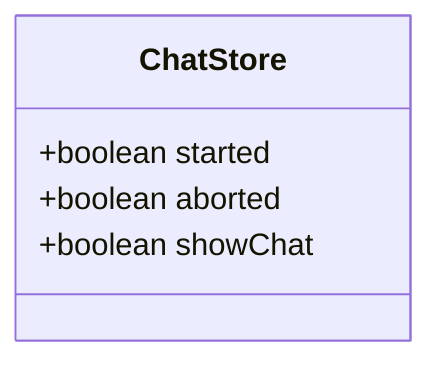

**Diagram sources**
- [chat.ts](file://apps/desktop/app/lib/stores/chat.ts#L2-L6)

### Settings Store
The settings store manages user preferences and application configuration. It implements both Nanostores atoms and maps for different types of settings, with persistence to localStorage.

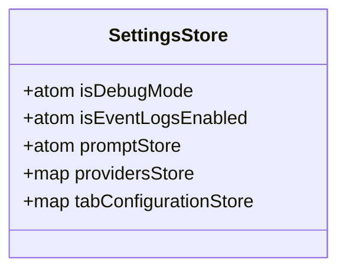

**Diagram sources**
- [settings.ts](file://apps/desktop/app/lib/stores/settings.ts#L0-L404)

### Editor Store
The editor store manages the state of the code editor, including document content, scroll positions, and file selection. It implements a class-based store that maintains references to other stores.

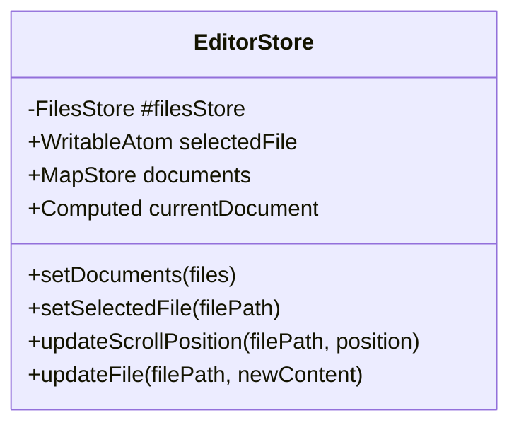

**Diagram sources**
- [editor.ts](file://apps/desktop/app/lib/stores/editor.ts#L0-L113)

### GitHub Store
The GitHub store manages the connection state and user information for GitHub integration. It uses an atom to store the connection object with persistence to localStorage.

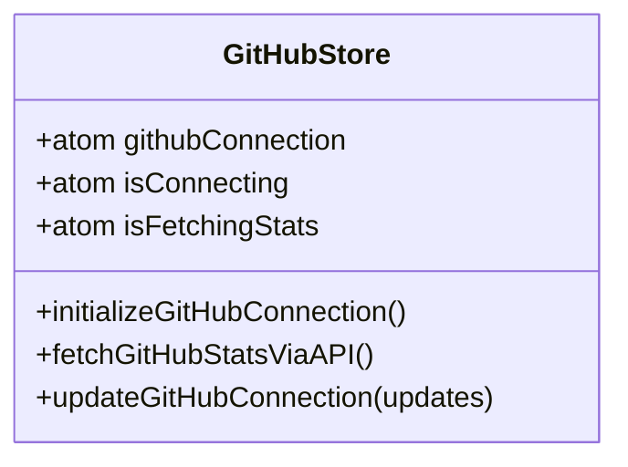

**Diagram sources**
- [github.ts](file://apps/desktop/app/lib/stores/github.ts#L0-L136)

### Terminal Store
The terminal store manages the state of terminal instances and their processes. It implements a class-based store that handles WebContainer integration.

```mermaid
classDiagram
class TerminalStore {
-Promise<WebContainer> #webcontainer
-Array<{terminal : ITerminal, process : WebContainerProcess}> #terminals
-ShellProcess #boltTerminal
+WritableAtom<boolean> showTerminal
+toggleTerminal(value)
+attachBoltTerminal(terminal)
+attachTerminal(terminal)
+onTerminalResize(cols, rows)
+detachTerminal(terminal)
}
```

**Diagram sources**
- [terminal.ts](file://apps/desktop/app/lib/stores/terminal.ts#L0-L68)

## Reactive State Patterns

The application implements reactive state patterns using Nanostores' store.on() and store.set() methods, allowing components to subscribe to state changes and update accordingly.

### State Subscription
Components subscribe to state changes using the useStore hook from @nanostores/react, which automatically handles subscription and cleanup.

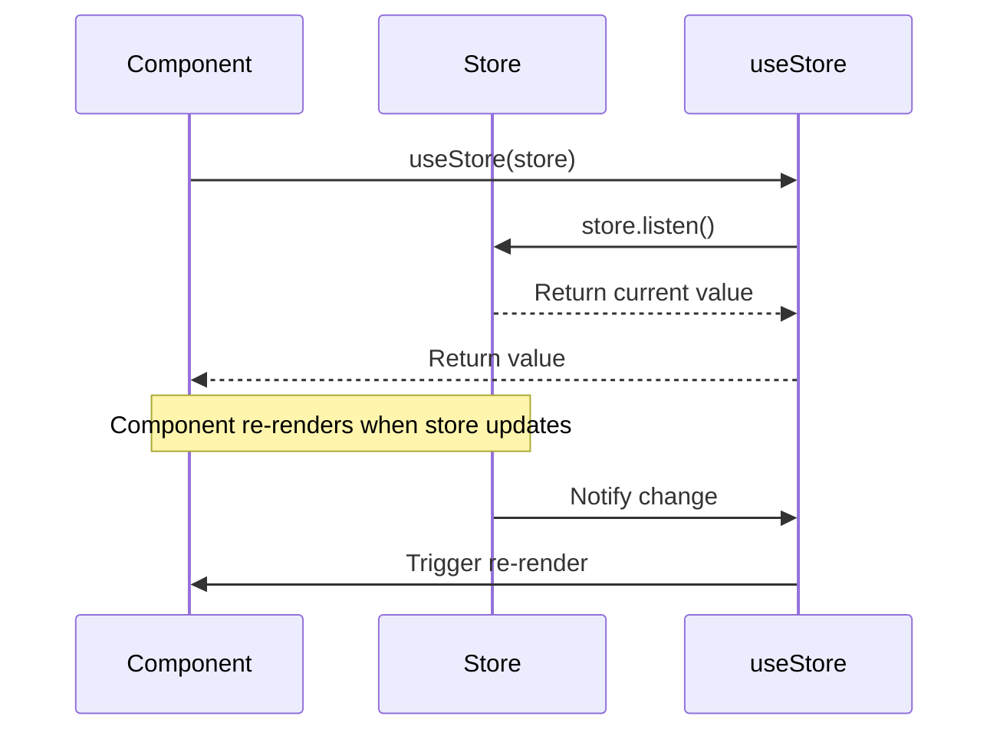

**Diagram sources**
- [useSettings.ts](file://apps/desktop/app/lib/hooks/useSettings.ts#L71-L207)
- [useGitHubConnection.ts](file://apps/desktop/app/lib/hooks/useGitHubConnection.ts#L26-L249)

### State Updates
State updates are performed using the store.set() method, which notifies all subscribers of the change.

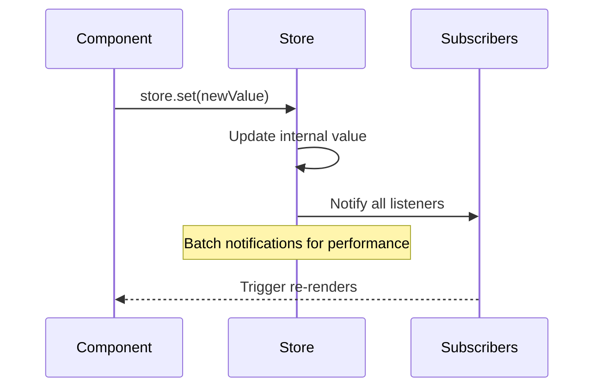

**Diagram sources**
- [settings.ts](file://apps/desktop/app/lib/stores/settings.ts#L297-L329)

## Persistence Strategy

The application implements a multi-layer persistence strategy using localStorage and IndexedDB to ensure state persistence across sessions.

### LocalStorage Persistence
Simple settings and connection data are persisted to localStorage with helper functions for safe read/write operations.

```mermaid
flowchart TD
A[Application State] --> B{Is it simple data?}
B --> |Yes| C[Use localStorage]
B --> |No| D[Use IndexedDB]
C --> E[getLocalStorage(key)]
C --> F[setLocalStorage(key, value)]
D --> G[openDatabase()]
D --> H[CRUD operations]
```

**Diagram sources**
- [localStorage.ts](file://apps/desktop/app/lib/persistence/localStorage.ts#L0-L28)
- [settings.ts](file://apps/desktop/app/lib/stores/settings.ts#L297-L329)

### IndexedDB Persistence
Complex data such as chat history and snapshots are persisted to IndexedDB using a structured database schema.

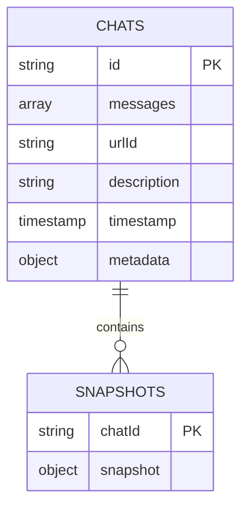

**Diagram sources**
- [db.ts](file://apps/desktop/app/lib/persistence/db.ts#L0-L343)

## State Synchronization

The application implements state synchronization between UI components and backend services, particularly in real-time collaboration scenarios.

### GitHub Connection Synchronization
The GitHub connection state is synchronized between the client and server, with token management handled securely.

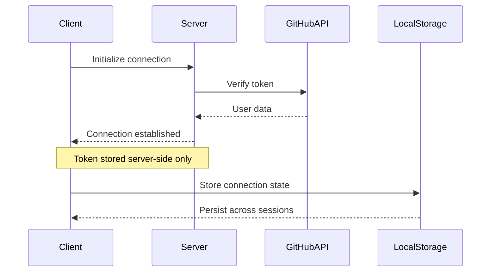

**Diagram sources**
- [github.ts](file://apps/desktop/app/lib/stores/github.ts#L14-L14)
- [useGitHubConnection.ts](file://apps/desktop/app/lib/hooks/useGitHubConnection.ts#L26-L249)

## Store Composition and Derived State

The application implements store composition and derived state calculations to create complex state from simpler primitives.

### Computed State
Computed values are derived from multiple stores using Nanostores' computed function.

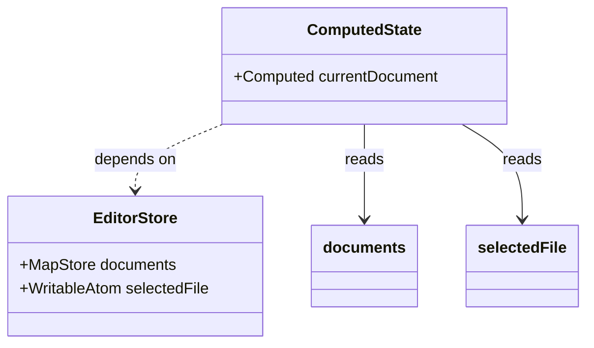

**Diagram sources**
- [editor.ts](file://apps/desktop/app/lib/stores/editor.ts#L15-L22)

### Store Dependencies
Stores can depend on other stores, creating a hierarchy of state management.

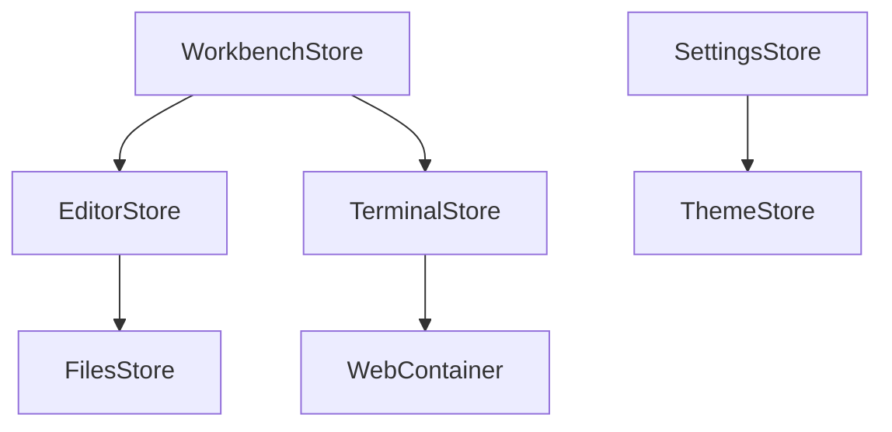

**Section sources**
- [editor.ts](file://apps/desktop/app/lib/stores/editor.ts#L0-L113)
- [terminal.ts](file://apps/desktop/app/lib/stores/terminal.ts#L0-L68)
- [workbench.ts](file://apps/desktop/app/lib/stores/workbench.ts#L0-L32)

## Best Practices

The implementation follows several best practices for state management to ensure maintainability and performance.

### Memory Leak Prevention
The application prevents memory leaks through proper subscription cleanup and store management.

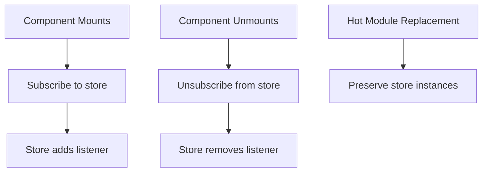

**Section sources**
- [editor.ts](file://apps/desktop/app/lib/stores/editor.ts#L38-L40)
- [terminal.ts](file://apps/desktop/app/lib/stores/terminal.ts#L22-L24)

### Async State Management
Async operations are handled with proper state transitions to reflect loading and error states.

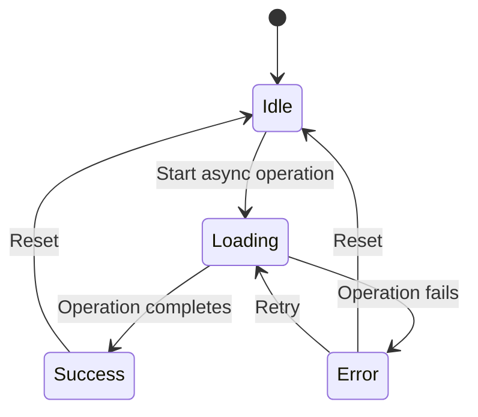

**Section sources**
- [github.ts](file://apps/desktop/app/lib/stores/github.ts#L45-L65)
- [useGitHubConnection.ts](file://apps/desktop/app/lib/hooks/useGitHubConnection.ts#L26-L249)

### State Debugging
Comprehensive logging and debugging tools are implemented to trace state transitions.

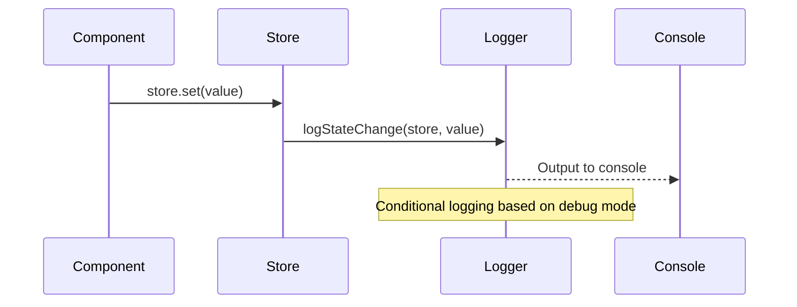

**Section sources**
- [settings.ts](file://apps/desktop/app/lib/stores/settings.ts#L297-L329)
- [useSettings.ts](file://apps/desktop/app/lib/hooks/useSettings.ts#L71-L207)

## Performance Considerations

The application implements several performance optimizations for handling large state trees and state hydration.

### Large State Optimization
Strategies are implemented to handle large state trees efficiently.

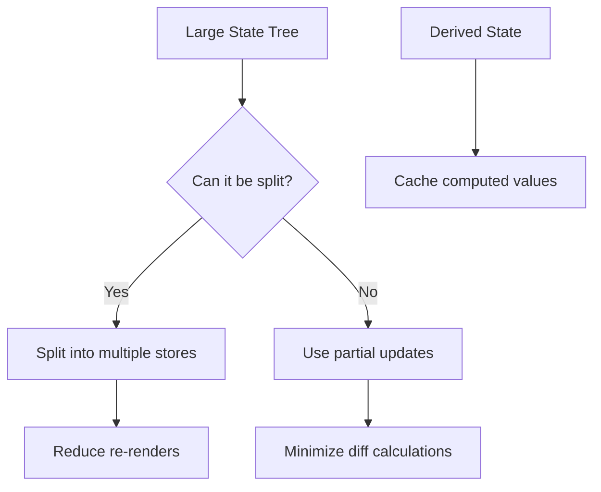

**Section sources**
- [editor.ts](file://apps/desktop/app/lib/stores/editor.ts#L70-L113)
- [settings.ts](file://apps/desktop/app/lib/stores/settings.ts#L297-L329)

### SSR State Hydration
State hydration strategies are implemented for server-side rendering scenarios.

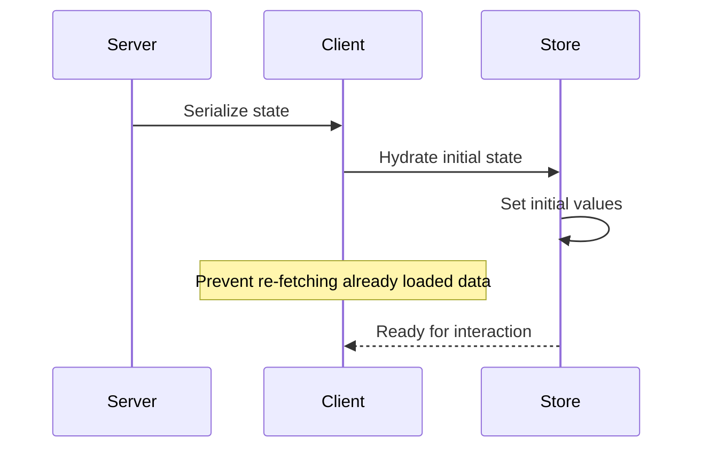

**Section sources**
- [settings.ts](file://apps/desktop/app/lib/stores/settings.ts#L220-L250)
- [useSettings.ts](file://apps/desktop/app/lib/hooks/useSettings.ts#L71-L207)