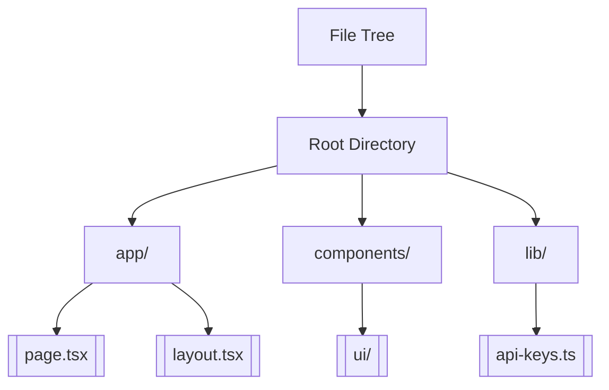
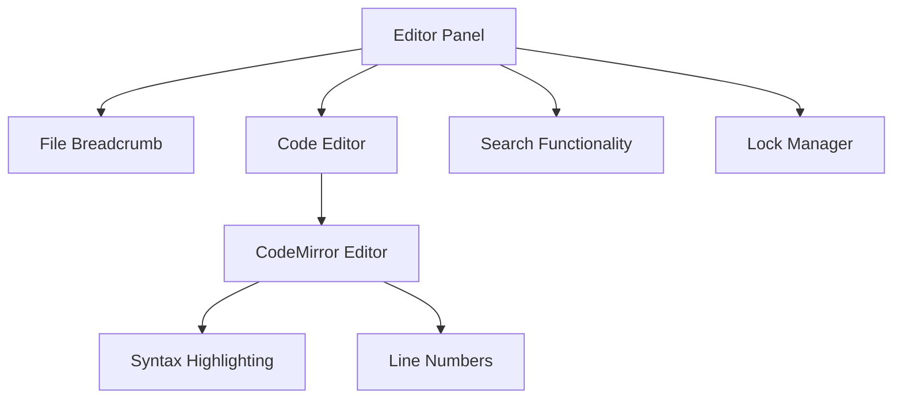
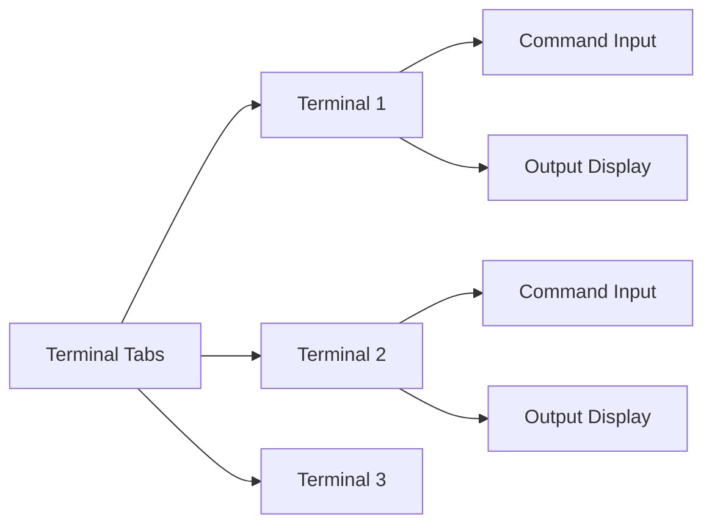
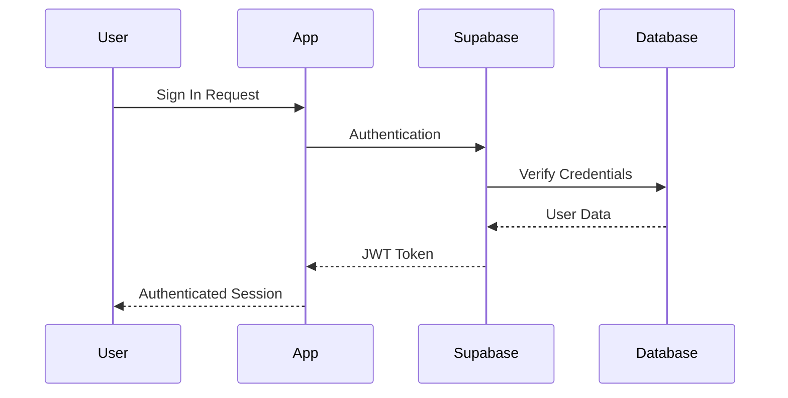
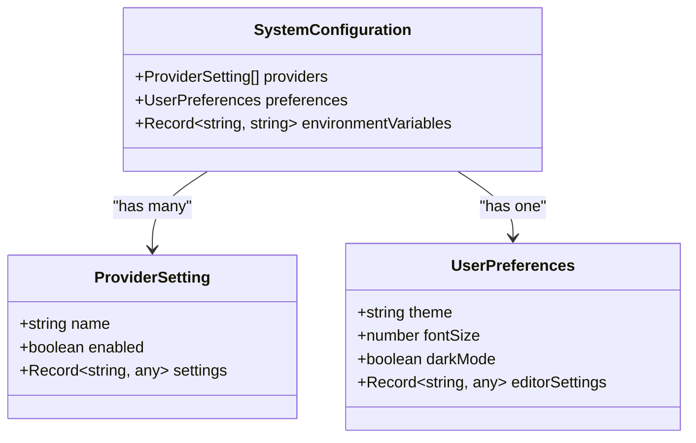

# Getting Started

<cite>
**Referenced Files in This Document**   
- [README.md](file://README.md)
- [package.json](file://package.json)
- [apps/desktop/package.json](file://apps/desktop/package.json)
- [apps/desktop/scripts/setup-env.sh](file://apps/desktop/scripts/setup-env.sh)
- [apps/desktop/bindings.sh](file://apps/desktop/bindings.sh)
- [middleware.ts](file://middleware.ts)
- [supabase/schemas/auth.sql](file://supabase/schemas/auth.sql)
- [apps/desktop/app/components/chat/ExamplePrompts.tsx](file://apps/desktop/app/components/chat/ExamplePrompts.tsx)
- [apps/desktop/app/components/workbench/FileTree.tsx](file://apps/desktop/app/components/workbench/FileTree.tsx)
- [apps/desktop/app/components/workbench/EditorPanel.tsx](file://apps/desktop/app/components/workbench/EditorPanel.tsx)
- [apps/desktop/app/components/workbench/terminal/TerminalTabs.tsx](file://apps/desktop/app/components/workbench/terminal/TerminalTabs.tsx)
- [apps/desktop/app/lib/common/prompt-library.ts](file://apps/desktop/app/lib/common/prompt-library.ts)
- [apps/desktop/app/lib/stores/settings.ts](file://apps/desktop/app/lib/stores/settings.ts)
- [apps/desktop/app/lib/stores/logs.ts](file://apps/desktop/app/lib/stores/logs.ts)
- [apps/desktop/app/utils/projectCommands.ts](file://apps/desktop/app/utils/projectCommands.ts)
- [lib/prompt.ts](file://lib/prompt.ts)
</cite>

## Table of Contents
1. [Introduction](#introduction)
2. [Prerequisites](#prerequisites)
3. [Installation](#installation)
4. [Environment Setup](#environment-setup)
5. [Starting the Application](#starting-the-application)
6. [Creating Your First Project](#creating-your-first-project)
7. [Interface Overview](#interface-overview)
8. [Authentication Configuration](#authentication-configuration)
9. [Troubleshooting Common Issues](#troubleshooting-common-issues)
10. [Key Features Tour](#key-features-tour)
11. [Next Steps](#next-steps)

## Introduction
Welcome to CodingIT-1, an AI-powered full-stack development platform that transforms natural language into working applications. This guide will help you set up both the web and desktop versions of CodingIT-1, configure your environment, and start building applications using natural language prompts.

CodingIT-1 enables developers to build production-ready applications across multiple frameworks including Next.js, Vue, Streamlit, and Gradio. With support for over 50 AI models from providers like OpenAI, Anthropic, Google AI, and local Ollama models, you can create applications using simple natural language instructions.

The platform features live sandbox execution with E2B secure containers, real-time preview capabilities, and seamless deployment options to platforms like Vercel, Netlify, and GitHub.

**Section sources**
- [README.md](file://README.md#L1-L50)

## Prerequisites
Before installing CodingIT-1, ensure you have the following prerequisites installed on your system:

- **Node.js** v18+ - JavaScript runtime environment
- **pnpm** v10.17+ - Package manager for JavaScript
- **Git** - Version control system
- **E2B API Key** - For secure code execution in sandboxes
- **AI Provider API Keys** - At least one from OpenAI, Anthropic, Google AI, or other supported providers

You can verify your Node.js and pnpm installations by running:
```bash
node --version
pnpm --version
```

For the desktop application, you'll also need Electron dependencies which will be installed automatically during setup.

**Section sources**
- [README.md](file://README.md#L100-L120)

## Installation
To install CodingIT-1, follow these steps:

**1. Clone the repository:**
```bash
git clone https://github.com/Gerome-Elassaad/CodingIT.git
cd CodingIT
```

**2. Install dependencies using pnpm:**
```bash
pnpm install
```

This command installs all required dependencies for both the web and desktop applications as defined in the package.json files.

The repository uses a monorepo structure with two main applications:
- Web App (@codinit/web) - Next.js 14 cloud platform running on port 3000
- Desktop App (@codinit/desktop) - Electron native application running on port 5173

**Section sources**
- [README.md](file://README.md#L125-L140)
- [package.json](file://package.json#L1-L20)
- [apps/desktop/package.json](file://apps/desktop/package.json#L1-L15)

## Environment Setup
Proper environment configuration is essential for CodingIT-1 to function correctly. Follow these steps to set up your environment variables.

**1. Create an environment configuration file:**
Create a `.env.local` file in the project root directory:
```bash
touch .env.local
```

**2. Add required environment variables:**
```env
# E2B Code Execution (Required)
E2B_API_KEY=your_e2b_api_key

# Supabase (Required for auth & database)
NEXT_PUBLIC_SUPABASE_URL=your_supabase_url
NEXT_PUBLIC_SUPABASE_ANON_KEY=your_supabase_anon_key
SUPABASE_SERVICE_ROLE_KEY=your_service_role_key

# AI Providers (Add at least one)
OPENAI_API_KEY=sk-...
ANTHROPIC_API_KEY=sk-ant-...
GOOGLE_GENERATIVE_AI_API_KEY=AI...
XAI_API_KEY=xai-...
MISTRAL_API_KEY=...
GROQ_API_KEY=gsk_...
FIREWORKS_API_KEY=fw_...
TOGETHER_API_KEY=...
DEEPSEEK_API_KEY=...

# Ollama (Optional - for local models)
OLLAMA_BASE_URL=http://localhost:11434
```

**3. Database setup:**
Initialize the Supabase database with the provided migrations:
```bash
npx supabase db push
```

This command sets up the necessary tables and functions in the PostgreSQL database.

For Docker environments, use the setup script to ensure proper environment variable loading:
```bash
./apps/desktop/scripts/setup-env.sh
```

**Section sources**
- [README.md](file://README.md#L145-L180)
- [apps/desktop/scripts/setup-env.sh](file://apps/desktop/scripts/setup-env.sh#L1-L40)
- [apps/desktop/bindings.sh](file://apps/desktop/bindings.sh#L1-L32)

## Starting the Application
You can start either the web or desktop version of CodingIT-1 depending on your preference.

**Starting the Web Application:**
```bash
pnpm dev
```
This starts the Next.js development server on http://localhost:3000.

**Starting the Desktop Application:**
```bash
pnpm desktop:dev
```
This starts the Electron application on http://localhost:5173.

**Building production versions:**
- Web App: `pnpm build && pnpm start`
- Desktop App: `pnpm desktop:build`

The desktop application uses WebContainer technology for in-browser execution, while the web app leverages E2B Cloud Sandboxes for secure code execution.

**Section sources**
- [package.json](file://package.json#L5-L15)
- [apps/desktop/package.json](file://apps/desktop/package.json#L20-L50)

## Creating Your First Project
Once the application is running, you can create your first project using natural language prompts.

**1. Access the application:**
Open your browser and navigate to:
- Web App: http://localhost:3000
- Desktop App: http://localhost:5173

**2. Use example prompts:**
The interface provides several example prompts to help you get started:
- "Create a mobile app about codinit.dev"
- "Build a todo app in React using Tailwind"
- "Build a simple blog using Astro"
- "Make a space invaders game"

**3. Enter your own prompt:**
Type a natural language description of what you want to build. For example:
"Create a Next.js todo app with dark mode and local storage"

The AI will:
- Create the Next.js project structure
- Implement CRUD operations for todos
- Add a dark mode toggle
- Configure localStorage persistence
- Provide a live preview

**4. View real-time preview:**
As the AI generates code, you can view the application in real-time through the preview panel.

**Section sources**
- [apps/desktop/app/components/chat/ExamplePrompts.tsx](file://apps/desktop/app/components/chat/ExamplePrompts.tsx#L1-L36)
- [lib/prompt.ts](file://lib/prompt.ts#L1-L14)

## Interface Overview
The CodingIT-1 interface consists of several key panels that facilitate development:

**Chat Panel:**
Located at the bottom of the screen, this is where you interact with the AI using natural language prompts. You can send messages, view AI responses, and see the generated code artifacts.

**File Tree Panel:**
Displays the project's directory structure, allowing you to navigate through files and folders. You can click on files to open them in the editor.



**Diagram sources**
- [apps/desktop/app/components/workbench/FileTree.tsx](file://apps/desktop/app/components/workbench/FileTree.tsx#L37-L82)

**Editor Panel:**
The main workspace where code files are displayed and edited. It supports syntax highlighting and code completion.



**Diagram sources**
- [apps/desktop/app/components/workbench/EditorPanel.tsx](file://apps/desktop/app/components/workbench/EditorPanel.tsx#L1-L29)

**Terminal Panel:**
Provides access to a command-line interface for running shell commands, installing dependencies, and viewing build output.



**Diagram sources**
- [apps/desktop/app/components/workbench/terminal/TerminalTabs.tsx](file://apps/desktop/app/components/workbench/terminal/TerminalTabs.tsx#L1-L34)

**Section sources**
- [apps/desktop/app/components/workbench/FileTree.tsx](file://apps/desktop/app/components/workbench/FileTree.tsx#L1-L50)
- [apps/desktop/app/components/workbench/EditorPanel.tsx](file://apps/desktop/app/components/workbench/EditorPanel.tsx#L1-L50)
- [apps/desktop/app/components/workbench/terminal/TerminalTabs.tsx](file://apps/desktop/app/components/workbench/terminal/TerminalTabs.tsx#L1-L50)

## Authentication Configuration
CodingIT-1 uses Supabase for authentication and user management. The system implements Row Level Security (RLS) to ensure data privacy and security.

**Authentication Flow:**
1. User signs in through Supabase authentication
2. System creates a user profile and preferences
3. Session is managed with secure tokens
4. Access to resources is controlled through RLS policies

**Database Security:**
The Supabase schema includes comprehensive security measures:
- Users can only view their own data
- Sessions are protected with time-based expiration
- Multi-factor authentication support
- Secure token management



**Diagram sources**
- [supabase/schemas/auth.sql](file://supabase/schemas/auth.sql#L367-L403)

**Section sources**
- [supabase/schemas/auth.sql](file://supabase/schemas/auth.sql#L1-L50)
- [middleware.ts](file://middleware.ts#L1-L22)

## Troubleshooting Common Issues
This section addresses common setup issues and their solutions.

**1. Environment variables not loading:**
If your API keys are not being recognized:
- Ensure `.env.local` file exists in the project root
- Verify file permissions allow reading
- Restart the development server after making changes
- Use the setup script for Docker environments: `./apps/desktop/scripts/setup-env.sh`

**2. Database connection errors:**
- Verify Supabase URL and keys are correct
- Check network connectivity to Supabase
- Ensure database migrations have been applied: `npx supabase db push`
- Validate that the service role key has proper permissions

**3. AI provider connectivity issues:**
- Verify API keys are valid and have sufficient quota
- Check for network restrictions or firewalls
- Ensure the provider is enabled in settings
- Test API connectivity independently

**4. Build or installation failures:**
- Clear pnpm cache: `pnpm store prune`
- Remove node_modules and reinstall: `rm -rf node_modules && pnpm install`
- Verify Node.js version compatibility
- Check disk space availability

**5. Performance issues:**
- Monitor system resources (CPU, memory)
- Check for background processes consuming resources
- Consider using local models (Ollama) for faster response times
- Optimize AI prompt complexity

**Section sources**
- [apps/desktop/scripts/setup-env.sh](file://apps/desktop/scripts/setup-env.sh#L1-L40)
- [apps/desktop/app/lib/stores/logs.ts](file://apps/desktop/app/lib/stores/logs.ts#L196-L240)
- [apps/desktop/app/utils/projectCommands.ts](file://apps/desktop/app/utils/projectCommands.ts#L1-L33)

## Key Features Tour
CodingIT-1 offers a comprehensive set of features designed to streamline AI-powered development.

**AI Model Support:**
With over 50 models from 10 providers, you can choose the best model for your task:
- OpenAI: GPT-5, GPT-4.5, GPT-4o
- Anthropic: Claude 4.1 Opus, Claude 3.7 Sonnet
- Google AI: Gemini 2.5 Pro/Flash
- Local models via Ollama

**Secure Code Execution:**
All code runs in isolated E2B containers with:
- Resource limits to prevent abuse
- Network isolation
- File system sandboxing
- Real-time monitoring

**Development Environments:**
Choose from multiple templates:
- Next.js Developer
- Vue.js Developer
- Python Data Analyst
- Streamlit Developer
- Gradio Developer

**Configuration Management:**
The system stores user preferences and settings:
- Provider configurations
- Theme preferences
- Terminal settings
- Editor configurations



**Diagram sources**
- [apps/desktop/app/lib/stores/settings.ts](file://apps/desktop/app/lib/stores/settings.ts#L80-L127)
- [apps/desktop/app/lib/common/prompt-library.ts](file://apps/desktop/app/lib/common/prompt-library.ts#L1-L44)

**Section sources**
- [README.md](file://README.md#L50-L100)
- [apps/desktop/app/lib/stores/settings.ts](file://apps/desktop/app/lib/stores/settings.ts#L1-L50)

## Next Steps
Now that you've successfully set up CodingIT-1, you can explore more advanced features:

1. **Customize AI prompts** in the prompt library for specialized tasks
2. **Add new sandbox templates** for additional development environments
3. **Integrate with GitHub** to import and export repositories
4. **Configure deployment targets** for Vercel, Netlify, or GitHub Pages
5. **Explore the API routes** in the app/api directory for custom integrations

For more detailed documentation, visit the [complete documentation](https://docs.codinit.dev) or check the [WORKSPACE.md](file://WORKSPACE.md) file for monorepo architecture details.

Continue experimenting with natural language prompts to build increasingly complex applications, and refer to the troubleshooting section if you encounter any issues during development.

**Section sources**
- [README.md](file://README.md#L500-L550)
- [WORKSPACE.md](file://WORKSPACE.md#L1-L10)