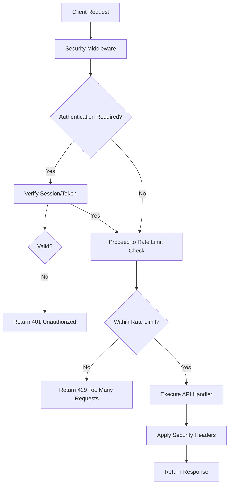
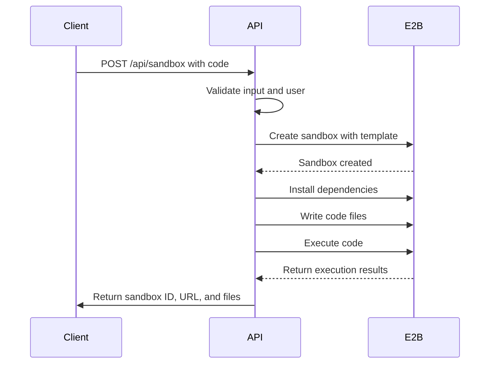
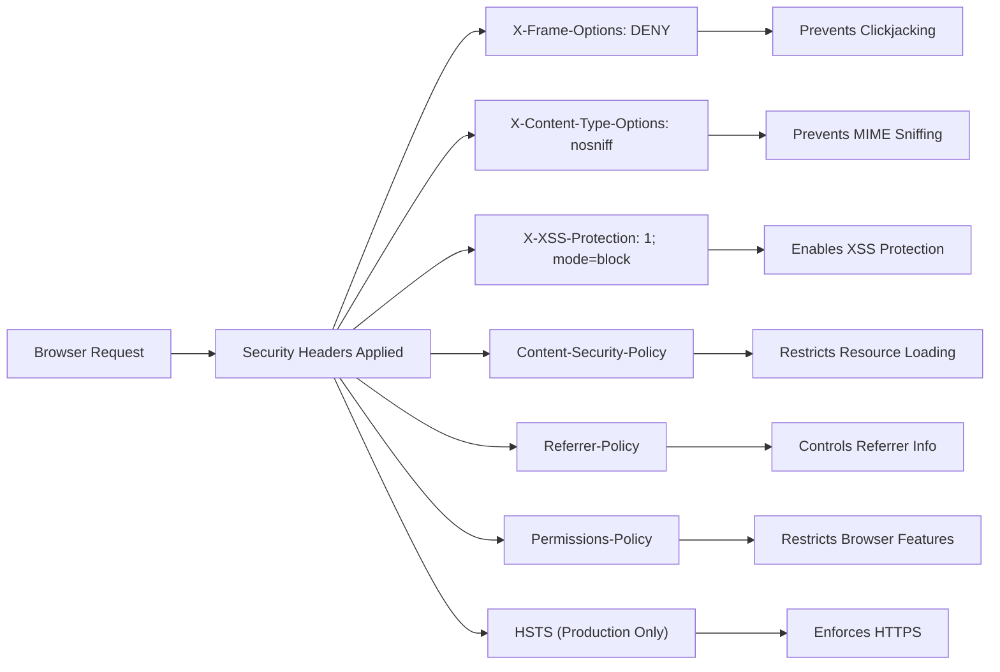

# Security Considerations

<cite>
**Referenced Files in This Document**   
- [middleware.ts](file://middleware.ts)
- [lib/api-keys.ts](file://lib/api-keys.ts)
- [lib/security.ts](file://apps/desktop/app/lib/security.ts)
- [app/api/sandbox/route.ts](file://app/api/sandbox/route.ts)
- [supabase/schemas/auth.sql](file://supabase/schemas/auth.sql)
- [supabase/schemas/public.sql](file://supabase/schemas/public.sql)
</cite>

## Table of Contents
1. [Authentication and Authorization](#authentication-and-authorization)
2. [API Route Protection](#api-route-protection)
3. [Database Security with Row Level Security](#database-security-with-row-level-security)
4. [Secure Code Execution in E2B Sandboxes](#secure-code-execution-in-e2b-sandboxes)
5. [API Key Management and Data Protection](#api-key-management-and-data-protection)
6. [Vulnerability Mitigation](#vulnerability-mitigation)
7. [Security Headers and Content Policies](#security-headers-and-content-policies)
8. [Secure Deployment and Monitoring](#secure-deployment-and-monitoring)
9. [Security Audit and Disclosure Policy](#security-audit-and-disclosure-policy)

## Authentication and Authorization

The CodingIT-1 platform implements a robust authentication system using Supabase Auth, which provides secure user management and session handling. The system supports multiple authentication methods including email/password, OAuth providers, and enterprise SSO through SAML. Multi-factor authentication (MFA) is supported via TOTP and WebAuthn, enhancing account security. User sessions are protected with refresh tokens and automatic expiration, while the system logs all authentication events for audit purposes. The authentication flow is secured with CSRF protection and rate limiting to prevent brute force attacks.

**Section sources**
- [supabase/schemas/auth.sql](file://supabase/schemas/auth.sql#L1-L435)

## API Route Protection

API routes are protected through a comprehensive middleware system that enforces authentication, rate limiting, and request validation. The middleware verifies user identity and session validity before allowing access to protected endpoints. Rate limiting is implemented to prevent abuse, with different thresholds for various API endpoints based on their sensitivity and resource requirements. The system uses in-memory rate limiting with time-windowed counters to track request frequency per client IP address. Error messages are sanitized to prevent information leakage, and security headers are automatically applied to all API responses.

**Diagram sources**
- [middleware.ts](file://middleware.ts#L1-L22)
- [lib/security.ts](file://apps/desktop/app/lib/security.ts#L1-L245)

## Database Security with Row Level Security

The platform employs Row Level Security (RLS) at the database level to ensure that users can only access data they are authorized to view. This security model is implemented in the Supabase PostgreSQL database using policies that restrict data access based on the authenticated user's identity. Each table has specific RLS policies that define what operations (SELECT, INSERT, UPDATE, DELETE) a user can perform on records. For example, users can only view, modify, or delete their own projects, API keys, and chat sessions. Team members have access to shared resources based on their role within the team. This approach provides a strong security boundary at the data layer, preventing unauthorized access even if application-level security is compromised.

**Section sources**
- [supabase/schemas/public.sql](file://supabase/schemas/public.sql#L1-L799)

## Secure Code Execution in E2B Sandboxes

Code execution is isolated in secure E2B sandbox environments to prevent malicious code from affecting the host system or accessing unauthorized resources. Each sandbox is created with specific templates (e.g., code-interpreter-v1, web server) and runs with limited privileges. The system implements a 10-minute timeout for sandbox operations to prevent resource exhaustion. Sandboxes are created with metadata including the user ID and team ID, enabling audit and tracking. Before code execution, dependencies are installed in a controlled manner, and files are written to the sandbox environment. After execution, the file tree is scanned and returned to the client, while the sandbox is properly cleaned up. Error handling ensures that sandboxes are terminated even if execution fails, preventing resource leaks.

**Diagram sources**
- [app/api/sandbox/route.ts](file://app/api/sandbox/route.ts#L1-L195)

## API Key Management and Data Protection

API keys are securely managed through a dedicated system that ensures confidentiality and proper access control. Keys are stored in the database with SHA-256 hashes, never in plaintext. Each API key has a prefix (first 12 characters) stored for display purposes, allowing users to identify their keys without exposing the full secret. Keys can be assigned specific permissions (e.g., chat:read, files:write) or granted full access with wildcard permissions. The system supports key expiration, revocation, and usage tracking. When an API key is used, its last_used_at timestamp is updated, providing an audit trail. The API key validation process checks not only the hash but also the active status and expiration date before granting access.

**Section sources**
- [lib/api-keys.ts](file://lib/api-keys.ts#L1-L394)

## Vulnerability Mitigation

The platform implements comprehensive protections against common web vulnerabilities. Injection attacks are prevented through the use of parameterized queries in database operations and proper input validation. Cross-Site Scripting (XSS) is mitigated through content security policies, input sanitization, and the use of safe rendering practices in the frontend. Cross-Site Request Forgery (CSRF) protection is implemented using anti-CSRF tokens and proper session management. The system also protects against XML External Entity (XXE) attacks, insecure direct object references, and security misconfigurations through regular security reviews and automated testing. Rate limiting helps prevent denial-of-service attacks, while input validation and sanitization protect against malformed data.

**Section sources**
- [lib/security.ts](file://apps/desktop/app/lib/security.ts#L1-L245)

## Security Headers and Content Policies

The platform implements a comprehensive set of security headers to protect against various web-based attacks. The Content Security Policy (CSP) restricts resource loading to trusted sources, preventing unauthorized script execution. X-Frame-Options is set to DENY to prevent clickjacking attacks. X-Content-Type-Options prevents MIME type sniffing, while X-XSS-Protection enables browser XSS filtering. The platform uses strict Referrer-Policy to control referrer information disclosure. Permissions Policy restricts access to sensitive browser features like camera, microphone, and geolocation. In production, HTTP Strict Transport Security (HSTS) is enabled to enforce HTTPS connections. These headers work together to create multiple layers of defense against client-side attacks.

**Diagram sources**
- [lib/security.ts](file://apps/desktop/app/lib/security.ts#L82-L120)

## Secure Deployment and Monitoring

The platform follows secure deployment practices to ensure the integrity and availability of the system. All deployments are performed through automated CI/CD pipelines with security scanning at each stage. The system is deployed with minimal privileges, following the principle of least privilege. Environment variables containing sensitive information are encrypted and securely managed. The platform implements comprehensive logging and monitoring to detect and respond to security incidents. Security events such as failed login attempts, API key usage, and sandbox creation are logged and can be audited. The system includes health checks and automated alerts for suspicious activity. Regular security updates are applied to dependencies, and vulnerability scanning is performed on the codebase and infrastructure.

**Section sources**
- [middleware.ts](file://middleware.ts#L1-L22)
- [lib/security.ts](file://apps/desktop/app/lib/security.ts#L1-L245)

## Security Audit and Disclosure Policy

The platform undergoes regular security audits to identify and address potential vulnerabilities. These audits include both automated scanning and manual penetration testing by security experts. The codebase is reviewed for security best practices, and dependencies are checked for known vulnerabilities. The platform maintains a responsible disclosure policy that encourages security researchers to report vulnerabilities. Reported vulnerabilities are triaged and addressed promptly, with fixes deployed in a timely manner. The security team maintains a public changelog of security updates and provides guidance to users on securing their accounts and data. Regular security training is provided to the development team to ensure awareness of the latest threats and mitigation techniques.

**Section sources**
- [supabase/schemas/auth.sql](file://supabase/schemas/auth.sql#L1-L435)
- [supabase/schemas/public.sql](file://supabase/schemas/public.sql#L1-L799)