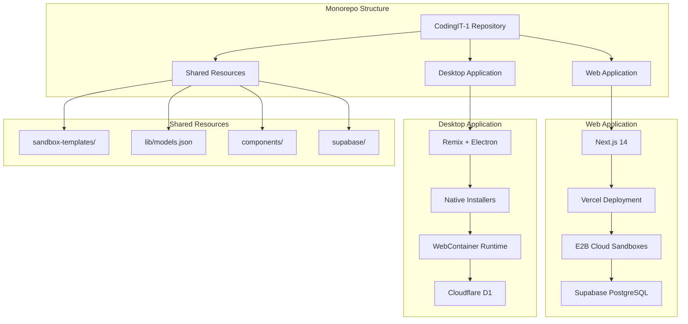
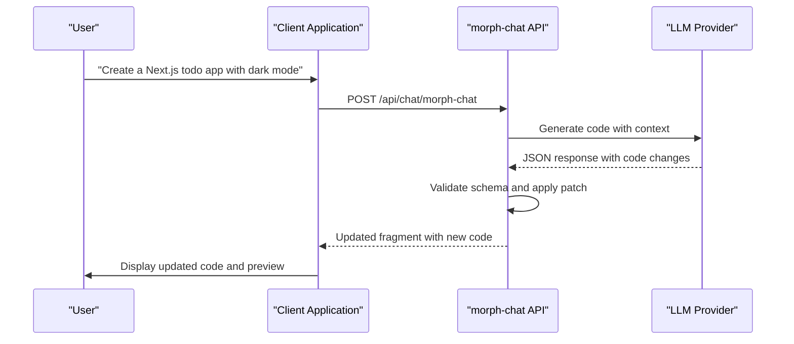
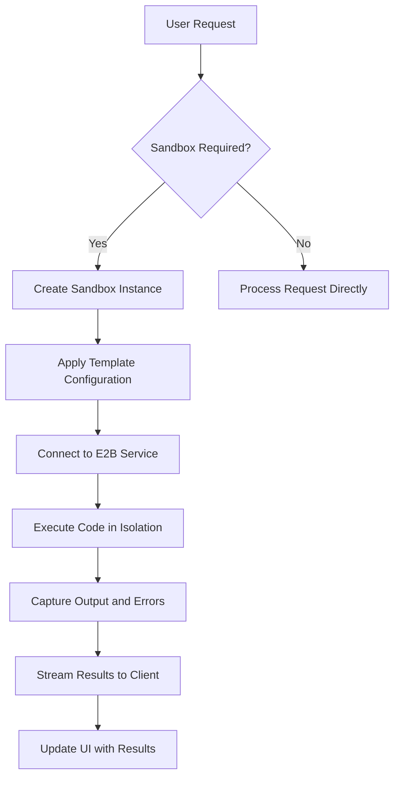
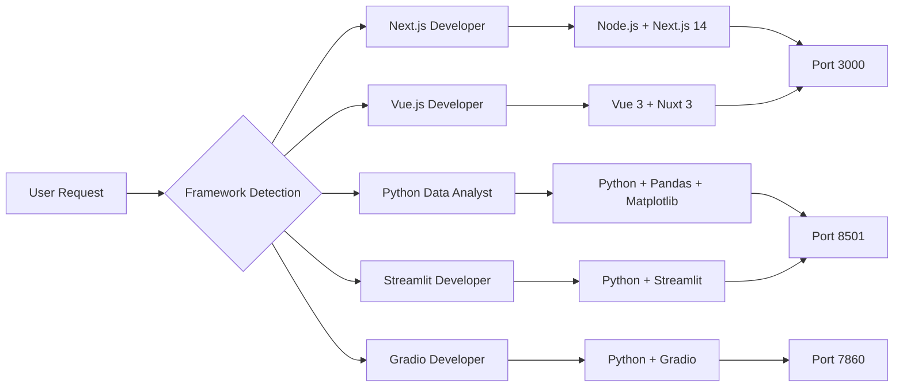
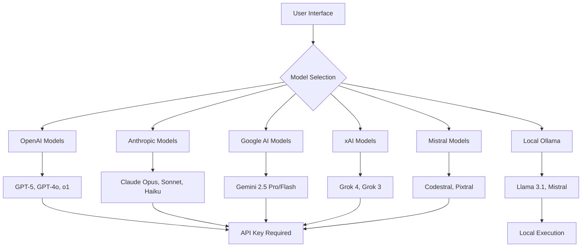
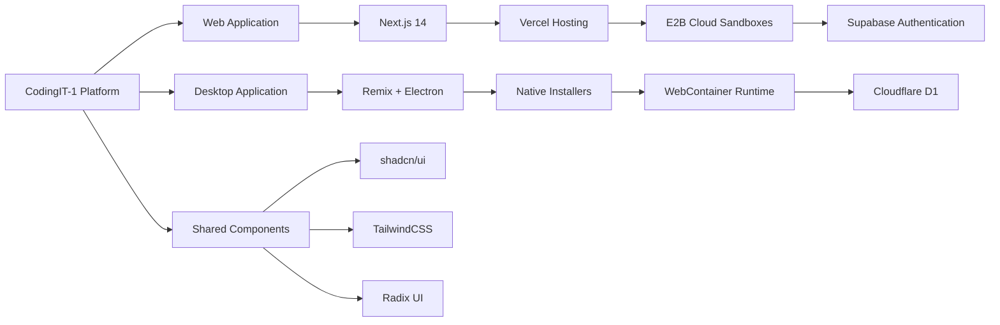
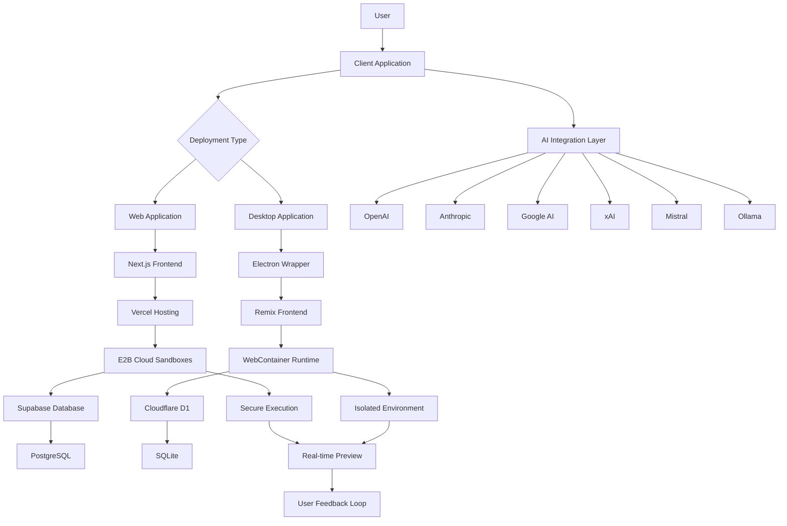

# System Overview

<cite>
**Referenced Files in This Document**   
- [README.md](file://README.md)
- [WORKSPACE.md](file://WORKSPACE.md)
- [lib/models.json](file://lib/models.json)
- [lib/templates.json](file://lib/templates.json)
- [app/api/chat/morph-chat/route.ts](file://app/api/chat/morph-chat/route.ts)
- [app/api/sandbox/route.ts](file://app/api/sandbox/route.ts)
- [app/api/sandbox/[sbxId]/files/route.ts](file://app/api/sandbox/[sbxId]/files/route.ts)
- [app/api/sandbox/[sbxId]/files/content/route.ts](file://app/api/sandbox/[sbxId]/files/content/route.ts)
- [apps/desktop/package.json](file://apps/desktop/package.json)
- [sandbox-templates/nextjs-developer/e2b.toml](file://sandbox-templates/nextjs-developer/e2b.toml)
- [sandbox-templates/nextjs-developer/e2b.Dockerfile](file://sandbox-templates/nextjs-developer/e2b.Dockerfile)
</cite>

## Table of Contents
1. [Introduction](#introduction)
2. [Core Architecture](#core-architecture)
3. [Natural Language to Code Workflow](#natural-language-to-code-workflow)
4. [Secure Code Execution with Sandboxes](#secure-code-execution-with-sandboxes)
5. [Multi-Framework Support](#multi-framework-support)
6. [AI Model Integration](#ai-model-integration)
7. [Client Applications](#client-applications)
8. [Data Flow and API Endpoints](#data-flow-and-api-endpoints)
9. [Key Differentiators](#key-differentiators)
10. [System Context Diagram](#system-context-diagram)

## Introduction

CodingIT-1 is an open-source AI-powered full-stack development platform that transforms natural language instructions into fully functional applications. The platform serves as an AI co-developer, enabling users to build, test, and deploy production-ready applications across multiple frameworks through conversational interfaces. By combining advanced language models with secure execution environments, CodingIT-1 bridges the gap between idea conception and working software implementation.

The platform supports two primary deployment models: a web application hosted on Vercel with cloud-based sandboxes, and a desktop application packaged with Electron for local execution. Both clients connect to the same core functionality but differ in their execution runtime and persistence mechanisms. The system is designed to provide real-time feedback, immediate preview capabilities, and seamless deployment options, making it accessible to developers of all skill levels.

**Section sources**
- [README.md](file://README.md#L1-L100)
- [WORKSPACE.md](file://WORKSPACE.md#L1-L50)

## Core Architecture

CodingIT-1 follows a monorepo architecture implemented with pnpm workspaces, containing two distinct applications that share common resources. The web application, located at the repository root, is built with Next.js 14 and deploys to Vercel, while the desktop application in the `apps/desktop` directory uses Remix with Electron for native packaging. Both applications leverage shared components, sandbox templates, and database schemas while maintaining independent dependency trees and build processes.

The backend architecture centers around AI-driven code generation and secure execution. When a user submits a natural language request, the system routes it through the morph-chat API endpoint, which orchestrates communication with various AI providers. The generated code is then executed within isolated E2B sandboxes for the web application or WebContainer environments for the desktop version. The platform uses Supabase for authentication and database operations in the web version, while the desktop application employs Cloudflare D1 for local data persistence.



**Diagram sources**
- [WORKSPACE.md](file://WORKSPACE.md#L50-L100)
- [README.md](file://README.md#L100-L150)
- [package.json](file://package.json#L1-L20)

**Section sources**
- [WORKSPACE.md](file://WORKSPACE.md#L1-L100)
- [README.md](file://README.md#L1-L150)

## Natural Language to Code Workflow

The core functionality of CodingIT-1 revolves around transforming natural language prompts into executable code through a structured workflow. When a user submits a request such as "Create a Next.js todo app with dark mode," the system initiates a multi-step process that begins with the morph-chat API endpoint. This endpoint serves as the primary interface for AI-powered code generation, accepting user messages, model specifications, and context about the current code fragment.

The morph-chat system employs a specialized prompt engineering approach that provides the AI model with detailed context about the current file, including its path and existing code content. This contextual information enables the AI to generate precise code modifications rather than creating files from scratch. The system uses JSON schema validation to ensure that AI responses conform to expected formats, with required fields including commentary (explanation of changes), instruction (one-line description), edit (code changes with markers for unchanged sections), and file_path (target file location).

Once the AI generates a response, the system applies the changes using a patching mechanism that intelligently merges the proposed edits with the existing codebase. This approach minimizes the risk of introducing syntax errors or breaking existing functionality. The entire process is designed to support iterative development, allowing users to refine their applications through conversational refinement rather than direct code editing.



**Diagram sources**
- [app/api/chat/morph-chat/route.ts](file://app/api/chat/morph-chat/route.ts#L1-L50)
- [lib/schema.ts](file://lib/schema.ts#L1-L20)

**Section sources**
- [app/api/chat/morph-chat/route.ts](file://app/api/chat/morph-chat/route.ts#L1-L110)
- [lib/morph.ts](file://lib/morph.ts#L1-L20)

## Secure Code Execution with Sandboxes

CodingIT-1 implements secure code execution through isolated sandbox environments that prevent malicious code from affecting the host system. The platform uses E2B (Embedded Browser) sandboxes for the web application, providing secure containers where generated code can be executed and previewed in real-time. Each sandbox runs as an isolated environment with restricted access to system resources, ensuring that potentially harmful operations cannot compromise the platform or other users' data.

The sandbox architecture follows a strict security model with multiple layers of protection. When a new task is created, the system provisions a sandbox instance based on predefined templates specified in the `lib/templates.json` file. These templates define the runtime environment, including the base operating system, pre-installed packages, and startup commands. For example, the Next.js developer template includes Node.js, npm, and a preconfigured Next.js application with Tailwind CSS and shadcn/ui components.

API endpoints in the `app/api/sandbox` directory manage the lifecycle of sandbox instances, handling operations such as file listing, content retrieval, and code execution. The system implements path sanitization to prevent directory traversal attacks, ensuring that file operations are restricted to the user's home directory (`/home/user`). When reading or writing files, the system normalizes paths and verifies that they remain within the allowed directory structure before forwarding requests to the E2B SDK.



**Diagram sources**
- [app/api/sandbox/route.ts](file://app/api/sandbox/route.ts#L1-L130)
- [app/api/sandbox/[sbxId]/files/route.ts](file://app/api/sandbox/[sbxId]/files/route.ts#L1-L50)
- [app/api/sandbox/[sbxId]/files/content/route.ts](file://app/api/sandbox/[sbxId]/files/content/route.ts#L1-L80)

**Section sources**
- [app/api/sandbox/route.ts](file://app/api/sandbox/route.ts#L1-L130)
- [lib/sandbox.ts](file://lib/sandbox.ts#L1-L30)
- [sandbox-templates/](file://sandbox-templates/#L1-L10)

## Multi-Framework Support

CodingIT-1 supports multiple development frameworks through configurable sandbox templates that provide specialized environments for different technology stacks. The system's framework support is defined in the `lib/templates.json` file, which specifies five primary templates: Python data analyst, Next.js developer, Vue.js developer, Streamlit developer, and Gradio developer. Each template includes metadata about required libraries, entry point files, startup commands, and exposed ports for live preview.

The framework selection process is automated based on user requests and context. When a user asks to create a specific type of application, the system identifies the appropriate template and provisions a sandbox with the required dependencies pre-installed. For example, a request for a "Next.js e-commerce site" triggers the nextjs-developer template, which uses a Dockerfile to create an environment with Node.js, Next.js 14.2.20, TypeScript, Tailwind CSS, and shadcn/ui components. Similarly, data analysis requests activate the Python data analyst template with pandas, matplotlib, and Jupyter-style execution capabilities.

Each framework template is implemented as a self-contained configuration in the `sandbox-templates/` directory, containing both an `e2b.toml` configuration file and an `e2b.Dockerfile`. The TOML file specifies the template name, Dockerfile location, startup command, and resource allocation (CPU and memory), while the Dockerfile defines the exact environment setup. This modular approach allows for easy extension with additional frameworks by creating new template directories and registering them in the templates configuration.



**Diagram sources**
- [lib/templates.json](file://lib/templates.json#L1-L60)
- [sandbox-templates/nextjs-developer/e2b.toml](file://sandbox-templates/nextjs-developer/e2b.toml#L1-L20)
- [sandbox-templates/nextjs-developer/e2b.Dockerfile](file://sandbox-templates/nextjs-developer/e2b.Dockerfile#L1-L25)

**Section sources**
- [lib/templates.json](file://lib/templates.json#L1-L60)
- [sandbox-templates/](file://sandbox-templates/#L1-L10)

## AI Model Integration

CodingIT-1 integrates with over 50 AI models across ten different providers, offering users extensive choice in language model selection. The AI model configuration is centralized in the `lib/models.json` file, which defines each model's ID, provider, display name, and capabilities. Supported providers include OpenAI (GPT-5, GPT-4o), Anthropic (Claude 4, Claude 3.5), Google AI (Gemini 2.5), xAI (Grok 4), Mistral (Codestral), Fireworks AI, Groq, DeepSeek, Together AI, and Ollama for local model execution.

The platform's AI integration architecture is designed for flexibility and extensibility. Each provider is implemented as a separate module in the `lib/modules/llm/providers/` directory, with standardized interfaces that allow the system to route requests to the appropriate service. The getModelClient function in `lib/models.ts` serves as the factory method for creating model instances based on user selection and API key availability. This abstraction layer enables seamless switching between providers without requiring changes to the core application logic.

For local model execution, the system supports Ollama, allowing users to run AI models completely offline. This capability is particularly valuable for development with sensitive codebases or in environments with limited internet connectivity. The platform also supports multi-modal models that can process both text and images, expanding its capabilities beyond pure code generation to include visual analysis and interface design.



**Diagram sources**
- [lib/models.json](file://lib/models.json#L1-L50)
- [lib/modules/llm/providers/](file://lib/modules/llm/providers/#L1-L10)
- [lib/models.ts](file://lib/models.ts#L1-L20)

**Section sources**
- [lib/models.json](file://lib/models.json#L1-L480)
- [lib/models.ts](file://lib/models.ts#L1-L50)

## Client Applications

CodingIT-1 provides two client applications to accommodate different user preferences and deployment requirements: a web application and a desktop application. The web application, built with Next.js 14, offers cloud-based access through any modern browser and deploys to Vercel with automatic scaling. This version leverages E2B cloud sandboxes for code execution and Supabase for authentication and database operations, making it ideal for collaborative development and remote access.

The desktop application, implemented with Remix and Electron, provides a native experience on Windows, macOS, and Linux platforms. Packaged as installable applications, the desktop version runs locally on the user's machine with WebContainer for in-browser code execution. This approach offers enhanced privacy and offline capabilities, as sensitive code remains on the user's device rather than being transmitted to cloud services. The desktop application uses Cloudflare D1 for local data persistence, ensuring that chat history and project files are securely stored.

Both clients share a common component library and UI framework, ensuring a consistent user experience across platforms. The shared `components/` directory contains reusable React components built with shadcn/ui, TailwindCSS, and Radix UI primitives. This shared foundation allows feature parity between clients while enabling platform-specific optimizations. The desktop application extends the core functionality with Electron-specific features like system tray integration, native file dialogs, and automatic updates.



**Diagram sources**
- [package.json](file://package.json#L1-L30)
- [apps/desktop/package.json](file://apps/desktop/package.json#L1-L30)
- [components/](file://components/#L1-L10)

**Section sources**
- [package.json](file://package.json#L1-L50)
- [apps/desktop/package.json](file://apps/desktop/package.json#L1-L50)
- [WORKSPACE.md](file://WORKSPACE.md#L1-L100)

## Data Flow and API Endpoints

The CodingIT-1 platform implements a comprehensive API layer that orchestrates data flow between the client applications and backend services. The API endpoints, located in the `app/api/` directory, follow a structured organization with subdirectories for chat, files, GitHub integration, sandbox management, and terminal operations. Each endpoint handles specific aspects of the development workflow, from code generation to execution and deployment.

The data flow begins with user input in the chat interface, which is sent to the morph-chat endpoint for AI processing. The system then generates code that is stored as fragments in the database and executed within isolated sandboxes. File operations are managed through the sandbox API endpoints, which provide CRUD functionality for files within the execution environment. The `/api/sandbox/[sbxId]/files` endpoint returns the file tree structure, while `/api/sandbox/[sbxId]/files/content` handles reading and writing individual file contents.

Authentication and user management are handled through Supabase for the web application, with API routes for GitHub integration, user profiles, and team management. The tasks API manages user projects and development sessions, while the terminal API provides command-line access to the sandbox environment. All API routes implement proper error handling, rate limiting, and input validation to ensure system stability and security.

```mermaid
flowchart LR
A[Client Application] --> B[/api/chat/morph-chat]
B --> C[AI Model Provider]
C --> D[Code Generation]
D --> E[/api/sandbox]
E --> F[Sandbox Creation]
F --> G[/api/sandbox/[sbxId]/files]
G --> H[File System Operations]
H --> I[/api/sandbox/[sbxId]/files/content]
I --> J[Read/Write Files]
J --> K[Code Execution]
K --> L[Real-time Preview]
L --> A
```

**Diagram sources**
- [app/api/chat/morph-chat/route.ts](file://app/api/chat/morph-chat/route.ts#L1-L110)
- [app/api/sandbox/route.ts](file://app/api/sandbox/route.ts#L1-L130)
- [app/api/sandbox/[sbxId]/files/route.ts](file://app/api/sandbox/[sbxId]/files/route.ts#L1-L50)
- [app/api/sandbox/[sbxId]/files/content/route.ts](file://app/api/sandbox/[sbxId]/files/content/route.ts#L1-L80)

**Section sources**
- [app/api/](file://app/api/#L1-L10)
- [app/api/chat/](file://app/api/chat/#L1-L10)
- [app/api/sandbox/](file://app/api/sandbox/#L1-L10)

## Key Differentiators

CodingIT-1 distinguishes itself from other AI development tools through several key features that enhance security, flexibility, and usability. The platform's support for over 50 AI models across multiple providers gives users unprecedented choice in language model selection, allowing them to optimize for cost, performance, or specific capabilities. This extensive model support includes cutting-edge offerings like GPT-5, Claude 4, and Grok 4, as well as specialized coding models like Codestral and local execution options through Ollama.

The secure isolated execution model using E2B sandboxes provides a critical safety layer that prevents malicious code from affecting the host system or other users. Unlike tools that execute code directly on the user's machine, CodingIT-1's sandbox architecture ensures that all code runs in isolated containers with limited system access. This approach enables safe experimentation with untrusted code while maintaining system integrity.

The platform's dual deployment model—offering both cloud-based web access and locally-installed desktop applications—caters to different user needs and security requirements. The desktop version allows for completely offline operation with local model execution, making it suitable for sensitive development environments. Additionally, the multi-framework support with specialized templates for Next.js, Vue, Streamlit, Gradio, and Python data analysis enables users to work with their preferred technology stack without switching between different tools.

**Section sources**
- [README.md](file://README.md#L1-L150)
- [lib/models.json](file://lib/models.json#L1-L480)
- [lib/templates.json](file://lib/templates.json#L1-L60)

## System Context Diagram



**Diagram sources**
- [README.md](file://README.md#L1-L150)
- [WORKSPACE.md](file://WORKSPACE.md#L1-L100)
- [package.json](file://package.json#L1-L50)
- [apps/desktop/package.json](file://apps/desktop/package.json#L1-L50)